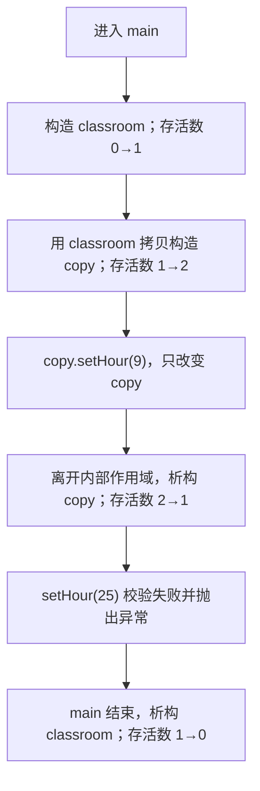
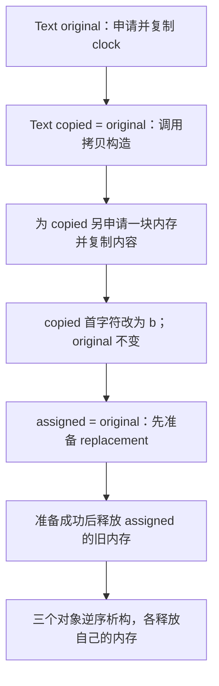
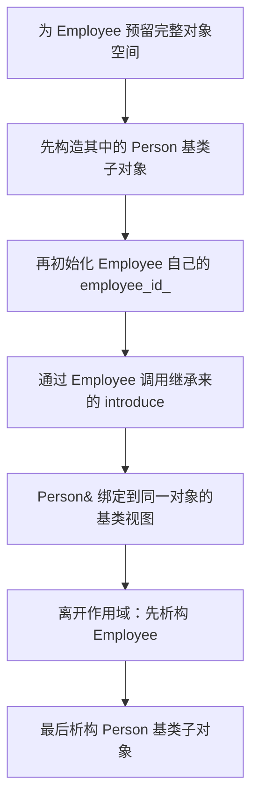
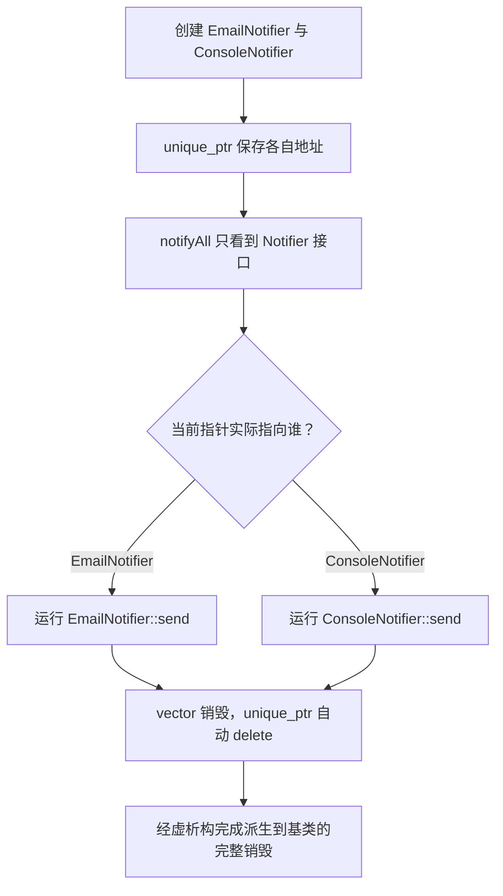

# 面向对象程序设计（OOP）自学教程：从项目代码到可运行设计

> 本教程以本项目的 C++ 教学代码为主线，重新组织并修正了 `e02_01` 到 `e13_01` 中的示例。目标不是背诵语法，而是理解：**对象为什么要保护状态、资源为什么要有所有者、继承为什么必须表达“是一个”、多态为什么依赖虚函数、接口为什么能降低耦合。**

## 阅读与运行说明

本项目使用 C++，各目录的 `CMakeLists.txt` 将语言标准设为 C++20。本教程里的完整程序只使用常见的 C++17/C++20 能力，可以将任一 `cpp` 代码块保存为单独的 `main.cpp`，然后用 `g++ -std=c++20 -Wall -Wextra -pedantic main.cpp -o main` 编译，在 Windows PowerShell 中运行 `./main.exe`。

教程中的示例不是原始代码的简单粘贴。它们保留了项目里的 `Clock`、`Student`、`MyDate`、`Complex`、`MyArray`、`Shape` 等教学对象，同时做了三类调整：

1. **修复正确性问题**：例如未初始化指针上调用 `strlen`、越界判断漏掉负数与等号、赋值时没有处理自赋值、二维数组释放方式错误。
2. **改成现代且易验证的写法**：优先使用 `std::string`、`std::vector`、`std::unique_ptr`，让资源所有权一眼可见。
3. **把“能编译”提升为“设计合理”**：增加 `const`、`override`、虚析构函数、初始化列表，并拆分职责。

### 项目代码与教程章节的对应关系

| 项目目录 | 原有主题 | 本教程中的位置 |
| --- | --- | --- |
| `e02_01` | 类、对象、构造析构、深浅拷贝 | 第 1、2 章 |
| `e03_01`、`e04_01` | 对象成员、静态成员、常成员、友元 | 第 1、7 章 |
| `e04_02`、`e05_01`、`e05_02` | 继承、虚析构、虚基类 | 第 3、4 章 |
| `e07_01`、`e07_02` | 运算符重载、动态数组 | 第 2、6 章 |
| `e08_01`、`e08_02` | 虚函数、抽象类 | 第 4、5 章 |
| `e09_01`、`e09_02`、`e11_01` | 函数模板、类模板、动态矩阵 | 第 7 章 |
| `e12_02`、`e13_01` | 学生数据、流、文件与菜单 | 第 8 章 |

> **先建立一个总观念：**类是“规则与结构”，对象是按该规则创建出来的具体实体；封装、继承和多态不是三个孤立技巧，而是依次回答“对象如何守住自己”“类型如何复用关系”“调用者如何忽略具体类型”三个问题。

## 第 1 章：封装、类与对象

### 本章目标

学完本章，你能够：

- 区分类与对象，正确使用 `private`、`public` 和成员函数；
- 用构造函数保证对象从诞生起就有效；
- 解释 `this` 指针何时存在、指向谁、为什么静态函数没有 `this`；
- 理解 `static` 数据成员是“全类一份”而不是“每个对象一份”；
- 写出带只读查询函数的简单封装类。

### 前置依赖

只需要会使用变量、函数、`if` 和标准输出。本章是后续所有章节的前置；第 2 章会继续讨论本章对象在复制和销毁时发生什么。

### 核心概念：把类想成一台有外壳的自动售货机

自动售货机内部有库存、零钱和线路，但顾客不能伸手修改这些东西，只能按按钮、投币、取货。**内部状态**对应私有数据成员，**按钮和投币口**对应公有成员函数，**外壳**就是封装边界。

如果把所有成员都设为 `public`，调用者可以随意把时钟改成 99 点、把余额改成负数。程序也许暂时能运行，却失去了维护“不变量”的唯一入口。所谓不变量，是对象在任何公开操作完成后都应满足的规则，例如小时始终位于 `[0, 23]`。

原项目 `e02_01` 用 `Clock` 讲类与对象，`e03_01` 用 `Student` 讲对象成员。本章先把 `Clock` 改造成一个始终有效、可以统计存活对象数量的类。

### 可运行示例：受保护的时钟

```cpp
#include <iostream>
#include <stdexcept>
#include <string>
#include <utility>

class Clock {
private:
    int hour_;
    int minute_;
    int second_;
    std::string label_;
    inline static int live_count_ = 0;

    static void checkTime(int hour, int minute, int second) {
        if (hour < 0 || hour >= 24 ||
            minute < 0 || minute >= 60 ||
            second < 0 || second >= 60) {
            throw std::invalid_argument("invalid time");
        }
    }

public:
    Clock(int hour, int minute, int second, std::string label)
        : hour_(hour),
          minute_(minute),
          second_(second),
          label_(std::move(label)) {
        checkTime(hour_, minute_, second_);
        ++live_count_;
    }

    Clock(const Clock& other)
        : hour_(other.hour_),
          minute_(other.minute_),
          second_(other.second_),
          label_(other.label_) {
        ++live_count_;
    }

    ~Clock() {
        --live_count_;
    }

    void setHour(int hour) {
        checkTime(hour, minute_, second_);
        this->hour_ = hour;
    }

    int hour() const {
        return hour_;
    }

    void display() const {
        std::cout << label_ << ": "
                  << hour_ << ':' << minute_ << ':' << second_ << '\n';
    }

    static int liveCount() {
        return live_count_;
    }
};

int main() {
    Clock classroom(8, 30, 0, "classroom");
    classroom.display();

    {
        Clock copy = classroom;
        copy.setHour(9);
        copy.display();
        std::cout << "alive in block: " << Clock::liveCount() << '\n';
    }

    std::cout << "alive after block: " << Clock::liveCount() << '\n';

    try {
        classroom.setHour(25);
    } catch (const std::invalid_argument& error) {
        std::cout << "rejected: " << error.what() << '\n';
    }
}
```

预期输出的关键部分是：两个对象处于内部作用域时数量为 2，`copy` 离开作用域后数量恢复为 1，非法的 25 点被拒绝。

### 执行流程图与内存变化



内存示意：`classroom` 与 `copy` 是两个独立对象，各自拥有一组 `hour_ / minute_ / second_ / label_`；`live_count_` 不嵌在任何一个对象里，而是在类级别只有一份。修改 `copy.hour_` 不会修改 `classroom.hour_`。

### 逐段拆解：为什么这样写

**第一段：数据放在 `private`。**调用者不能直接写 `classroom.hour_ = 25`。所有修改必须经过 `setHour`，于是校验规则集中在一个位置。封装的价值不只是“隐藏”，而是**把状态和维护状态有效性的代码放在一起**。

**第二段：构造函数使用初始化列表。**冒号后的 `hour_(hour)` 表示在成员诞生时直接初始化，而不是先默认创建再赋值。对象型成员、引用成员、`const` 成员必须通过初始化列表处理；对普通成员也应优先这样写。成员实际初始化顺序由它们在类中的声明顺序决定，而不是列表书写顺序，所以列表最好也按声明顺序排列。

**第三段：先校验，再允许公开操作结束。**构造参数非法时抛出异常，构造失败的对象不会存在。`setHour` 先调用 `checkTime`，校验成功后才修改，这保证异常发生时原对象仍保持旧的有效值。

**第四段：查询函数右侧的 `const`。**`int hour() const` 和 `display() const` 承诺不改变这个对象的可观察状态。这样即便拿到的是 `const Clock&`，也能调用这些查询。右侧 `const` 修饰的是隐含的对象参数，不是返回值。

**第五段：用 `std::string` 管理文字。**原项目使用 `char*` 并手动 `new[]/delete[]`，这非常适合学习资源管理，却不应成为普通业务代码的默认选择。`std::string` 自己管理内存，复制时能得到正确的值语义，让本章先聚焦封装；手动深拷贝会在第 2 章专门展开。

### 关键字专题：`this` 到底是什么

每次通过对象调用非静态成员函数时，编译器都隐含传入该对象的地址。可以把 `copy.setHour(9)` 概念性地理解为“把 `&copy` 交给 `Clock::setHour`”。函数体里的 `this` 就保存这个地址，其概念类型是 `Clock* const`；在 `const` 成员函数中则可理解为 `const Clock* const`。

`this->hour_ = hour` 左边明确表示“当前对象的成员”，右边是形参。若成员与形参不同名，`this->` 常可省略。它不是为了炫耀语法，而是在同名遮蔽时消除歧义。注意以下四点：

- `this` 只存在于**非静态成员函数**中；普通函数和静态成员函数没有当前对象。
- 构造函数体执行时已经有 `this`，但不要让尚未完整构造的对象逃逸给外部长期使用。
- `return *this;` 返回当前对象本身，赋值运算符和前置自增常用这种写法。
- 不要从成员函数返回局部对象的引用；`this` 指向调用者对象，而局部变量在函数返回后已经销毁。

### 关键字专题：`static` 是“类的一份共享状态”

普通成员 `hour_` 在每个 `Clock` 对象里各有一份；静态成员 `live_count_` 只存在一份，被所有 `Clock` 对象共享。它适合保存对象总数、全局配置或无须访问对象状态的工具行为。

`liveCount()` 是静态成员函数，应通过 `Clock::liveCount()` 调用。因为它没有 `this`，所以不能直接访问 `hour_`；否则编译器无法知道你想访问哪个时钟。它只能直接访问静态成员，或通过显式传入的对象访问普通成员。

项目原代码写了 `static int nCout;` 却没有类外定义；传统写法必须在某个 `.cpp` 中写 `int Student::nCout = 0;`，否则一旦使用会出现链接错误。本例使用 C++17 的 `inline static`，允许在类内直接定义并初始化。**`static` 不是“永远不变”**，不变是 `const` 的职责；`static` 表示存储与对象实例脱离。

### 常见误区 / 易错点

1. **误以为 `private` 成员“子类中不存在”。**它仍是对象的一部分，只是派生类不能直接访问；第 3 章会区分“存在”和“可访问”。
2. **构造函数中先赋非法值，再校验。**如果校验抛异常前已经改动多个字段，setter 可能留下半更新状态。优先先校验所有输入，再提交修改。
3. **把 `static` 当成每个对象一份。**静态计数器不会随对象复制出新存储，必须由构造/析构逻辑主动维护。
4. **认为所有成员函数都该写 `this->`。**没有同名遮蔽时可以省略；可读性比机械添加更重要。
5. **固定长度字符数组直接 `strcpy`。**项目 `e03_01` 的 `char sName[11]` 在名字过长时会越界。普通文本应使用 `std::string`。

### 小节思考题

1. 如果 `Clock` 的拷贝构造函数没有增加 `live_count_`，上述程序会输出什么错误计数？
2. `setHour` 为什么不直接写成 `hour_ = hour % 24`？“拒绝错误”和“悄悄修正”分别适合什么场景？
3. 如果把 `liveCount()` 改成普通成员函数，调用体验和语义会有什么变化？
4. 一个银行账户的余额应不应该提供 `setBalance`？怎样设计接口更能表达业务规则？

## 第 2 章：对象生命周期、深浅拷贝与资源所有权

### 本章目标

学完本章，你能够：

- 说明构造函数、拷贝构造函数、拷贝赋值运算符和析构函数各在何时调用；
- 画出浅拷贝导致两个指针指向同一内存的图；
- 实现满足“规则之三”的资源管理类，并处理自赋值和异常安全；
- 理解为什么现代 C++ 优先选择标准库资源类型，即“规则之零”。

### 前置依赖

依赖第 1 章的类、对象、`this`、构造与 `private`。本章是第 6 章运算符重载和第 7 章模板容器的前置。

### 核心概念：复印门卡，不等于复制房间

假设一张门卡保存了房间地址。浅拷贝只复印门卡，于是两个人都指向同一个房间；如果两人都认为房间归自己并分别拆除一次，就会发生重复释放。深拷贝则新建一个房间，再复制里面的内容，两个人各自管理各自的房间。

在 C++ 中，裸指针成员只保存地址。编译器生成的默认拷贝只复制地址，不会猜测该指针是否拥有资源。只要类负责 `delete[]`，就必须认真定义复制语义。原项目 `e02_01` 正是在这里出现了关键错误：拷贝构造中写成 `strlen(pBuff)`，但 `pBuff` 尚未初始化；即便长度正确，也没有把字符复制进去。默认赋值又会造成两个对象共享地址并最终重复释放。

### 可运行示例：正确实现“规则之三”

```cpp
#include <cstring>
#include <iostream>
#include <stdexcept>
#include <utility>

class Text {
private:
    char* data_;

    static char* clone(const char* source) {
        const std::size_t length = std::strlen(source);
        char* result = new char[length + 1];
        std::memcpy(result, source, length + 1);
        return result;
    }

public:
    explicit Text(const char* text = "")
        : data_(clone(text)) {
    }

    Text(const Text& other)
        : data_(clone(other.data_)) {
    }

    Text& operator=(const Text& other) {
        if (this == &other) {
            return *this;
        }

        char* replacement = clone(other.data_);
        delete[] data_;
        data_ = replacement;
        return *this;
    }

    ~Text() {
        delete[] data_;
    }

    void setFirst(char value) {
        if (data_[0] == '\0') {
            throw std::logic_error("empty text has no first character");
        }
        data_[0] = value;
    }

    const char* cStr() const {
        return data_;
    }
};

int main() {
    Text original("clock");
    Text copied = original;
    copied.setFirst('b');

    Text assigned;
    assigned = original;
    assigned = assigned;

    std::cout << original.cStr() << '\n';
    std::cout << copied.cStr() << '\n';
    std::cout << assigned.cStr() << '\n';
}
```

程序应输出 `clock`、`block`、`clock`。如果复制只是共享地址，修改 `copied` 的首字符时 `original` 也会变成 `block`；本例没有发生，说明复制出的缓冲区彼此独立。

### 执行流程图与内存变化



深拷贝后的内存可文字表示为：`original.data_ → 地址 A → "clock"`，`copied.data_ → 地址 B → "block"`，`assigned.data_ → 地址 C → "clock"`。A、B、C 不相等。错误的浅拷贝则是两个或三个指针同时指向地址 A，任何一方修改都会影响其他对象，析构时还会多次 `delete[] A`。

### 逐段拆解：为什么这样写

**第一段：把申请与复制集中到 `clone`。**构造、拷贝构造和赋值都需要“按长度申请，再复制终止符”。集中后不容易在某处漏写 `+1` 或忘记复制。`std::strlen` 不包含末尾 `\0`，所以申请长度必须加 1；`memcpy` 复制 `length + 1` 才会连终止符一起复制。

**第二段：拷贝构造创建新资源。**`Text copied = original;` 是初始化一个新对象，因此调用 `Text(const Text&)`，不是赋值运算符。参数必须是引用；如果按值接收，为了构造这个参数又要调用拷贝构造，会形成无限递归。加 `const` 表示复制不会修改来源，也允许复制常对象。

**第三段：赋值先申请，后释放。**若先 `delete[] data_` 再申请，而 `new` 抛出异常，对象就丢失了原内容。先生成 `replacement`，成功后才替换，至少提供“失败时原值不变”的强异常保证。`this == &other` 检测 `assigned = assigned`；若不处理自赋值，先释放的正是后面准备读取的来源。

**第四段：`return *this` 支持链式赋值。**赋值表达式本身应代表左操作数，所以标准惯例返回 `Text&`。这样 `a = b = c` 会先执行 `b = c`，再用返回的 `b` 执行 `a = b`。返回引用避免再复制一个对象。

**第五段：析构函数释放且只释放自己拥有的资源。**`delete[]` 必须与 `new char[...]` 配对。对空指针执行 `delete[]` 也是安全的，因此通常不需要先写 `if (data_)`。

### 规则之三、规则之五与规则之零

如果类自行拥有需要释放的资源，并且定义了析构、拷贝构造或拷贝赋值中的一个，通常三个都需要考虑，这叫**规则之三**。C++11 以后还应考虑移动构造和移动赋值，合称**规则之五**。移动不是复制资源，而是把地址的所有权转交给新对象，并把旧对象置于可安全析构的状态。

更推荐的是**规则之零**：让 `std::string`、`std::vector`、`std::unique_ptr` 等类型成为成员，让它们负责资源，业务类不手写析构和复制。第 1 章的 `Clock` 使用 `std::string` 就是这个思路。本节保留裸指针实现，是为了真正理解项目原代码为什么危险，而不是鼓励在业务项目中重复制造低层容器。

### 原项目在这一主题上的直接修正

- `e02_01` 的 `pBuff=new char[strlen(pBuff)+1]` 必须读取来源：应为 `strlen(src.pBuff) + 1`，随后还必须复制字符。
- 只修拷贝构造仍不够；`c4 = c3` 调用拷贝赋值，默认实现会浅拷贝。上例补齐了赋值运算符。
- `e07_02::resize` 扩容时原代码按旧大小清零，却按新大小从旧数组复制，会越界读取；正确做法是只复制 `min(oldSize, newSize)` 个元素，并同时支持缩小。
- `e11_01::operator=` 在自赋值时会先释放自身再读取自身；必须检测自赋值，或使用“拷贝并交换”惯用法。

### 常见误区 / 易错点

1. **把 `Text b = a` 当成赋值。**`b` 正在被创建，所以是拷贝构造；只有 `b` 已存在后再写 `b = a` 才是拷贝赋值。
2. **只复制 `strlen` 个字节。**C 风格字符串还需要结尾的 `\0`，漏掉后输出函数会继续读到未知内存。
3. **从局部对象返回引用。**后置自增会保存一个局部旧值，因此必须按值返回；第 6 章会专门对比。
4. **认为有析构函数就不会泄漏。**如果复制语义错误，析构反而可能造成重复释放；资源所有权必须从构造到复制再到销毁完整一致。
5. **任何指针都要 `delete`。**只有拥有资源的指针负责释放。观察指针、指向栈对象的指针不能删除。

### 小节思考题

1. 如果 `clone` 中的内存申请失败，拷贝构造和拷贝赋值中的原对象分别处于什么状态？
2. 为什么移动构造通常可以标记为 `noexcept`？这会怎样影响 `std::vector` 扩容？
3. 若把 `char*` 换成 `std::unique_ptr<char[]>`，哪些成员函数仍需要自己实现？
4. 一个类只保存不拥有的指针时，如何在命名、类型或文档上表达这种“借用”关系？

## 第 3 章：继承与派生

### 本章目标

学完本章，你能够：

- 判断两个概念之间是否适合使用公有继承；
- 解释基类子对象与派生类新增成员在内存中的关系；
- 理解 `private`、`protected`、`public` 对派生类和外部调用者的不同影响；
- 预测构造函数和析构函数的执行顺序；
- 识别多继承的菱形问题，并知道虚继承解决的是什么。

### 前置依赖

依赖第 1 章的封装、初始化列表和 `const` 成员函数。第 4 章的多态建立在本章“基类引用或指针可以指向派生对象”的规则之上。

### 核心概念：员工“是一个”人，而发动机不是汽车

继承最实用的判断句是“**派生类是一个基类吗？**”员工是一个人，所以 `Employee : public Person` 合理；汽车有一台发动机，但汽车不是发动机，因此应该让 `Engine` 成为 `Car` 的成员，这叫组合。

公有继承不只是拿到几段代码，它还作出类型承诺：任何需要 `Person` 的位置，都应能合理地接收 `Employee`。这正是后面里氏替换原则的基础。如果只是为了偷用一个函数而继承，往往会得到脆弱关系。

### 可运行示例：人和员工

```cpp
#include <iostream>
#include <string>
#include <utility>

class Person {
private:
    std::string name_;

protected:
    const std::string& name() const {
        return name_;
    }

public:
    explicit Person(std::string name)
        : name_(std::move(name)) {
        std::cout << "construct Person\n";
    }

    virtual ~Person() {
        std::cout << "destroy Person\n";
    }

    void introduce() const {
        std::cout << "I am " << name_ << '\n';
    }
};

class Employee : public Person {
private:
    int employee_id_;

public:
    Employee(std::string name, int employeeId)
        : Person(std::move(name)), employee_id_(employeeId) {
        std::cout << "construct Employee\n";
    }

    ~Employee() override {
        std::cout << "destroy Employee\n";
    }

    void work() const {
        std::cout << name() << " works as #" << employee_id_ << '\n';
    }
};

int main() {
    Employee employee("Lin", 1001);
    employee.introduce();
    employee.work();

    Person& personView = employee;
    personView.introduce();
}
```

### 执行流程图与对象布局示意



对象内存可以抽象为一个整体：`Employee 对象 = [Person 子对象: name_] + [Employee 部分: employee_id_]`。`Person& personView` 没有创建新对象，也没有切掉员工部分；它只是以 `Person` 视角观察同一地址，因此只能直接使用基类接口。

### 逐段拆解：为什么这样写

**第一段：`name_` 仍保持私有。**派生类不应该因为继承就能随意破坏基类状态。基类提供受保护的只读函数 `name()` 给派生实现使用，仍由 `Person` 控制名字如何存储。`protected` 比 `private` 放宽了边界，因此应克制使用；优先保护数据，按需开放行为。

**第二段：派生构造函数显式调用基类构造。**创建 `Employee` 前必须先得到一个有效的 `Person` 子对象，所以初始化列表写 `Person(std::move(name))`。构造顺序固定为：虚基类、直接基类、成员（按声明顺序）、派生类构造函数体。析构顺序完全相反。

**第三段：公有继承保留接口可见性。**`Employee` 对象可以调用基类的公有 `introduce()`。外部不能调用受保护的 `name()`，但 `Employee::work()` 可以。这体现 `protected` 是“给派生实现的接口”，不是“给所有调用者的接口”。

**第四段：基类引用绑定派生对象。**这是向上转换，安全且隐式允许，因为每个 `Employee` 内确实包含一个 `Person` 子对象。反方向不能凭空成立：不是每个 `Person` 都是 `Employee`。

### 访问控制速查

| 基类成员声明 | 基类内部 | 派生类内部 | 类外调用者 |
| --- | --- | --- | --- |
| `private` | 可访问 | 不可直接访问 | 不可访问 |
| `protected` | 可访问 | 可访问 | 不可访问 |
| `public` | 可访问 | 可访问 | 可访问 |

这里说“不可直接访问”不等于成员不存在。项目 `e04_02` 的 `A1::x` 是私有成员，`B` 对象仍包含它，只是 `B` 和 `main` 都不能写 `x`。原代码 `cout << x;` 既没有对象限定，也试图访问私有成员，因此无法编译；正确做法是调用 `b.display()` 之类的公有接口。

### 多继承与虚继承浅析

项目 `e05_02` 展示了 `C` 同时继承 `B1`、`B2`，而两者又都继承 `A` 的菱形结构。普通继承会让 `C` 中出现两个 `A` 子对象，访问 `A::x` 时产生歧义；`B1 : virtual public A` 与 `B2 : virtual public A` 让最底层对象共享一份 `A` 虚基类子对象。

虚继承时，**最末端派生类**负责构造共享虚基类，所以 `C` 的初始化列表必须直接构造 `A`。这能解决重复基类子对象，但也增加对象布局、初始化和理解成本。实际设计中应先问能否用组合或接口拆分；多继承更适合继承多个纯接口，而不是同时继承多个带状态的实现类。

### 常见误区 / 易错点

1. **“为了复用代码就继承”。**代码复用只是结果，不是充分理由；若不满足“是一个”，优先使用组合。
2. **认为派生类可以直接访问基类所有成员。**`private` 始终由声明它的类控制，派生类只能通过基类提供的接口使用。
3. **在构造函数体里给基类“赋值”。**进入派生类函数体前，基类已经构造完成；必须在初始化列表选择基类构造函数。
4. **把对象按值转换给基类。**`Person person = employee;` 会发生对象切片，只留下基类部分；使用引用或指针才能保留完整动态对象。
5. **把虚继承和虚函数混为一谈。**虚继承解决菱形结构中的重复基类子对象；虚函数解决运行时选择覆盖实现，两者目的不同。

### 小节思考题

1. `Square` 公有继承 `Rectangle` 是否总能满足“正方形是矩形”？如果矩形接口允许分别修改宽和高呢？
2. 为什么成员的初始化顺序不服从初始化列表的书写顺序？编译器发出顺序警告时应如何处理？
3. 如果 `Person` 的名字永远不允许派生类读取，能否删除 `protected name()`？`Employee::work()` 又该如何获得展示文本？
4. 什么场景下“汽车拥有发动机”的组合关系比继承更容易替换与测试？

## 第 4 章：多态、虚函数与虚析构

### 本章目标

学完本章，你能够：

- 区分编译期绑定和运行期绑定；
- 使用基类指针或引用调用派生类覆盖的虚函数；
- 正确使用 `virtual`、`override` 和虚析构函数；
- 解释对象切片为什么会破坏多态；
- 使用 `std::unique_ptr` 安全管理多态对象。

### 前置依赖

依赖第 3 章的公有继承和向上转换，也依赖第 2 章的资源所有权概念。下一章会把本章的虚函数推进为纯虚函数和抽象接口。

### 核心概念：同一个“播放”按钮，设备自己决定动作

遥控器只提供一个“播放”按钮。它连接电视时播放画面，连接音响时播放声音。使用者面对的是同一套抽象操作，具体设备在运行时决定如何响应。多态就是：**调用代码依赖稳定的基类接口，实际行为由对象的动态类型决定。**

项目 `e08_01` 的 `A*` 数组里同时放入 `A`、`B`、`C`，再统一调用 `say()`，已经抓住了核心。本章把它改成更明确的通知器示例，并用智能指针消除手工 `delete`。

### 可运行示例：统一发送不同通知

```cpp
#include <iostream>
#include <memory>
#include <string>
#include <utility>
#include <vector>

class Notifier {
public:
    virtual void send(const std::string& message) const {
        std::cout << "generic: " << message << '\n';
    }

    virtual ~Notifier() = default;
};

class EmailNotifier : public Notifier {
private:
    std::string address_;

public:
    explicit EmailNotifier(std::string address)
        : address_(std::move(address)) {
    }

    void send(const std::string& message) const override {
        std::cout << "email to " << address_ << ": " << message << '\n';
    }
};

class ConsoleNotifier : public Notifier {
public:
    void send(const std::string& message) const override {
        std::cout << "console: " << message << '\n';
    }
};

void notifyAll(const std::vector<std::unique_ptr<Notifier>>& notifiers,
               const std::string& message) {
    for (const auto& notifier : notifiers) {
        notifier->send(message);
    }
}

int main() {
    std::vector<std::unique_ptr<Notifier>> notifiers;
    notifiers.push_back(std::make_unique<EmailNotifier>("oop@example.com"));
    notifiers.push_back(std::make_unique<ConsoleNotifier>());

    notifyAll(notifiers, "class begins at 8:30");
}
```

### 执行流程图与多态内存示意



内存关系可理解为：容器内每个元素只保存一个拥有所有权的指针；堆上分别存在完整的 `EmailNotifier` 和 `ConsoleNotifier` 对象。基类指针的**静态类型**都是 `Notifier*`，决定“编译时允许调用哪些接口”；对象的**动态类型**不同，决定虚调用最终进入哪个函数体。

### 逐段拆解：为什么这样写

**第一段：基类函数声明为 `virtual`。**如果没有 `virtual`，`Notifier*` 调用 `send` 时会在编译期固定选择 `Notifier::send`，不会根据真实对象变化。虚函数让运行时根据动态类型选择最终覆盖者。实现通常借助虚函数表，但 C++ 标准规定的是行为，不要求某一种具体内存布局。

**第二段：派生覆盖写 `override`。**`override` 不负责开启多态，基类的 `virtual` 才负责；它让编译器检查派生函数是否真的覆盖了某个虚函数。如果误把参数写成按值、漏掉末尾 `const` 或拼错函数名，编译器会报错，而不是悄悄生成一个无关的新函数。

**第三段：多态基类使用虚析构。**容器持有的是 `unique_ptr<Notifier>`，销毁时概念上通过 `Notifier*` 执行 `delete`。若基类析构不虚，删除派生对象会产生未定义行为，派生部分管理的资源可能无法正确释放。只要类预期被多态使用，基类析构函数就应为虚函数。

**第四段：函数依赖接口集合。**`notifyAll` 不需要 `if (type == email)`，新增 `SmsNotifier` 时函数无需修改。循环中的 `const auto&` 是对智能指针的只读引用，不复制所有权；`unique_ptr` 本来就禁止复制。

**第五段：用智能指针表达所有权。**项目原例用 `new` 创建后再调用 `free()` 删除，只要中间抛异常或提前返回就可能漏掉。`unique_ptr` 表示“唯一拥有”，容器销毁时自动清理，实现第 2 章所说的 RAII。

### 静态绑定与动态绑定

函数重载、普通非虚函数调用、模板实例化通常在编译期决定，属于静态绑定。虚函数通过基类引用或指针调用时，在运行期根据动态类型决定，属于动态绑定。**运算符重载虽然名字里有“多态”的广义意味，但通常是编译期多态**；它与虚函数的运行时多态不同。

注意，直接写 `EmailNotifier email; email.send(...)` 时编译器已经知道具体类型，结果当然仍是派生实现。真正体现可替换能力的是：调用者只拿 `Notifier&` 或 `Notifier*`，依旧获得具体行为。

### 常见误区 / 易错点

1. **基类写了同名函数就自动多态。**必须由基类接口声明 `virtual`，并通过基类引用或指针观察动态分派。
2. **漏写虚析构。**如果可能通过基类指针删除派生对象，非虚析构会导致未定义行为；这不是仅仅“少打印一行”。
3. **按值传递基类对象。**`void sendNow(Notifier n)` 会切片，派生部分被丢弃；应使用 `const Notifier&` 或指针。
4. **认为构造函数可以是虚函数。**决定动态类型所需的派生对象尚未构造完成，因此构造函数不能是虚函数。构造/析构期间调用虚函数也只会分派到当前正在构造/析构的层级。
5. **用裸指针表达拥有关系却忘记释放。**观察对象可用引用或非拥有指针；拥有堆对象优先用智能指针。

### 小节思考题

1. 为什么 `notifyAll` 的参数不能按值接收 `vector<unique_ptr<Notifier>>`？如果确实要转移所有权，应怎样设计签名？
2. 若 `Notifier::send` 忘记末尾 `const`，派生类写了 `const override` 会发生什么？
3. 把 `Notifier` 对象直接存入 `vector<Notifier>` 为什么不能保存派生对象的特有状态与行为？
4. 哪些类不需要虚析构？给出一个不会被继承、也不会经基类指针删除的例子。
