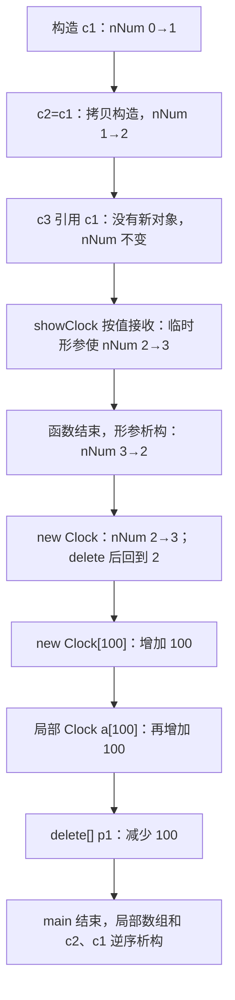
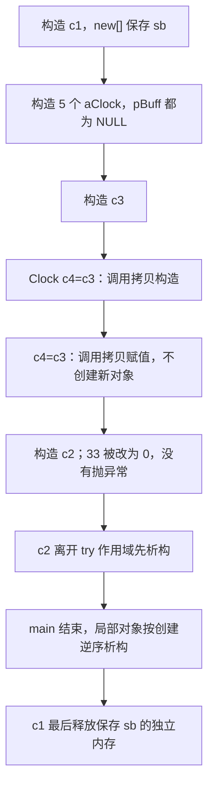
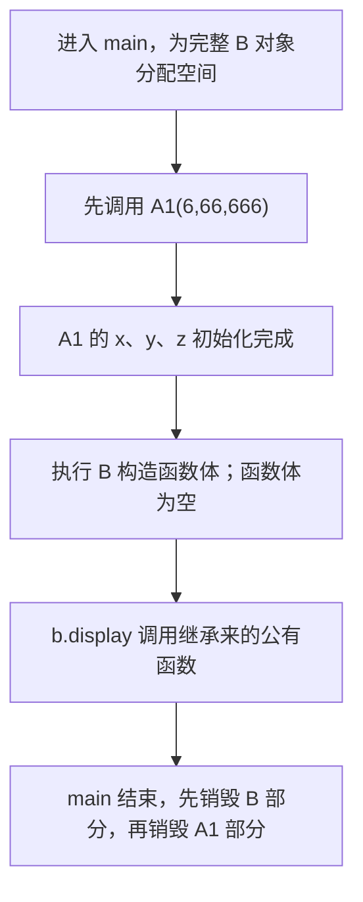
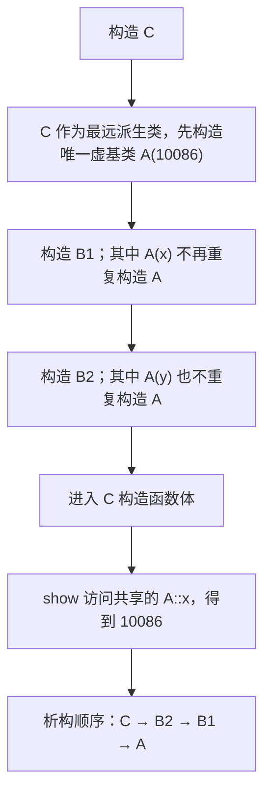
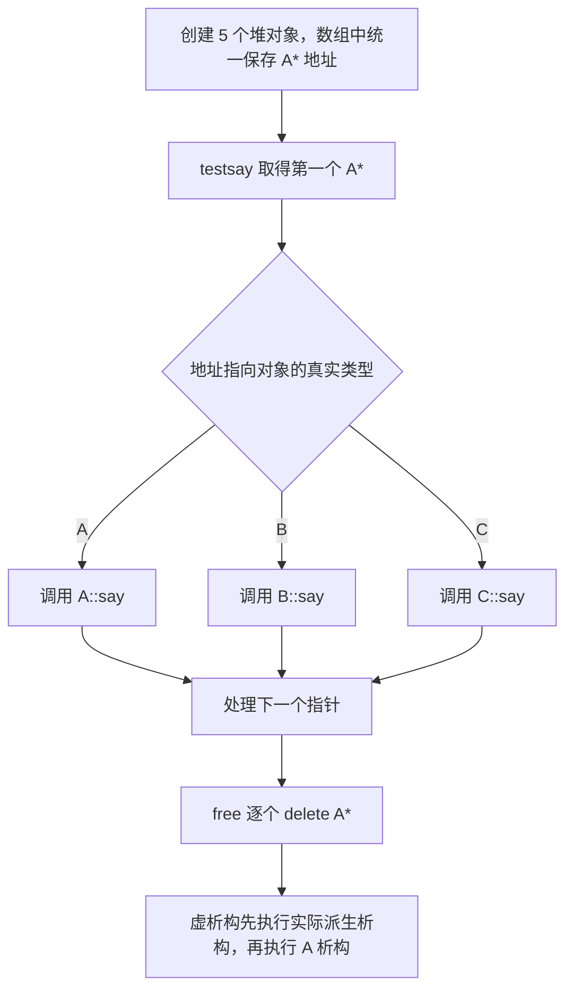
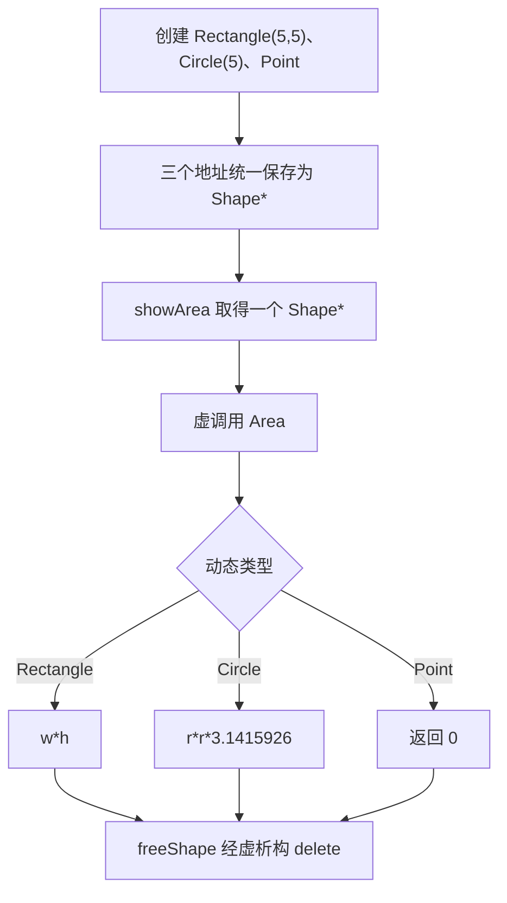
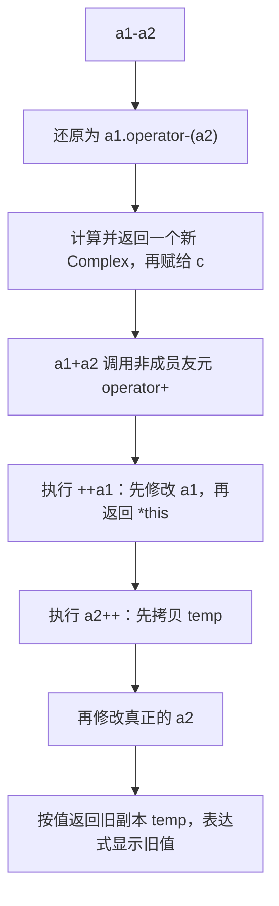
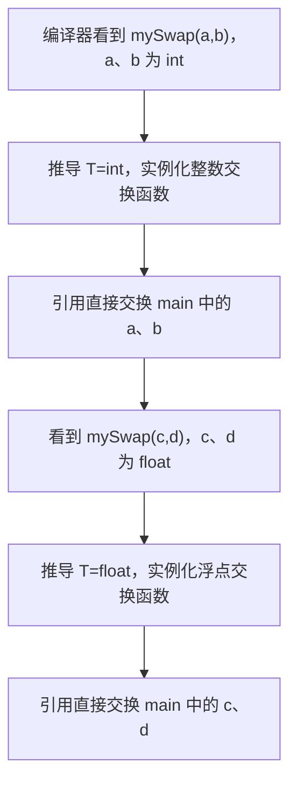
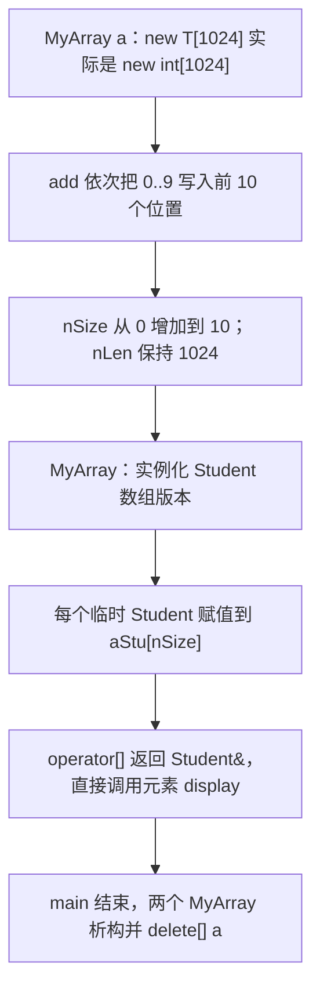
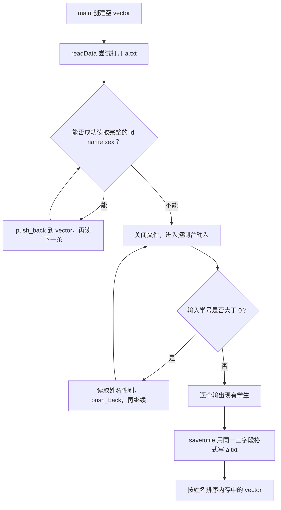

# 面向对象程序设计（OOP）项目代码教程

> 本教程直接以项目 `e02_01` 到 `e13_01` 中的 C++ 代码为讲解对象。代码块尽量保持原文件的类名、变量名、函数顺序、控制流程和书写风格；只有遇到**编译错误、越界、未定义行为、资源重复释放或明显未完成实现**时才做最小修正。

## 阅读说明

这不是另写一套与项目无关的示例。各章代码来源如下：

| 章节 | 直接采用的项目代码 |
| --- | --- |
| 封装、`this`、`static` | `e04_01/main.cpp` |
| 构造析构、深浅拷贝 | `e02_01/main.cpp` |
| 继承 | `e04_02/main.cpp`、`e05_02/main.cpp` |
| 多态 | `e08_01/main.cpp` |
| 抽象类与接口 | `e08_02/main.cpp` |
| 运算符重载、前置/后置 `++` | `e07_01/main.cpp` |
| 函数模板与类模板 | `e09_01/main.cpp`、`e09_02/main.cpp` |
| 设计原则浅析与文件读写 | `e12_02/main.cpp` |

代码中的 `// 修正` 表示教程对原文件所作的必要修复。每段代码后面都会说明原写法、修改内容和修改理由。项目原有注释保留在代码块中，是为了方便你和源文件逐行对照；正文讲解不会拿原注释换一种排版重复一遍，而会解释代码为什么这样运行。

项目的 CMake 文件使用 C++20。教程中的每个完整程序都可以单独作为 `main.cpp` 编译：`g++ -std=c++20 -Wall -Wextra -pedantic main.cpp -o main`。由于每个项目目录本来就各有一个 `main()`，不同章节的代码不要合并到同一个源文件中。

## 第 1 章：封装、`this` 与 `static`

### 本章目标

学完本章，你能够：

- 说明类与对象的区别；
- 使用 `private` 和公有成员函数建立封装边界；
- 解释 `this` 指向哪个对象；
- 理解静态数据成员为什么全类只有一份；
- 区分对象、对象指针和对象引用；
- 根据代码预测构造、拷贝构造和析构对对象计数的影响。

### 前置依赖

只要求掌握变量、函数、指针、引用和基本输入输出。本章中的拷贝构造只是先观察调用时机，第 2 章会深入解释深拷贝。

### 核心概念：钟表工厂与出厂的钟

可以把 `Clock` 类想成钟表工厂使用的图纸，`c1`、`c2` 是按图纸制造出来的具体钟。每只钟都有自己的 `H、M、S`，所以修改一只钟不会自动改变另一只钟；但“当前一共存在多少只钟”是整个工厂共同关心的数据，不应该在每只钟里各存一个互相矛盾的计数。因此，时分秒是普通成员，`nNum` 是静态成员。

封装像钟表外壳。外部代码不能直接拨动内部齿轮，而应通过类提供的接口操作。`friend` 相当于给某个外部维修员一把专用钥匙，它能越过外壳访问私有数据，所以应有明确理由，不能到处发钥匙。

### 基于 `e04_01/main.cpp` 的可运行代码

```cpp
/*
 *静态数据成员:必须在类的外部声明
 *静态成员函数
 *常成员
 *常引用
 *友元 破坏了封装性，新兴的面向对象语言不支持友元
 */
#include<iostream>
using namespace std;

class Clock;//类的前向申明

// Clock负责保存一只钟的时间，并用静态成员统计当前存活对象数
class Clock {
private:
    // 每个Clock对象各自拥有一份时、分、秒
    int H,M,S;
private:
    // 所有Clock对象共享同一个计数器，它不属于某一只具体的钟
    static int nNum;
public:
    // 静态成员函数用于查询全类共享的数据，不需要先指定某个对象
    static int objNum() {
        return Clock::nNum;
    }
public:
    // 构造函数：初始化当前对象的时间，并把存活对象数加1
    Clock(int H=0,int M=0, int S=0) {
        this->H=H;
        this->M=M;
        this->S=S;
        Clock::nNum++;
    }

    //拷贝构造
    // 用已有Clock创建新Clock时调用，新对象也要计入nNum
    Clock(const Clock &c) {
        cout<<"拷贝构造"<<endl;
        H=c.H;
        M=c.M;
        S=c.S;
        Clock::nNum++;
    }
    // 对象生命周期结束时自动调用，存活对象数减1
    ~Clock() {
        nNum--;
    }

    //申明【友元】函数，使其可以访问私有成员
    friend void showClock(Clock c);
};

//静态数据成员必须在外部申明并初始化
int Clock::nNum = 0;

void showClock(Clock cl) {
    // cl是按值形参：进入函数前会用实参拷贝构造一个新对象
    cout<<"duixianggeshu"<<Clock::objNum()<<endl;
    // showClock是友元，所以可以直接读取Clock的私有成员
    cout<<cl.H<<cl.M<<cl.S<<endl;
    // 修正：原代码是 return cl;，但本函数返回类型是 void
    return;
}

int main() {
    // 验证1：无实参构造c1，使用构造函数的三个默认值
    Clock c1;
    // 验证2：这里只创建指针变量，没有创建Clock对象，nNum不变
    Clock *p1=NULL;
    // 验证3：用c1创建c2，触发拷贝构造，nNum加1
    Clock c2=c1;
    // 验证4：c3只是c1的别名，不创建对象，nNum不变
    Clock &c3=c1;
    //以下c3是对c1的引用，并未创建新的对象
    //函数形参是对象，形参传实参 将产生拷贝构造
    // 验证5：按值传参会临时调用一次拷贝构造；函数结束时形参析构
    showClock(c1);

    // 查看临时形参析构后，当前应只剩c1和c2
    cout<<"duixianggeshu"<<Clock::objNum()<<endl;
    // 验证6：new创建一个动态Clock对象，构造后计数加1
    p1=new Clock(8,59,45);
    cout<<"duixianggeshu"<<Clock::objNum()<<endl;
    // 验证7：delete销毁单个动态对象，调用析构后计数减1
    delete p1;
    cout<<"duixianggeshu"<<Clock::objNum()<<endl;

    // 验证8：new Clock[100]会连续调用100次默认构造
    p1=new Clock[100];
    cout<<"duixianggeshu"<<Clock::objNum()<<endl;
    // 验证9：局部对象数组同样创建100个Clock，但离开main时自动销毁
    Clock a[100];
    cout<<"duixianggeshu"<<Clock::objNum()<<endl;

    // 验证10：new[]必须配对delete[]，这里会调用100次析构
    delete[] p1;
    cout<<"duixianggeshu"<<Clock::objNum()<<endl;
    return 0;
}
```

### 本段代码的必要修正

原文件的 `showClock` 声明为 `void`，结尾却写了 `return cl;`。`void` 表示函数不返回值，因此这是编译错误。教程只把它改为 `return;`，没有把形参改为引用，因为按值传递触发拷贝构造正是原代码要观察的现象。

其他写法即使可以现代化，也没有擅自改动。例如 `NULL` 可以换成 `nullptr`，计数器可以写成 C++17 的 `inline static`，`showClock` 也可以避免友元；这些都属于风格或设计改进，不是让本程序正确运行所必需的修改，所以保留原样。

### 执行流程图与对象数量变化



内存变化可以文字表示为：`c1` 和 `c2` 是两个独立对象，各有一组 `H、M、S`；`c3` 只是 `c1` 的别名，不占一份新的 `Clock` 对象存储；`p1` 自身只是一个地址变量，`new Clock` 创建的对象位于动态存储区；`nNum` 位于类级别的静态存储区，全程序只有一份。

### 逐段拆解：为什么这样写

**私有成员体现封装。**`H、M、S、nNum` 都在 `private` 区域，`main` 不能直接写 `c1.H`。`Clock` 自己负责初始化时分秒、增加计数和减少计数。这样对象数量的维护逻辑不会散落到所有调用者中。

**构造函数的形参与成员同名。**进入 `Clock(int H, int M, int S)` 后，直接写 `H=H` 只会把形参赋给自己。`this->H` 表示“当前正在构造的那个对象的成员 H”，右侧 `H` 表示形参。因此 `this->H=H` 消除了同名遮蔽。

**拷贝构造函数的参数必须是引用。**`Clock(const Clock &c)` 接收来源对象的别名，不创建参数副本。如果改成 `Clock(Clock c)`，为了构造参数 `c` 又必须调用拷贝构造，形成没有终点的递归。左侧 `const` 保证复制过程不修改来源。

**静态计数器在类外定义。**类内的 `static int nNum;` 只是声明。`int Clock::nNum = 0;` 才分配并初始化那一份静态存储。`Clock::objNum()` 是静态成员函数，没有当前对象，也就没有 `this`；它访问的是类共享的 `Clock::nNum`。

**按值形参有意产生新对象。**`showClock(c1)` 会用 `c1` 拷贝构造形参 `cl`，所以调用期间计数加一，返回时 `cl` 析构又减一。这不是引用：函数内的 `cl` 是另一个对象。

**数组构造和释放成对发生。**`new Clock[100]` 调用 100 次默认构造，必须用 `delete[] p1`，这样才会调用 100 次析构。局部数组 `Clock a[100]` 不需要手工释放，离开作用域时自动析构。

### 关键字专题：`this`

`this` 是非静态成员函数隐藏接收的当前对象地址。可以把 `c1` 调用成员函数理解成编译器把 `&c1` 一并传入。它有三个常见用途：

1. 形参与成员同名时，用 `this->成员` 指明左边是对象成员；
2. 赋值或前置自增中用 `return *this;` 返回当前对象本身；
3. 比较 `this == &src` 判断是否发生自赋值。

静态成员函数属于类，不对应某一个具体对象，所以没有 `this`。普通全局函数 `showClock` 也没有 `this`，它能访问私有成员是因为被声明为友元，而不是因为它变成了成员函数。

### 关键字专题：`static`

普通数据成员随对象创建，每个对象各一份；静态数据成员与类关联，全类共享一份。`static` 不表示不可修改，代码中的构造和析构都在修改 `nNum`。不可修改由 `const` 表达。

静态成员函数应使用 `Clock::objNum()` 调用。它不能直接访问 `H`，因为不存在“当前是哪一只钟”的信息。若确实需要某个对象的时分秒，必须显式接收该对象或地址。

### 常见误区 / 易错点

1. **把引用当成一次拷贝。**`Clock &c3=c1` 只是别名，不调用构造，也不增加 `nNum`。
2. **认为指针声明会创建对象。**`Clock *p1=NULL` 只创建指针；真正的 `Clock` 在执行 `new Clock` 时才产生。
3. **忘记给静态数据成员类外定义。**一旦实际使用却没有定义，常见结果是链接错误。
4. **在静态成员函数里访问普通成员。**静态函数没有 `this`，不知道要读取哪个对象的 `H`。
5. **`new[]` 后使用 `delete`。**数组必须使用 `delete[]`，否则析构次数和释放行为不正确。

### 小节思考题

1. 如果把 `showClock(Clock cl)` 改成 `showClock(const Clock &cl)`，调用前后的 `nNum` 怎样变化？
2. 为什么 `Clock *p1=NULL` 不会让计数器加一？
3. 如果拷贝构造函数忘了 `nNum++`，程序在哪些位置开始显示错误数量？
4. 为什么 `objNum()` 可以在没有任何 `Clock` 对象时调用？

## 第 2 章：构造析构、深浅拷贝与对象生命周期

### 本章目标

学完本章，你能够：

- 判断默认构造、带参构造、拷贝构造和拷贝赋值分别何时发生；
- 解释裸指针成员为什么会带来深浅拷贝问题；
- 正确匹配 `new[]` 和 `delete[]`；
- 理解自赋值、异常安全和资源所有权；
- 根据变量所在作用域预测析构顺序。

### 前置依赖

依赖第 1 章的对象、指针、引用、`this` 和构造析构观察。本章继续直接使用项目中的 `Clock`，不替换成另一套资源类。

### 核心概念：复制钥匙与复制房间

`pBuff` 像一把标有房间地址的钥匙。浅拷贝只复制钥匙上的地址，于是两个 `Clock` 都以为同一房间属于自己；一个对象释放房间后，另一个对象的钥匙变成悬空地址，之后再次释放就会重复删除。深拷贝则申请另一个房间，把原房间里的文字复制过去，每个对象只释放自己的房间。

### 基于 `e02_01/main.cpp` 的最小修正版

```cpp
//类与对象
#include<iostream>
#include<cstring>  // 修正：strlen、strcpy 需要该头文件
using namespace std;

//a b是引用型形参，它的改变将影响实参
//引用并不会产生新的对象，他就是实参，是实参的别名
void swap(int &a, int &b) {
    // 引用形参直接操作调用者的两个整数，不会只交换副本
    int t = a;
    a = b;
    b = t;
};

class Clock {
private:
    // H、M、S直接存放在对象内部
    int H;
    int M;
    int S;
    // pBuff指向Clock自己申请的字符数组，是本例需要手工管理的资源
    char *pBuff;
public:
    // 构造函数负责建立有效对象：初始化时间，并决定是否申请字符串内存
    Clock(int H=1, int M=2, int S=3,const char *s =NULL){
        if (H<0 || H>=24) {
            H=0;
        }
        this->H=H;
        this->M=M;
        this->S=S;
        cout<<"构造被调用"<<endl;
        if (s==NULL) {
            pBuff=NULL;
        }
        else {
            pBuff=new char[strlen(s)+1];
            strcpy(pBuff,s);
        }
    }

    // 拷贝构造：创建新对象时，为来源字符串申请一块独立内存
    Clock(const Clock& src) {
        H=src.H;
        M=src.M;
        S=src.S;
        cout<<"拷贝构造"<<endl;

        if (src.pBuff==NULL) {
            pBuff=NULL;
        }
        else {
            // 修正：长度必须读取 src.pBuff，并把内容真正复制过来
            pBuff=new char[strlen(src.pBuff)+1];
            strcpy(pBuff,src.pBuff);
        }
    }

    // 修正：类拥有动态内存，还必须提供深拷贝赋值
    // 拷贝赋值：左右对象已经存在，因此要安全替换左对象的旧资源
    Clock& operator=(const Clock& src) {
        // 防止c=c时把自己的数据释放后再读取
        if (this==&src) {
            return *this;
        }

        // 先准备新资源；申请失败时，当前对象仍保留原来的内容
        char *newBuff=NULL;
        if (src.pBuff!=NULL) {
            newBuff=new char[strlen(src.pBuff)+1];
            strcpy(newBuff,src.pBuff);
        }

        // 新资源准备成功后，再释放左对象原来拥有的资源
        delete[] pBuff;
        H=src.H;
        M=src.M;
        S=src.S;
        pBuff=newBuff;
        return *this;
    }

    // 析构函数：对象销毁时释放构造/复制时申请的字符数组
    ~Clock() {
        if (pBuff!=NULL) {
            cout<<"析构将释放："<<pBuff<<endl;
            delete[] pBuff;
        }
        else {
            cout<<"析构，pbuff为空"<<endl;
        }
    }

public:
    // const表示显示时间不会改变当前Clock对象
    void display() const{
        cout<<H<<":"<<M<<":"<<S<<endl;
    }
};

int main() {
    // 验证1：带完整参数构造；c1会独立申请空间保存"sb"
    Clock c1(0,0,0,"sb");
    // 验证2：display读取构造后的时分秒
    c1.display();
    // 验证3：对象数组的5个元素都使用默认参数构造
    Clock aClock[5];
    // 验证4：只传H时，M、S使用默认值2、3
    Clock c3(11);
    // 验证5：创建c4，调用拷贝构造；这里不是赋值运算
    Clock c4=c3;
    // 验证6：c4已经存在，此处调用重载的深拷贝赋值运算
    c4=c3;
    // 验证7：逐个读取默认构造出的数组元素
    for(int i=0;i<5;i++) {
        aClock[i].display();
    }
    try {
        // 验证8：当前构造函数把非法小时33修正为0，并没有throw
        Clock c2(33,12,12);
        c2.display();
    }catch(char const* e) {
        cout<<e<<endl;
    }
    // 验证9：bb是aa的引用，通过bb赋值会直接改变aa
    int aa=888;
    int &bb=aa;
    bb=666666;
    cout<<"aa="<<aa<<endl;
    cout<<"bb="<<bb<<endl;
    return 0;
}
```

### 本段代码的必要修正

1. 原代码使用 `strlen`、`strcpy`，但只包含了 `<iostream>`。教程增加 `<cstring>`，否则这些函数在标准 C++ 中没有声明。
2. 原拷贝构造写成 `new char[strlen(pBuff)+1]`。此时目标对象的 `pBuff` 尚未初始化，对它求长度是未定义行为；应读取来源 `src.pBuff`。
3. 原拷贝构造申请内存后没有 `strcpy`，目标缓冲区中没有有效字符串。教程补上复制。
4. 类析构时释放 `pBuff`，却没有自定义赋值运算符。编译器生成的赋值只复制地址，遇到带文字的两个对象会共享地址并重复释放。教程按原来的裸指针风格补上深拷贝赋值，没有把它改写为 `std::string`。
5. 赋值中先申请 `newBuff`，成功后才删除旧内存。这样如果 `new` 失败，左侧对象仍保持原状态；`this==&src` 则处理 `c=c`。

原程序当前 `c4` 和 `c3` 的 `pBuff` 都是空指针，可能暂时看不出默认赋值的破坏，但类的赋值语义仍是错误的。例如 `Clock a(1,2,3,"A"); Clock b; b=a;` 就会暴露共享地址问题，所以这属于必须修复的类级错误。

### 执行流程图与内存变化



若复制一个带文字的对象，深拷贝后的内存是：`源对象.pBuff → 地址 A → 字符串`，`目标对象.pBuff → 地址 B → 相同字符串`，其中地址 A 不等于地址 B。浅拷贝则是两个指针都指向 A，任何修改互相影响，两个析构函数还会先后删除 A。

### 逐段拆解：为什么这样写

**带默认参数的构造函数同时承担默认构造。**`Clock aClock[5]` 要求每个元素都能无实参构造。`Clock(int H=1, int M=2, int S=3, ...)` 的所有参数都有默认值，因此满足要求。`Clock c3(11)` 只覆盖 H，M 和 S 仍采用 2、3。

**构造函数先确定指针状态。**无文字时设为 `NULL`，有文字时按 `strlen(s)+1` 申请。加一是为字符串结尾的 `\0` 留空间。指针成员必须始终处于“空”或“指向自己拥有的有效内存”之一，析构函数才能安全判断。

**拷贝构造与赋值发生时机不同。**`Clock c4=c3` 正在创建 `c4`，调用拷贝构造；下一行 `c4=c3` 中 `c4` 已存在，调用 `operator=`。前者不需要释放旧资源，后者必须先妥善替换旧资源。

**赋值返回 `*this`。**赋值运算符的惯例是返回左侧对象引用，因此返回类型为 `Clock&`，最后 `return *this;`。这也支持 `a=b=c` 形式。返回引用不会再创建一个 `Clock`。

**析构只释放自己拥有的内存。**构造用 `new char[...]`，析构必须用 `delete[] pBuff`。每个正确深拷贝对象拥有不同地址，所以每个地址只释放一次。

**引用别名会直接影响原变量。**`int &bb=aa` 没有新整数，`bb=666666` 实际修改的是 `aa`，所以两次输出相同。这与 `Clock c4=c3` 创建新对象完全不同。

**`try/catch` 在当前代码里不会捕获。**活动构造函数遇到非法小时是把 H 改为 0，并没有 `throw`。原文件上方被注释掉的另一版构造函数才会抛字符串异常。本教程保留现有控制流程，只明确说明实际行为，避免把“写了 try”误认为“一定会进入 catch”。

### 常见误区 / 易错点

1. **在目标的未初始化指针上求长度。**拷贝时应读取 `src.pBuff`，目标指针要由本次构造产生。
2. **申请后忘记复制内容。**`new[]` 只提供未初始化空间，不会自动复制来源字符串。
3. **只写拷贝构造，不写拷贝赋值。**资源类的初始化与赋值是两条不同路径，都必须正确。
4. **赋值先删除再判断自赋值。**`a=a` 会把来源一起删除；应先判断，或使用能自然处理自赋值的复制交换方法。
5. **认为 `try` 会主动发现错误。**只有代码实际执行 `throw`，异常才会沿调用栈传播到匹配的 `catch`。

### 小节思考题

1. 如果把 `strcpy(pBuff,src.pBuff)` 删除，为什么 `display()` 仍可能看不出错误，而析构输出会暴露问题？
2. `c4=c3` 为什么不能增加对象数量？
3. 赋值运算为什么先申请 `newBuff`，而不是先删除旧 `pBuff`？
4. 如果给类增加移动构造函数，来源对象的 `pBuff` 应被置为什么状态？

## 第 3 章：继承、访问权限与虚基类

### 本章目标

学完本章，你能够：

- 用“是一个”关系判断何时适合继承；
- 区分基类的 `private`、`protected`、`public` 成员；
- 写出派生类对基类构造函数的调用；
- 预测基类和派生类的构造、析构顺序；
- 理解多继承的菱形问题以及虚基类的作用。

### 前置依赖

依赖前两章的类、构造函数、初始化列表和析构函数。第 4 章的动态多态要建立在“基类指针可以指向派生对象”这一继承规则上。

### 核心概念：子类型是更具体的身份

“学生是一个人”适合表达为继承，因为需要人的地方通常可以接受学生；“学生有一个生日”不适合继承，因为学生不是日期，应使用对象成员。继承不是简单地把代码复制进来，而是建立类型之间的可替换承诺。

访问权限可以类比住宅：`private` 是只有房主自己能进入的房间，`protected` 允许家庭后代进入，`public` 是对外开放的门厅。即使派生类不能直接访问基类私有成员，该成员仍然存在于派生对象的基类部分中。

### 基础继承：基于 `e04_02/main.cpp`

```cpp
/*
 *继承与派生
 *1、子类必须在构造函数外部实现对父类的构造
 */

#include <iostream>
using namespace std;

class A1 {
private:
    // x只允许A1自己的成员函数直接访问
    int x;
protected:
    // y还允许A1的派生类直接访问，但类外仍不能访问
    int y;
public:
    // z对类内、派生类和类外都公开
    int z;
public:
    // 初始化列表直接初始化三个不同访问级别的数据成员
    A1(int x=0, int y=0, int z=0)
        : x(x), y(y), z(z) {
    }

    // 由A1自己的公有函数统一读取并显示三个成员
    void display() const{
        cout<<x<<" "<<y<<" "<<z<<endl;
    }
};

//B是基类A1的派生类
class B : public A1 {
public:
    // 构造B时先调用A1(6,66,666)构造其中的基类部分
    B():A1(6,66,666){}
};

int main() {
    // 验证1：创建B时是否先正确构造A1基类子对象
    B b;
    // 修正：原代码是 cout<<x;，main 中没有名为 x 的可访问变量
    // 验证2：通过继承得到的公有接口读取基类的三个成员
    b.display();
    return 0;
}
```

### 本段代码的必要修正

原来的 `main` 写 `cout<<x;`，但 `x` 是 `A1` 的私有成员，类外不能直接访问，而且表达式中也没有通过任何对象限定它。因此原程序无法编译。教程只将这一行改成 `b.display();`，调用原类已经提供的公有接口，输出 `6 66 666`。

没有把 `x` 改成 `protected` 或 `public`，因为那会破坏原来的权限设计。修复调用端比放宽整个类的封装边界更合适。

### 基础继承的执行流程与对象布局



一个 `B` 对象可抽象为：`[A1 基类子对象：x、y、z] + [B 自己新增的成员]`。本例 B 没有新增数据成员，但 A1 子对象仍完整存在。`x` 存在却不能在 `main` 中直接访问，这正是“存在性”和“访问性”的区别。

### 逐段拆解：为什么这样写

**`class B : public A1` 表示公有继承。**基类原来的公有接口在 B 中仍对外公有，受保护成员可供 B 的成员函数直接使用，私有成员只能由 A1 自己访问。公有继承表达 B 可以作为 A1 使用。

**基类必须先成为有效对象。**`B():A1(6,66,666){}` 在初始化列表中选择 A1 的构造函数。进入 B 的函数体之前，A1 子对象已经构造完毕。不能等进入 B 的函数体后再“补构造”基类。

**初始化列表中的同名不是赋值。**`A1(int x, int y, int z) : x(x), y(y), z(z)` 左边是成员，括号里是形参。成员在此处直接初始化，没有先默认初始化再赋值。

**`display() const` 能读取三种权限的成员。**权限限制是针对访问者，不是针对数据本身。A1 自己的成员函数当然可以读取自己的 `private x`、`protected y` 和 `public z`。右侧 `const` 表示展示时不修改对象。

### 多继承：直接观察 `e05_02/main.cpp`

```cpp
/*
 *多继承下的歧义性问题，及其解决办法
 *解决方法1、同名覆盖 2、域限定 3、虚基类
 *当一类的家族具有虚基类的时候，则子类必须负责
 * ‘最远虚基类’的构造
 */
#include<iostream>
using namespace std;

class A {
protected:
    // 虚基类中只保留一份共享状态x
    int x;
public:
    // A没有默认构造函数，创建A子对象时必须给出x
    A(int x) :x(x){}
    virtual ~A() {
        cout<<"~A()"<<endl;
    }
};

class B1 : virtual public A {
public:
    // virtual public A表示B1沿这条路径共享A虚基类子对象
    B1(int x) :A(x){}
    virtual ~B1() {
        cout<<"~B1()"<<endl;
    }
};

class B2 : virtual public A {
public:
    // B2也共享同一份A，而不是再拥有第二份A
    B2(int x) :A(x){}
    virtual ~B2() {
        cout<<"~B2()"<<endl;
    }
};

class C:public B1,public B2 {
public:
    // C是最远派生类，所以由C的A(10086)最终构造共享虚基类
    C(int x = 0, int y = 0) :B1(x),B2(y),A(10086) {
    }
    virtual ~C() {
        cout<<"~C()"<<endl;
    }
    // show读取的是B1、B2共同拥有的那一份A::x
    void show() const {
        cout<<"x = "<<x<<endl;
    }
};

int main() {
    // 验证1：虽然分别向B1、B2传入66和99，共享A仍由10086构造
    C c(66,99);
    // 验证2：访问x时没有两份A造成的歧义，应输出10086
    c.show();
    // 验证3：main结束时观察C、B2、B1、A的逆序析构输出
    return 0;
}
```

这段原代码本身可以编译运行，因此教程没有改写。它会输出 `x = 10086`，随后依次输出 `~C()`、`~B2()`、`~B1()`、`~A()`。

### 多继承的执行流程与共享基类



若 B1、B2 都普通继承 A，那么 C 内会存在两个 A 子对象，`x` 不知道指 B1 路径还是 B2 路径。`virtual public A` 让两条路径共享一份 A。于是最远派生类 C 负责构造这份共享 A，B1 和 B2 初始化列表中的 `A(x)`、`A(y)` 在构造完整 C 时不会决定最终值。

### 常见误区 / 易错点

1. **认为继承的首要目的只是少写代码。**公有继承还承诺派生对象可以替换基类对象，语义不成立时应使用组合。
2. **认为基类 `private` 成员没有进入派生对象。**它仍存在，只是派生类不能直接访问。
3. **在派生构造函数体中才处理基类。**基类在进入函数体前已构造，必须通过初始化列表选构造函数。
4. **把虚继承和虚函数混为一谈。**虚继承解决重复基类子对象；虚函数解决运行期行为选择。
5. **看到 C(66,99) 就期待 A::x 是 66 或 99。**虚基类由 C 的 `A(10086)` 决定，所以结果是 10086。

### 小节思考题

1. 如果把 `B():A1(6,66,666){}` 改成 `B(){}`，A1 的三个成员分别是多少？
2. 为什么不能为修复 `cout<<x` 就简单把 x 改成 public？
3. 去掉 B1、B2 继承列表中的 `virtual` 后，C 中有几份 A？`show()` 会遇到什么问题？
4. 在虚继承代码里去掉 `A(10086)`，而 A 又没有默认构造函数，会发生什么？

## 第 4 章：运行时多态与虚析构

### 本章目标

学完本章，你能够：

- 区分函数重载的编译期选择与虚函数的运行期选择；
- 让基类指针指向不同派生对象并调用正确实现；
- 解释 `virtual` 如何改变调用结果；
- 理解为什么多态基类需要虚析构函数；
- 识别按值传递造成的对象切片。

### 前置依赖

依赖第 3 章的公有继承、基类指针兼容派生对象，以及第 2 章的对象销毁概念。

### 核心概念：同一句“请发言”，不同对象作不同回答

老师面对一排身份不同的人说“请发言”，学生、教师和访客会给出不同回答。发出命令的一方只使用共同接口，不写一长串类型判断；具体对象在运行时决定执行哪个函数体。这就是运行时多态。

### 直接采用 `e08_01/main.cpp`

```cpp
/*
 * 虚函数：动态绑定 ，与静态绑定在编译前已经绑定的情况所不同的是，虚函数是在运行时绑定
 *      虚析构可以通过父类指针正确析构到子类
 * 注意 构造函数不能是虚函数
 * 函数重载、函数模板是静态绑定
 */

#include <iostream>
using namespace std;

class A {
public:
    // 基类把say声明为虚函数，允许通过A指针动态选择派生实现
    virtual void say() {
        cout << "Hello World A" << endl;
    }
    // 通过A指针delete派生对象时，需要虚析构保证完整析构链
    virtual ~A() {
        cout << "析构A" << endl;
    }
};

class B:public A {
public:
    // B提供自己的say版本；虚调用遇到B对象时执行这里
    virtual void say() {
        cout << "Hello World B" << endl;
    }
    // B对象被删除时先执行~B，再自动执行~A
    virtual ~B() {
        cout << "析构B" << endl;
    }
};

class C:public A {
public:
    // C同样覆盖共同接口say，形成第三种运行时行为
    virtual void say() {
        cout << "Hello World C" << endl;
    }
    virtual ~C() {
        cout << "析构C" << endl;
    }
};

void testsay(A *a[], int size) {
    // 本函数只依赖A接口，不需要判断数组元素实际是A、B还是C
    for (int i = 0; i < size; i++) {
        // 验证动态绑定：根据a[i]实际指向的对象类型选择say
        a[i]->say();
    }
}

void free(A *a[], int size) {
    // 集中释放main中new出的所有对象，避免动态内存泄漏
    for (int i = 0; i < size; i++) {
        // 虽然指针类型是A*，虚析构会先调用实际派生类析构
        delete a[i];
    }
}

int main() {
    // 验证1：数组统一保存A*，但每个地址可指向不同动态类型
    A *a[5];
    // 第1、4个元素用于验证基类对象调用A::say
    a[0] = new A;
    // 第2个元素用于验证A*指向B时调用B::say
    a[1] = new B;
    // 第3、5个元素用于验证A*指向C时调用C::say
    a[2] = new C;
    a[3] = new A;
    a[4] = new C;
    // 验证2：同一条a[i]->say()产生A、B、C三种输出
    testsay(a, 5);
    // 验证3：经A*删除所有动态对象，并观察虚析构顺序
    free (a, 5);
    return 0;
}
```

这段项目代码可以直接编译运行，没有做风格修改。现代 C++ 可以用智能指针自动释放，但原例的目标正是观察基类指针与虚析构，因此这里保留 `new/delete` 和原来的 `free` 函数。

### 执行流程图与内存变化



指针数组本身包含 5 个地址，每个地址的静态类型都是 `A*`。堆上对象的动态类型依次是 A、B、C、A、C。静态类型决定编译器允许调用 `A` 接口，动态类型决定虚函数 `say()` 最终进入哪个函数体。

### 逐段拆解：为什么这样写

**基类先把接口声明为虚函数。**只有 A 中的 `say` 带 `virtual`，通过 A 指针调用时才会动态分派。派生类中的 `virtual` 可以省略，因为虚属性会沿继承关系保留；原代码重复写出有助于初学者观察，因此教程保留。

**基类指针能够指向派生对象。**B、C 都公有继承 A，所以 `A*` 可以保存 `new B`、`new C` 的地址。反过来不能把任意 `A*` 当成 `B*`，因为一个普通 A 对象没有 B 的派生部分。

**统一循环不需要判断具体类型。**`testsay` 只有 `a[i]->say()`，没有 `if` 或 `switch`。增加另一个 A 的派生类并覆盖 say 后，循环本身仍然成立，这就是多态减少调用端类型分支的价值。

**析构函数同样需要动态分派。**`delete a[i]` 的表达式只看到 A 指针。如果 A 的析构不虚，删除 B、C 对象时不能保证完整执行派生析构，行为是未定义的。现在删除 B 时先输出“析构B”，然后自动进入基类析构输出“析构A”。

**构造函数不能是虚函数。**虚调用要依赖对象的动态类型，而构造期间完整派生对象还没有形成。构造顺序由语言规则固定为从基类到派生类，不靠虚分派选择。

### 对象切片

本例用指针保留了完整对象。如果改为 `void testsay(A a)` 并把 B 对象按值传入，形参只复制 A 基类部分，B 的派生部分被切掉，`a.say()` 会表现为 A。需要多态时应使用 `A&` 或 `A*`，而不是按值接收基类。

### 常见误区 / 易错点

1. **只在派生类写 `virtual`。**动态接口应从基类声明开始，否则通过基类指针不会获得预期分派。
2. **基类析构不虚。**通过基类指针删除派生对象会产生未定义行为，不只是少打印一行。
3. **把派生对象按值交给基类形参。**这会发生切片，派生状态和行为都不再属于形参对象。
4. **认为指针类型会随指向对象自动变化。**数组元素的静态类型一直是 A*，只是动态对象不同。
5. **创建后忘记进入 `free`。**原例依赖显式删除；任何提前返回或异常都会增加泄漏风险，这是手工所有权需要承担的成本。

### 小节思考题

1. 删除 A::say 前的 `virtual` 后，五次调用会输出什么？
2. 删除 A 的虚析构后，`delete a[1]` 为什么是不安全的？
3. 如果 testsay 的参数改成 `A a[]`，还能保存 B、C 的完整对象吗？
4. 为什么构造函数不能虚，而析构函数可以且常常必须虚？

## 第 5 章：纯虚函数、抽象类与接口

### 本章目标

学完本章，你能够：

- 写出纯虚函数；
- 解释抽象类为什么不能直接创建对象；
- 让派生类完成抽象类规定的行为；
- 通过抽象类指针数组统一操作不同图形；
- 理解 C++ 中接口通常如何用抽象类表达。

### 前置依赖

依赖第 3 章的继承和第 4 章的虚函数、虚析构。抽象类是在虚函数基础上进一步声明“基类只规定要求，不给出完整具体对象”。

### 核心概念：图形规范与具体图形

“图形都应能求面积”是一份规范，但仅说“一个图形”无法得到数值：矩形需要宽高，圆需要半径。`Shape` 规定能力，`Rectangle`、`Circle`、`Point` 提供具体做法。规范本身不能实例化，但可以成为统一指针类型。

### 直接采用 `e08_02/main.cpp`

```cpp
/*
 * 纯虚函数和抽象类
 * 含有纯虚函数的类叫做抽象类 也叫接口类
 * 不能创建抽象类的对象
 * 从抽象类派生出的子类必须实现父类的纯虚函数，否则子类还是抽象类，不能创建对象
 */
#include <iostream>
using namespace std;

class Shape {
public:
    // 抽象基类仍可有构造函数，供派生对象中的Shape部分使用
    Shape() {}
    // showArea/freeShape通过Shape*工作，因此析构必须是虚函数
    virtual ~Shape() {}
    // 纯虚函数只规定“所有具体图形都必须能求面积”
    virtual float Area() = 0;
};

class Rectangle : public Shape {
private:
    // 矩形对象保存自己计算面积所需的宽和高
    float w,h;
public:
    // 初始化列表直接设置宽和高
    Rectangle(float w,float h):w(w),h(h) {}
    // 完成Shape的纯虚函数，使Rectangle成为可实例化的具体类
    virtual float Area() {
        return w*h;
    }
    virtual ~Rectangle() {}
};

class Circle : public Shape {
private:
    // 圆只需要保存半径
    float r;
public:
    // 形参与成员同名，用this->r明确给当前对象成员赋值
    Circle(float r) {this->r = r;}
    // Circle按自己的公式实现统一的Area接口
    virtual float Area() {
        return r*r*3.1415926;
    }
    virtual ~Circle() {}
};

class Point : public Shape {
private:
public:
    Point() {}
    // 点也实现Area，因此Point不再是抽象类；本例约定面积为0
    virtual float Area() {
        return 0;
    }
    virtual ~Point() {}
};

void showArea(Shape *s[],int size) {
    // 调用者只认识Shape接口，具体面积公式由动态对象决定
    for (int i = 0; i < size; i++) {
        cout << s[i]->Area() << endl;
    }
}

void freeShape(Shape *s[],int size) {
    // 释放main中创建的三个具体图形
    for (int i=0;i<size;i++) {
        delete s[i];
    }
}

int main() {
    //Shape *p = new Shape;  错误！抽象类不能创建对象
    // 验证1：可以创建抽象类指针数组，用统一类型保存具体图形地址
    Shape *a[3];
    // 验证2：矩形面积应使用5*5，得到25
    a[0] = new Rectangle(5,5);
    // 验证3：圆面积应使用5*5*3.1415926，约为78.5398
    a[1] = new Circle(5);
    // 验证4：Point完成纯虚函数后可以实例化，面积返回0
    a[2] = new Point();

    // 验证5：同一条s[i]->Area()根据动态类型调用三套公式
    showArea(a,3);
    // 验证6：通过Shape*安全删除三个派生对象
    freeShape(a,3);
    return 0;
}
```

这段代码可直接运行，没有必要修正。输出依次约为 25、78.5398、0。教程保留了 `float`、原来的函数名 `Area`、裸指针数组和手工释放，不将其改写成另一种图形实现。

### 执行流程图与内存变化



内存中没有被创建的纯 `Shape` 对象。每个堆对象都是完整的具体类型，只是外部用 `Shape*` 统一保存。`Shape` 的纯虚函数不保存面积值，它规定派生对象必须具备 `Area()` 行为。

### 逐段拆解：为什么这样写

**`= 0` 表示纯虚函数。**`virtual float Area() = 0;` 不是把函数返回值设为零，而是声明 Shape 在这一层不提供使其成为具体对象的完整实现。含有未实现纯虚函数的类是抽象类。

**抽象类不能创建，但能声明指针。**`new Shape` 错误，因为无法确定 Area 怎样计算；`Shape *a[3]` 正确，因为指针最终指向有完整实现的派生对象。

**派生类必须实现契约。**Rectangle、Circle、Point 都提供完全匹配的 `float Area()`，因此能创建对象。如果某个派生类不实现，它本身仍是抽象类。

**Circle 构造中的 `this` 解决同名。**形参 `r` 与成员 `r` 同名，`this->r = r` 左边是当前圆对象的半径成员，右边是传入值。这与第 1 章 Clock 的写法相同。

**抽象基类仍需虚析构。**`freeShape` 通过 Shape 指针删除 Rectangle、Circle、Point，所以 Shape 的析构必须虚。即使当前派生析构函数体为空，这也是接口对未来派生资源的安全保证。

### “接口类”应怎样理解

C++ 没有单独的 `interface` 关键字。像 Shape 这样主要通过纯虚函数规定行为、通过虚析构支持多态删除的类，可以承担接口角色。抽象类并不强制只能有纯虚函数；它也能有普通成员和已实现函数，但接口越轻量，具体类型受到的不必要约束通常越少。

Point 返回 0 在数学上可以解释，但设计时仍应问“点是否真的是本系统需要统一求面积的 Shape”。实现得出一个返回值并不自动证明类型关系合理，领域语义仍然优先。

### 常见误区 / 易错点

1. **把 `=0` 当成函数返回 0。**它是纯虚语法；真正返回 0 的是 Point::Area 函数体。
2. **尝试创建抽象类对象。**抽象类只能作为基类接口，具体对象必须来自完成全部纯虚函数的派生类。
3. **派生函数签名不一致。**参数、返回类型和末尾限定不匹配时可能没有完成覆盖；现代代码常加 `override` 检查，但本例保持原风格。
4. **抽象基类忘记虚析构。**经 Shape* 删除派生对象时会出现未定义行为。
5. **认为所有共同函数都应塞入一个大接口。**派生类若被迫实现无意义函数，说明抽象边界可能太宽。

### 小节思考题

1. 如果删除 Point::Area，Point 还能创建对象吗？
2. 为什么 `Shape shape;` 不允许，而 `Shape *p;` 允许声明？
3. 新增 Triangle 后，`showArea` 是否需要修改？为什么？
4. 如果 Area 不修改图形，是否可以把基类和派生类函数都改为 `Area() const`？为什么必须一起改？

## 第 6 章：运算符重载与前置、后置 `++`

### 本章目标

学完本章，你能够：

- 把运算符表达式还原为函数调用；
- 区分成员运算符和友元运算符；
- 理解参数为什么常写成 `const` 引用；
- 说清前置 `++a` 与后置 `a++` 的执行顺序和返回值；
- 避免返回局部变量引用。

### 前置依赖

依赖第 1 章的 `this`、友元和引用，也依赖第 2 章的拷贝构造。后置自增保存旧值时会创建一个临时副本。

### 核心概念：给自定义类型接入已有符号

整数知道怎样相加，复数也有明确的数学加法。运算符重载相当于告诉编译器：当 `+` 左右出现 `Complex` 时，应调用哪一个函数。它不能改变运算符的操作数个数、优先级和结合性，也不应赋予符号反直觉的含义。

### 直接采用 `e07_01/main.cpp`

```cpp
/*
 *多态：运算符重载 几乎所有的运算符都可以重载
 *运算符重载可以通过友元函数或成员函数实现
 *实例：+、-、++、--、[]（下标运算符）
 * ++a  a++
 */
#include <iostream>
using namespace std;

class Complex {
private:
    // 每个复数对象分别保存实部和虚部
    float real;
    float image;
public:
    // 默认参数使Complex c;可以得到0+0i
    Complex(float r=0.0f, float i=0.0f)
        :real(r), image(i){
    };

    // 成员形式的减法：左操作数是*this，参数a是右操作数
    Complex operator - (const Complex &a) {
        return Complex(real - a.real, image - a.image);
    };
    // 友元形式的加法可直接读取两个Complex的私有成员
    friend Complex operator +(const Complex &a1, const Complex &c2);

    //左++ 前置运算 表达式的值就是变化后的值
    const Complex &operator ++ () {
        // 先修改当前对象，再返回当前对象本身
        real += 1.0f;
        image += 1.0f;
        return *this;
    }

    //右++ 后置运算
    const Complex operator ++ (int) {
        // 先用拷贝构造保存自增前的旧值
        Complex temp= *this;
        // 再修改当前对象；返回的temp与当前对象是两个值
        real += 1.0f;
        image += 1.0f;
        return temp;
    }

    // 只读展示当前复数，不修改实部和虚部
    void display() const {
        cout<<real<<" + "<<image<<"i"<<endl;
    };
};

Complex operator + (const Complex &c1, const Complex &c2) {
    // 加法产生新Complex，不修改两个来源对象
    return Complex(c1.real+c2.real,c1.image+c2.image);
}

int main() {
    // 准备两个不同复数，作为后续加减和自增的测试数据
    Complex a1(1.6,2.3);
    Complex a2(1.6,6.6);
    // 验证1：无实参构造得到0+0i，随后用来接收运算结果
    Complex c;
    //运算符重载本质上还是调用函数
    // 验证2：显式调用成员operator-，结果赋给已存在的c
    c=a1.operator-(a2);
    // 验证3：运算符写法与上一行调用同一个减法函数
    c= a1 - a2;
    c.display();

    // 验证4：a1+a2调用类外友元operator+
    c=a1 + a2;
    //c=operator+(a1,a2);
    c.display();
    // 先显示a1自增前的值
    a1.display();
    // 验证5：前置++先修改a1，表达式显示修改后的值
    (++a1).display();
    // 先显示a2自增前的值
    a2.display();
    // 验证6：后置++表达式显示旧副本，但a2本身已经增加
    (a2++).display();

    return 0;
}
```

这段项目代码可以编译运行，教程没有把返回类型或成员/友元形式改成另一种风格。需要知道的是，现代惯例常让不修改左操作数的 `operator-` 带右侧 `const`，前置自增常返回非 `const Complex&`，后置常返回非 `const Complex` 值；原写法在当前演示中仍正确，所以只在讲解中指出，不当成必须修复。

### 执行流程图与内存变化



前置自增期间只有 `a1` 本身被改变，返回的引用仍指向 a1。后置自增期间短暂存在两份值：`temp` 保存自增前的 a2，原 a2 已经加一。表达式 `(a2++).display()` 显示 temp 的旧值；下一次 `a2.display()` 才会看到对象的新值。

### 逐段拆解：为什么这样写

**减法写成成员函数。**`a1-a2` 可还原为 `a1.operator-(a2)`。左操作数通过隐藏的 `this` 提供，显式参数只需要右操作数 a2。

**加法写成非成员友元。**`operator+(a1,a2)` 有两个显式参数。它不是 Complex 的成员，却因 friend 声明可以读取 `real` 和 `image`。友元不是运算符重载的唯一方式；这里只是原项目选择的实现方式。

**参数使用 `const Complex&`。**引用避免为了传参再复制一个复数，`const` 保证运算过程中不修改右侧来源。这是“只借用读取”的表达。

**加减返回新对象。**数学加减不应偷偷改变原操作数，所以函数构造并按值返回结果，再赋给 c。不要返回函数内部局部结果的引用，因为函数结束后局部对象已销毁。

**前置自增返回 `*this`。**先把当前对象两个分量都加一，然后返回当前对象引用，因此 `(++a1).display()` 显示新值。这里的 `*this` 不是指针，而是从 this 地址解引用得到的当前对象。

**后置函数用哑元 `int` 区分。**`operator++(int)` 中的 int 参数只是让编译器区分后置版本。函数先 `Complex temp=*this` 保存旧值，再修改当前对象，最后按值返回 temp。不能返回 `temp` 的引用，因为它离开函数就被销毁。

### 关键专题：前修饰与后修饰

- `++a`：先修改 a，整个表达式代表修改后的 a；典型签名为 `T& operator++()`。
- `a++`：表达式要提供修改前的旧值，但 a 自身已经修改；典型签名为 `T operator++(int)`。

如果循环只需要推进对象而不使用旧值，写前置形式通常更直接，因为后置语义要求保留旧副本。编译器可能优化临时对象，但不能依赖优化来改变语义。

### 常见误区 / 易错点

1. **把后置 int 当成真正要传的数。**写 `a++` 时不由程序员提供这个整数，它只是签名区分标志。
2. **后置自增返回局部 temp 的引用。**函数结束后引用悬空，必须按值返回旧副本。
3. **以为 `a1-a2` 和显式函数调用是两套逻辑。**二者最终调用同一个 `operator-`。
4. **滥用 friend。**友元能访问私有数据，会扩大封装边界；只有确有需要时使用。
5. **让 `operator+` 修改左操作数。**这违反常见数学直觉；修改型行为通常用 `operator+=`。

### 小节思考题

1. 为什么前置版本可以返回当前对象引用，而后置版本必须保存并返回旧值？
2. 如果删掉 `Complex temp=*this`，怎样才能仍让 `a2++` 表达式得到旧值？
3. `a1.operator-(a2)` 中哪个对象是 `this`？
4. 输出流左边是 `cout` 时，为什么输出运算符通常不能写成被输出类的成员函数？

## 第 7 章：函数模板、类模板与下标运算

### 本章目标

学完本章，你能够：

- 理解模板参数 T 代表尚未确定的类型；
- 调用同一函数模板处理不同数据类型；
- 创建 `MyArray<int>` 与 `MyArray<Student>`；
- 解释类模板成员函数放在类外时为什么还要写模板声明；
- 实现能修改元素的 `operator[]`；
- 识别模板容器中的边界和未完成函数问题。

### 前置依赖

依赖第 2 章的动态数组资源管理和第 6 章的运算符重载。模板在编译期生成具体代码，不依赖第 4 章的虚函数多态。

### 核心概念：一张未填写材料的制造图

函数模板和类模板像未写明材料的制造图。调用 `mySwap(a,b)` 且 a、b 是 int 时，编译器按图生成整数版本；使用 float 时生成浮点版本。`MyArray<Student>` 则把数组元素类型 T 替换为 Student。模板不是把所有类型都塞进同一个运行期对象，而是在编译时按实际类型产生所需版本。

### 函数模板：直接采用 `e09_01/main.cpp`

```cpp
/*
 * 模板：函数模板、类模板
 * 模板是静态绑定，在编译时基于调用情况生成对应的函数
 */

#include <iostream>
// T是待编译器推导的类型；同一份交换逻辑可生成多个具体版本
template<class T>
void mySwap(T &a,T &b) {
    // 引用形参让交换直接作用于调用者变量；临时变量类型也保持为T
    T t=a;a=b;b=t;
}

using namespace std;
int main() {
    // 验证1：两个实参都是int，编译器推导T=int
    int a=1,b=3;
    // 调用后应输出3 1，证明引用交换修改了原变量
    mySwap(a,b);
    cout<<a<<" "<<b<<endl;
    // 验证2：两个实参都是float，同一模板再次实例化为float版本
    float c=10.23,d=20.32;
    mySwap(c,d);
    cout<<c<<" "<<d<<endl;
    return 0;
}
```

这段代码没有错误，保持项目原样。它先输出 `3 1`，再输出接近 `20.32 10.23` 的浮点结果。

### 函数模板执行流程



模板形参 `T&` 是引用，因此交换修改的是 main 中原变量，不是参数副本。临时变量 `T t` 会随实例化变成 int 或 float，确保中间值与元素类型一致。

### 类模板：基于 `e09_02/main.cpp` 的最小修正版

```cpp
/*
 * 类模板
 */
#include <iostream>
#include <cstring>  // 修正：strcpy 需要
#include <cstdlib>  // 修正：rand 需要

using namespace std;

template<class T>
class MyArray {
private:
    // 修正：原来的空函数体没有正确复制，也没有正确返回，明确禁用
    // 当前版本不支持复制整个MyArray，防止两个数组浅拷贝同一个a指针
    MyArray(const MyArray&src) = delete;
    MyArray& operator =(const MyArray&src) = delete;
private:
    // a指向动态申请的T类型数组，是MyArray拥有的资源
    T *a;
    // nSize记录已经加入、可以通过下标访问的有效元素个数
    int nSize;
    // nLen记录已申请空间最多能容纳多少个元素
    int nLen;

public:
    // 创建空数组：有效元素为0，但提前申请1024个T的容量
    MyArray(){
        nSize=0;
        nLen=1024;
        a=new T[nLen];
    }
    // 析构声明；具体函数体放在类模板外部定义
    ~MyArray();

    // 查询有效元素数，不改变数组对象
    int size() const {
        return nSize;
    }

    // 在数组尾部增加一个元素；const引用避免无必要的实参副本
    void add(const T&item) {
        // 有效元素达到容量上限时，先扩容再加入
        if (nSize>=nLen) {
            // 申请一块比原来多1024个元素的新空间
            T *buff = new T[nLen+1024];
            // 逐元素赋值，保证对象类型T按自己的赋值规则复制
            for (int i=0;i<nSize;i++) {
                buff[i]=a[i];
            }
            // 数据搬迁完成后释放旧空间，并让a接管新空间
            delete[]a;
            a=buff;
            nLen+=1024;
        }
        // 把新元素写到第一个空位置，再更新有效元素数
        a[nSize]=item;
        nSize++;
    }

    // 返回元素引用，使a[i]既能读取，也能作为左值修改
    T& operator[](int i) {
        // 修正：负数同样越界
        if (i<0 || i>=nSize)throw "MyArray下标越界";
        return a[i];
    }

    // 顺序输出当前nSize个有效元素
    void display() const;

    // 逻辑清空：不释放容量，只让原元素不再属于有效范围
    void clear() {
        nSize=0;
    }

    // 修正：原函数体为空，补上原接口承诺的插入行为
    void insertAt(int i, const T& item) {
        // 插入位置允许等于nSize，表示追加到末尾
        if (i<0 || i>nSize)throw "MyArray插入位置越界";
        // 如果没有空位置，按add相同方式扩容
        if (nSize>=nLen) {
            T *buff = new T[nLen+1024];
            for (int j=0;j<nSize;j++) {
                buff[j]=a[j];
            }
            delete[]a;
            a=buff;
            nLen+=1024;
        }
        // 从末尾向后移动，避免从前向后复制时覆盖尚未搬走的数据
        for (int j=nSize;j>i;j--) {
            a[j]=a[j-1];
        }
        // 把新元素写入空出的第i个位置
        a[i]=item;
        nSize++;
    }
};

template<class T>
MyArray<T>::~MyArray() {
    // 与构造函数中的new T[nLen]配对，释放整个动态数组
    delete []a;
}

template<class T>
void MyArray<T>::display() const {
    // 只遍历有效元素，不访问nSize到nLen之间的预留容量
    for (int i=0;i<size();i++) {
        cout<<a[i]<<" ";
    }
}

class Student {
private:
    // Student作为MyArray的另一种元素类型，内部保存三项学生数据
    int nId;
    char sName[10];
    char sSex[30];
public:
    // 默认构造函数保证new Student[1024]可以创建整块对象数组
    Student() {
        nId=rand();
        strcpy(sName,"无名氏");
        strcpy(sSex,"沃尔玛塑料袋");
    }
    // 提供学生自己的显示行为；MyArray只负责保存，不理解字段含义
    void display() const {
        cout<<nId<<"\t"<<sName<<sSex<<endl;
    }
};

int main() {
    // 验证1：把模板参数T指定为int，创建整数动态数组
    MyArray<int> a;
    // 验证2：add把0到9依次写入前10个有效位置
    for (int i=0;i<10;i++) {
        a.add(i);
    }
    // 验证3：display只输出nSize个有效整数
    a.display();

    // 验证4：同一个类模板把T替换为Student，创建学生数组
    MyArray<Student> aStu;
    // 验证5：临时Student通过add赋值到数组元素中
    for (int i=0;i<10;i++) {
        aStu.add(Student());
    }
    // 验证6：operator[]返回Student引用，可直接调用真实元素的display
    for (int i=0;i<aStu.size();i++) {
        aStu[i].display();
    }
    return 0;
}
```

### 本段代码的必要修正

原文件用私有空函数体表示“禁用复制”，但拷贝构造体没有真正深拷贝，赋值运算返回类型写成 `const T&` 且没有返回值。一旦相关函数被使用，语义错误。教程保留“禁止复制”的原意，使用 `= delete` 明确告诉编译器禁止调用；赋值的标准返回类型也改为 `MyArray&`。

原 `operator[]` 只判断 `i>=nSize`，负数会访问数组前方，所以增加 `i<0`。原 `insertAt` 是公开接口却完全没有实现，教程在不改变现有存储结构的前提下补上扩容、后移、插入和计数。最后补齐 `strcpy`、`rand` 所需的直接头文件。

没有把 `char` 数组换成 `std::string`，没有把手工动态数组换成 `vector`，也没有改动容量每次增加 1024 的策略，因为这些属于设计替换而非本程序当前必须修复的错误。

### 类模板执行流程与内存变化



`nLen` 是已申请的容量，`nSize` 是当前有效元素数。合法元素只在 `[0,nSize)`，虽然 `[nSize,nLen)` 的存储已经申请，它们还不是数组接口对外声明的有效内容。返回 `T&` 让 `a[i]=新值` 能直接改到底层元素。

### 逐段拆解：为什么这样写

**模板类使用前必须给实际类型。**`MyArray<int>` 和 `MyArray<Student>` 是两个不同的具体类型。编译器分别生成需要的构造、add、下标、析构等代码。

**扩容要先搬迁元素。**容量不够时申请更大数组，逐个赋值旧元素，再释放旧数组并更新指针。这里不能使用固定字节复制来处理任意 T，因为 Student 等对象应通过自己的赋值语义复制。

**下标返回引用。**若返回 T 值，`a[i]=10` 修改的只是临时副本；返回 `T&` 才能把左值操作作用于数组内的真实元素。

**模板成员在类外定义仍要声明模板。**`MyArray<T>::~MyArray()` 前先写 `template<class T>`，并在类名后带 `<T>`，表明定义属于任意 T 对应的 MyArray。

**模板实现通常对实例化点可见。**编译器看到 `MyArray<Student>` 时需要看到函数体才能生成代码。因此类模板常把声明和实现都放在头文件中，而不像普通类那样任意拆到独立 cpp。

### 常见误区 / 易错点

1. **认为模板能无条件接受所有类型。**模板体使用了赋值、默认构造和输出等操作，T 必须支持这些操作。
2. **混淆 nSize 与 nLen。**访问上限由有效元素数 nSize 决定，不是已经申请的容量 nLen。
3. **只检查 `i>=nSize`。**有符号索引还可能为负数。
4. **用空函数体假装禁用复制。**`= delete` 能在调用处给出明确编译错误；空实现可能悄悄制造坏对象。
5. **扩容直接 `memcpy` 任意 T。**对象类型可能有自己的资源与赋值规则，应逐元素复制。

### 小节思考题

1. 为什么 `mySwap` 的临时变量必须是 T，而不是固定写 int？
2. `MyArray<Student>` 扩容时，每句 `buff[i]=a[i]` 会调用 Student 的什么操作？
3. 为什么合法下标是小于 nSize，而不是小于等于 nSize？
4. 若希望 MyArray 可以复制，需要补齐哪些函数，为什么必须深拷贝？

## 第 8 章：基于学生文件代码浅析设计原则

### 本章目标

学完本章，你能够：

- 理解 Student 如何封装学号、姓名和性别；
- 说明输入输出运算符为什么返回流引用；
- 写出正确的文件读取循环；
- 保证保存格式与读取格式一致；
- 从现有代码识别单一职责、开放封闭、里氏替换、接口隔离和依赖倒置；
- 理解设计原则是分析现有代码变化成本的工具，不是另写一套代码的理由。

### 前置依赖

依赖第 1 章的封装、静态成员函数和友元，第 6 章的运算符重载，以及第 7 章的 `vector<Student>` 与算法调用。

### 核心概念：档案、档案柜和办事窗口

Student 对象像一张学生档案，保存一名学生的数据；`vector<Student>` 像档案柜；控制台输入是办事窗口；文件是长期保存介质。原代码把这些工作集中在同一个 Student 类附近，便于练习友元、静态函数、流和容器。但当需求增长时，姓名排序规则、文件格式和学生自身数据会因不同原因变化，这正是设计原则要分析的地方。

### 基于 `e12_02/main.cpp` 的最小修正版

```cpp
#include <iostream>
#include <fstream>
#include <vector>
#include <algorithm>
#include <functional>
#include <string>
#include <cstring>   // 修正：strcpy 需要
#include <stdexcept> // 修正：runtime_error 需要
#include <iomanip>   // 修正：setw 限制字符数组输入长度
using namespace std;

class Student {
private:
    // 每个Student对象独立保存学号、姓名和性别
    int nId;
    string sName;
    // 修正：原来的 char[3] 无法安全容纳较长输入
    char sSex[30];
public:
    // 默认构造提供“尚未录入”的初始状态，学号0同时作为结束标记
    Student() {
        nId=0;
        sName="无名";
        strcpy(sSex,"??");
    }
    // main只需要读取学号判断是否结束，不开放直接修改
    int id() const {
        return nId;
    }
    // 友元输入运算负责把流中的三个字段写入私有成员
    friend istream &operator>>(istream &in, Student &stu);
    // 友元输出运算负责按持久化格式读取私有成员
    friend ostream &operator<<(ostream &out, const Student &stu);

public:
    // 这两个操作处理整个学生容器，因此写成不依赖某个对象的静态函数
    static void savetofile(vector<Student> &students);
    static void readData(vector<Student> &students);
    // sort需要比较器；返回true表示stu1的姓名应排在stu2前面
    static bool cmpByName(const Student &stu1, const Student &stu2) {
        return stu1.sName < stu2.sName;
    }
};

void Student::savetofile(vector<Student> &students) {
    // 本程序约定把数据保存在当前运行目录的a.txt
    const char sFileName[]="./a.txt";
    ofstream myfile;
    // 默认输出模式会创建文件；文件已存在时覆盖原内容
    myfile.open(sFileName);
    if (!myfile) {
        throw runtime_error("Can't open file");
    }
    // 逐个调用重载的operator<<，每个Student保存为一行
    for (int i = 0; i < students.size(); i++) {
        myfile << students[i] << endl;
    }
    myfile.close();
}

void Student::readData(vector<Student> &students) {
    const char sFileName[]="./a.txt";
    ifstream myfile;
    myfile.open(sFileName);
    // 文件不存在表示暂时没有历史数据，直接返回空容器
    if (!myfile) {
        return;
    }
    // stu是每次接收一条文件记录的临时对象
    Student stu;
    // 修正：以“成功读取一个完整对象”为循环条件
    while (myfile >> stu) {
        // 只有完整读取三个字段成功，才复制进vector
        students.push_back(stu);
    }
    myfile.close();
    // 修正：原代码使用了不存在的 nNum
    cout<<"共读"<<students.size()<<"条记录"<<endl;
}

istream &operator>>(istream &in, Student &stu) {
    // 文件读取时不需要交互提示；cin等非ifstream输入时显示提示
    if (!dynamic_cast<ifstream *>(&in)) {
        cout<<"Enter id name sex (id=0 for end input): ";
    }

    // 先读学号；0或负数用于结束控制台输入
    in>>stu.nId;
    if (stu.nId > 0) {
        // 修正：限制写入 sSex 的最大字符数，避免越界
        in>>stu.sName>>setw(sizeof(stu.sSex))>>stu.sSex;
    }
    // 返回同一个流，支持while(stream>>stu)和连续>>操作
    return in;
}

ostream &operator<<(ostream &out, const Student &stu) {
    // 修正：保存格式必须与 operator>> 读取的三字段格式一致
    // 三个字段保持同一顺序，确保程序写出的记录可以被自己读回
    out<<stu.nId<<" "<<stu.sName<<" "<<stu.sSex;
    // 返回同一个输出流，使调用者还能继续<<endl
    return out;
}

int main() {
    // 验证1：vector保存本次程序运行期间的全部Student对象
    vector<Student> a;
    // 验证2：启动时尝试从a.txt恢复历史记录；文件不存在也能继续
    Student::readData(a);
    // t作为控制台每次输入时反复使用的临时学生对象
    Student t;
    while(true) {
        // 验证3：重载operator>>从cin读取学号、姓名、性别
        cin>>t;
        // 验证4：输入学号0或负数时退出录入循环
        if (t.id()<=0) break;
        // 验证5：push_back复制t；下一次修改t不会影响已保存元素
        a.push_back(t);
    }
    // 验证6：重载operator<<能逐个输出容器中的学生记录
    for (int i = 0; i < a.size(); i++) {
        cout<<a[i]<<endl;
    }
    // 验证7：把当前容器覆盖保存到a.txt，供下次运行readData读取
    Student::savetofile(a);
    // 验证8：cmpByName可以作为sort比较器，按姓名升序重排内存数据
    // 注意：原流程在sort前已经保存，所以本次文件仍保持排序前顺序
    sort(a.begin(),a.end(),Student::cmpByName);
    return 0;
}
```

### 本段代码的必要修正

**补齐头文件。**原代码直接使用 `strcpy` 和 `runtime_error`，却没有包含对应的 `<cstring>`、`<stdexcept>`。依靠其他头文件间接包含不是可靠的标准 C++ 写法。限制字符数组输入还需要 `<iomanip>` 的 `setw`。

**扩大并限制性别字符数组。**原 `char sSex[3]` 只能安全保存两个单字节字符加 `\0`。输入更长英文或 UTF-8 中文都会越界。教程仍保留字符数组风格，只把容量改为 30，并在读取前设置最大宽度，没有把成员整体换成另一种数据设计。

**修正读取循环。**原逻辑是先读取，再只检查 `eof()`。文件可能因为格式错误而失败但并未到 EOF，此时程序无法可靠判断是否得到完整对象。`while (myfile >> stu)` 直接以流转换为布尔值为条件，只有三个字段全部读取成功才加入 vector。

**修正不存在的变量。**原 `cout<<"共读"<<nNum` 引用类中不存在的 `nNum`，程序无法编译。当前容器已有实际条数，使用 `students.size()` 是与原意一致的最小修复。

**统一读写格式。**原输出运算符写三行带英文标签的内容，输入运算符却期待 `学号 姓名 性别` 三个裸字段。程序自己保存的文件无法被自己读回。教程让输出也写成同一行三个字段，这是持久化必须满足的往返契约，不是风格替换。

仍然保留了原来的静态文件函数、友元流运算符、`dynamic_cast<ifstream*>` 提示判断、手工下标循环、函数指针比较器和先保存后排序的流程。它们有可讨论的设计空间，但不是当前程序编译与基本往返运行所必需的修改。

### 执行流程图与数据变化



内存中 `vector<Student>` 保存完整对象。`push_back(t)` 会把当前临时输入对象 t 复制到容器自己的元素空间，下一次输入修改 t 不会改掉已经保存的元素。文件中每条记录为 `nId sName sSex`，读取和写入使用同一字段顺序。

### 逐段拆解：为什么这样写

**Student 封装三个字段。**外部不能直接修改 nId、sName、sSex。`id() const` 只读返回学号，用于主循环判断结束标记。流友元被授权直接读取或写出私有数据。

**流运算符返回流引用。**`operator>>` 返回 `istream&`，所以 `while (myfile >> stu)` 能继续检查同一流状态，也支持 `cin>>a>>b` 链式操作。`operator<<` 返回 `ostream&`，所以后面能继续接 `<<endl`。

**同一个输入运算符服务文件与控制台。**接收类型是基类 `istream&`，因此 cin 和 ifstream 都能传入。原代码用 `dynamic_cast<ifstream*>` 判断是否来自文件，文件读取时不打印交互提示，控制台读取时打印提示。

**静态成员函数不依赖某个学生。**保存和读取操作处理整个 `vector<Student>`，不属于某一个具体 Student 对象，所以原代码把它们写成 static，并用 `Student::readData(a)` 调用。静态函数没有 `this`，所需容器必须作为参数显式传入。

**排序比较器返回严格次序。**`cmpByName` 在左姓名小于右姓名时返回 true，使 `sort` 按姓名升序排列。它是 Student 的静态成员，所以能访问两个参数的私有 sName，又可以像普通函数一样交给 sort。

**排序位置值得观察。**原代码先 `savetofile(a)`，再 `sort(a...)`。因此本次屏幕输出和保存文件保持输入顺序，只有排序后的内存 vector 在 main 结束前改变了顺序，却没有再次展示或保存。这不是编译错误，教程保留原流程；若需求是保存姓名有序记录，就应把 sort 移到输出和保存之前。

### 根据现有代码理解五个设计原则

**单一职责原则。**当前 Student 同时表示学生数据、解析流格式、输出流格式、读文件、写文件和姓名比较。对教学一个文件内的语法综合很方便；如果系统继续扩展，学生字段变化和文件格式变化是两个不同原因，可把文件读写移到独立模块。原则不是说本例必须立刻重写，而是帮助预测修改会影响哪些位置。

**开放/封闭原则。**如果以后要支持二进制文件或数据库，当前 `Student::readData/savetofile` 需要直接修改。更稳定的边界可以让不同存储实现遵守同一读写契约。不过在只有一个文本文件的小练习里，直接函数更容易学习，是否抽象应由真实扩展需求决定。

**里氏替换原则。**第 4、5 章的 B、C、Rectangle、Circle 才直接体现子类型替换：使用 A* 或 Shape* 的代码必须能正确接收派生对象。语法上能继承并不够，派生类还必须遵守基类对行为的承诺。例如 Shape 派生类的 Area 不应偷偷删除对象或改变完全无关的全局状态。

**接口隔离原则。**Shape 接口只有 Area 和析构，使用者依赖很少。如果把文件保存、显示菜单、排序等都强加给每一种 Shape，派生类会被迫实现无关函数。接口应围绕一组内聚能力，而不是把所有功能塞进一个基类。

**依赖倒置原则。**高层逻辑若直接绑定 `./a.txt`，测试时也会触碰真实文件。大型程序可以让业务逻辑依赖一个抽象的存储能力，再由文本文件实现它。但本项目尚未出现多个存储实现，因此本教程只指出演进方向，不用另一套仓库类替换你的 Student 代码。

### 常见误区 / 易错点

1. **使用 `while (!myfile.eof())`。**EOF 是一次读取失败后才设置的状态，不是“下一条是否存在”的预告；应以读取成功为条件。
2. **保存和读取格式不一致。**能写出文件不等于能持久化，必须验证程序能读回自己写出的记录。
3. **字符数组不限制输入长度。**流提取会继续写入，容量不足就越界；中文 UTF-8 还可能占多个字节。
4. **把 static 函数当成可以随意访问对象成员。**静态函数没有 this，只能通过参数 students 操作具体对象集合。
5. **机械套设计原则。**一个教学练习不需要为了“SOLID”凭空增加很多类；原则应围绕真实变化和测试困难使用。

### 小节思考题

1. 如果姓名中包含空格，当前三字段空白分隔格式会发生什么？可以怎样定义更可靠的格式？
2. 为什么 `while (myfile >> stu)` 既能检查 EOF，也能处理格式错误？
3. 若要求文件按姓名排序，sort 应移到哪些语句之前？
4. 如果未来同时支持文本文件和数据库，哪些代码最可能成为稳定接口，哪些是具体实现？

## 项目代码修正总表

下表只列“为了正确运行必须处理”的问题；诸如改用 `nullptr`、智能指针、`std::string`、`override`、范围 for 等建议没有冒充错误修复。

| 来源 | 原写法或问题 | 最小修正 | 必须修改的原因 |
| --- | --- | --- | --- |
| `e04_01` | `void showClock` 中 `return cl;` | 改为 `return;` | void 函数不能返回对象 |
| `e02_01` | 未包含 `<cstring>` | 增加头文件 | `strlen/strcpy` 需要声明 |
| `e02_01` | 拷贝时 `strlen(pBuff)` | 改读 `strlen(src.pBuff)` | 目标指针尚未初始化 |
| `e02_01` | 申请复制缓冲区后不复制字符 | 增加 `strcpy` | 新缓冲区内容未定义 |
| `e02_01` | 资源类缺少拷贝赋值 | 按原裸指针风格补 `operator=` | 默认赋值浅拷贝并可能重复释放 |
| `e04_02` | `main` 中 `cout<<x` | 调用 `b.display()` | x 不在当前作用域且是私有成员 |
| `e09_02` | 空拷贝构造与无返回赋值体 | 用 `= delete` 明确禁用 | 原实现会生成无效对象/返回行为 |
| `e09_02` | 下标不检查负数 | 增加 `i<0` | 负数访问数组前方内存 |
| `e09_02` | `insertAt` 空实现 | 补扩容、移动、插入 | 公有接口原本没有任何效果 |
| `e09_02` | 缺少 `<cstring>/<cstdlib>` | 增加直接头文件 | `strcpy/rand` 需要声明 |
| `e12_02` | 缺少所用设施头文件 | 增加 `<cstring>/<stdexcept>/<iomanip>` | 避免未声明或依赖间接包含 |
| `e12_02` | `char sSex[3]` 无限制输入 | 扩容并用 `setw` | 防止输入越界 |
| `e12_02` | 读取后只判断 `eof()` | 改为 `while (myfile >> stu)` | 正确处理 EOF 与格式失败 |
| `e12_02` | 输出不存在的 `nNum` | 使用 `students.size()` | 原程序无法编译 |
| `e12_02` | 输出格式与输入格式不一致 | 统一成一行三字段 | 程序必须能读回自己保存的数据 |

## 代码中存在但本教程没有强行改风格的地方

为了尊重项目原有写法，以下内容只作为学习提示，没有在代码块中统一重写：

- `NULL` 可以在 C++11 以后写为 `nullptr`，但原用法在这些位置能正常工作。
- `using namespace std;` 在大型头文件中可能造成名字冲突，本项目小型 cpp 示例保留。
- `new/delete` 可由 `unique_ptr` 和标准容器替代，但 e08 的目标就是观察多态删除，所以保留。
- 派生覆盖函数可添加 `override` 让编译器检查，原代码重复写 `virtual` 也能正常表达虚函数。
- `Area()`、`operator-` 可以增加右侧 `const` 以支持常对象，这是接口增强，不是当前调用必然出错。
- `Complex` 的前置自增现代惯例常返回非 const 引用，原代码返回 const 引用仍能完成现有表达式。
- `MyArray` 实际项目通常优先使用 `std::vector`，但直接替换会失去原代码要练习的扩容、析构和下标重载。
- 文件读写可以独立成类，但在当前综合语法练习中保留 Student 的静态函数，正文只分析职责变化。

区分“错误”和“可以写得更现代”很重要。错误会造成无法编译、未定义行为、越界、资源错误或违反明确的输入输出契约；风格建议则需要结合课程进度、团队约定和项目规模判断。

## 常见卡点清单

- **类与对象分不清**：类是类型定义；`Clock c1` 才创建具体对象。
- **指针声明与对象创建分不清**：`Clock *p` 只有地址变量，`new Clock` 才创建动态对象。
- **引用被当成副本**：`Clock &c3=c1` 是别名，不调用构造。
- **构造和赋值混淆**：`Clock c4=c3` 是拷贝构造；已有 c4 后 `c4=c3` 是赋值。
- **`this` 不知道指谁**：它指向调用当前非静态成员函数的那个对象。
- **static 被误解成常量**：static 表示全类共享；const 才表示不可修改。
- **静态函数访问普通成员**：没有 this，不知道要访问哪个对象的 H、M、S。
- **类外漏掉静态成员定义**：类内声明通常还需一处 `int Clock::nNum=0`。
- **初始化列表左右看反**：`x(x)` 左边是成员，括号内是形参。
- **成员初始化顺序误判**：按成员在类中的声明顺序，不按初始化列表书写顺序。
- **裸指针复制地址**：默认拷贝不会自动复制指向的内容。
- **字符串漏掉终止符**：申请 C 字符串要 `strlen+1`，复制也要包含 `\0`。
- **只写析构不管复制**：拥有资源的类必须同时审查拷贝构造和赋值。
- **忘记自赋值**：`a=a` 时先释放会把自己的来源销毁。
- **`new[]` 与 `delete[]` 不配对**：数组形式必须成对使用。
- **private 被误认为不存在**：它仍在派生对象中，只是不能由派生类或外部直接访问。
- **派生构造顺序弄反**：先构造基类，再构造成员，最后执行派生构造函数体。
- **虚继承与虚函数混淆**：一个处理共享基类，一个处理动态调用。
- **对象切片**：派生对象按值赋给基类对象会丢掉派生部分。
- **基类析构忘记 virtual**：通过基类指针 delete 派生对象会产生未定义行为。
- **抽象类强行实例化**：含纯虚函数的 Shape 只能做指针/引用接口，具体对象来自派生类。
- **`=0` 被当成返回零**：这是纯虚函数标记，Point 的函数体才是真的 `return 0`。
- **前置后置自增混淆**：前置先改再返回自身；后置先保存旧值、再改自身、最后返回旧值。
- **返回局部变量引用**：局部 temp 随函数结束销毁，引用立刻悬空。
- **模板被认为运行时变类型**：T 在编译时被具体类型替换。
- **模板接受任何类型的误解**：模板代码使用什么操作，T 就必须支持什么操作。
- **nSize 与 nLen 混淆**：一个是有效元素数，一个是已申请容量。
- **越界少写等号**：长度 n 的最后合法索引是 n-1，i==n 已越界。
- **文件用 eof 驱动循环**：应把读取完整对象是否成功作为条件。
- **读写格式不对称**：保存后必须用同一程序做一次读回测试。
- **中文字符数组容量想当然**：UTF-8 汉字可能占多个字节，还必须留结尾零字符。
- **把设计原则当重写命令**：先用原则解释真实变化成本，再决定是否值得拆分。

## 建议的自学顺序

第一遍按目录对照：打开原 `main.cpp`，再看教程对应代码块中的 `// 修正`。不要先背结论，先预测输出和构造析构次数。第二遍为每个对象画内存：对象内部有哪些成员，指针指到哪里，哪个析构负责释放。第三遍再主动修改一处错误，观察编译器或运行结果，例如去掉虚析构、把 `>=` 改为 `>`、把深拷贝改回地址赋值。

学习 OOP 的判断标准不是能否写出 `class` 关键字，而是能否回答以下问题：这个对象怎样保持有效状态？这块资源由谁拥有？这个继承是否真的是“是一个”？调用基类接口时为什么进入某个派生函数？新增一种类型时哪些旧代码必须变化？

> 当你能完全根据本项目代码画出 `Clock` 的创建—复制—赋值—销毁过程，能解释 `Shape*` 为何调用不同 Area，并能指出 Student 文件格式为什么必须读写对称时，就已经把语法连接成了可推理的面向对象知识体系。
