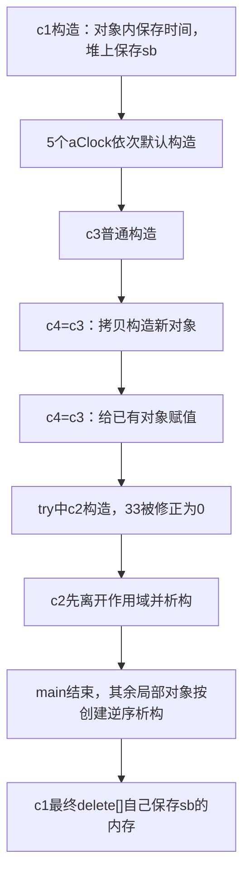
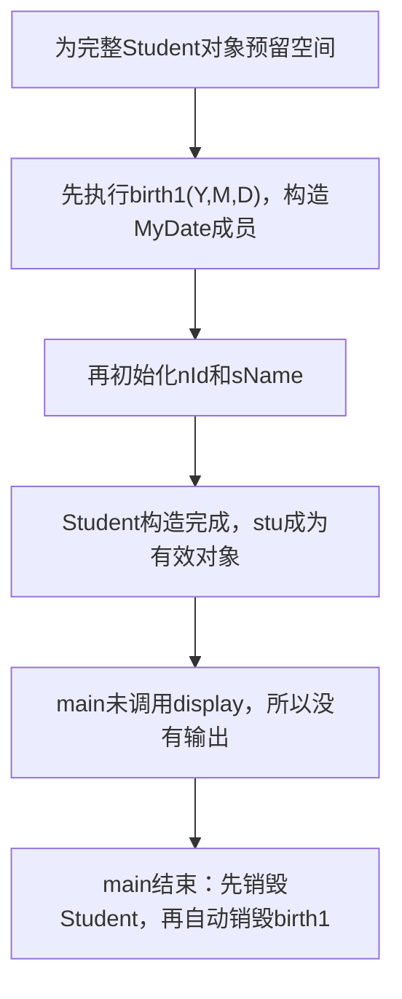
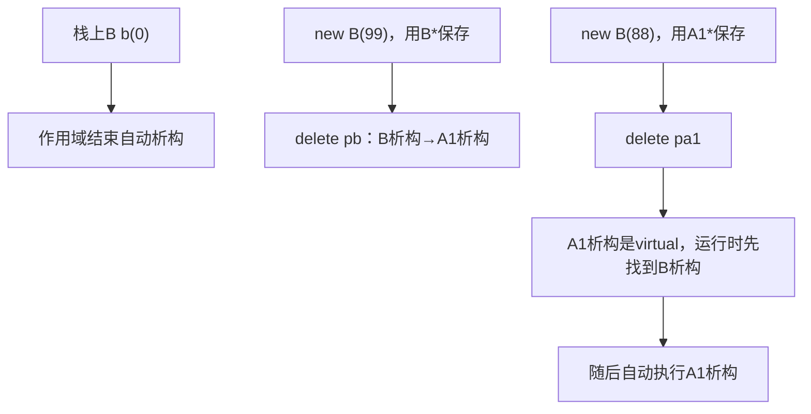
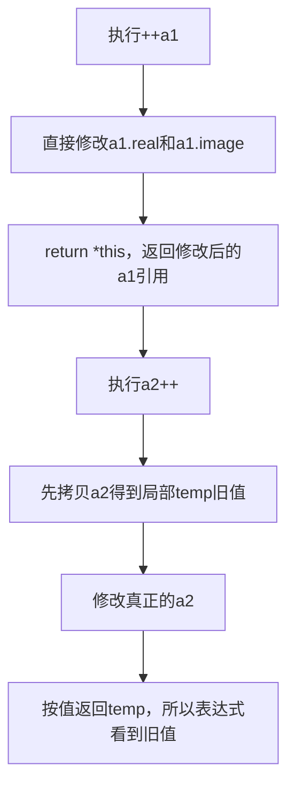
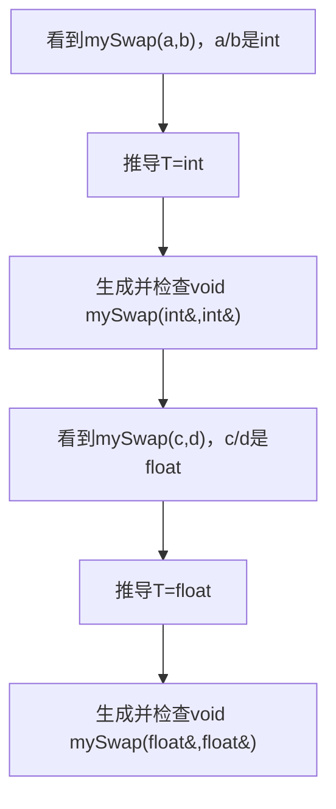
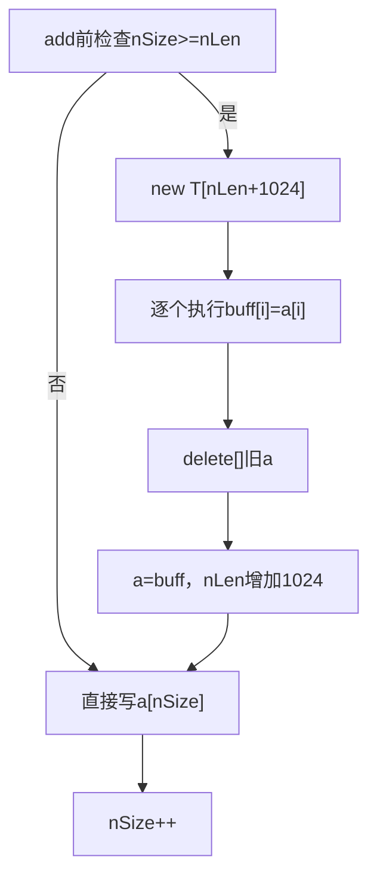
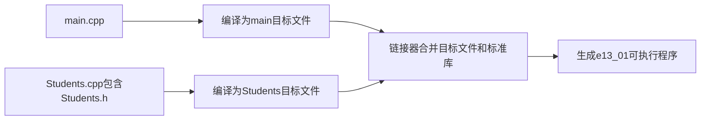

# 面向对象程序设计项目全量新手教程

> 本教程严格按照项目目录顺序讲解，不跳过任何代码集：`e02_01 → e03_01 → e04_01 → e04_02 → e05_01 → e05_02 → e07_01 → e07_02 → e08_01 → e08_02 → e09_01 → e09_02 → e11_01 → e11_02 → e12_01 → e12_02 → e13_01`。

## 开始之前：怎样读这套代码

这套项目不是一个大程序，而是一系列各自拥有 `main()` 的小实验。每个目录只负责验证一组新知识，后面的代码会复用前面的概念。你不应该把不同目录的 `main.cpp` 合并，否则会出现多个 `main()`。

每一讲都按同一逻辑展开：

1. **承接关系**：它建立在哪个前置实验上；
2. **本讲目标**：运行后应看懂什么；
3. **生活类比**：先建立直觉，再学术语；
4. **最小修正版代码**：保留你的类名、变量名、流程和代码风格，只修确切错误；
5. **执行流程和内存图**：解释程序按什么顺序运行；
6. **逐段拆解**：解释为什么这样写，而不是复述注释；
7. **新手补课与发散**：补上代码默认你已经知道的知识；
8. **易错点与思考题**：用来确认是否真正理解。

代码中的 `// 修正` 是对原文件的必要修复，`// 验证` 说明 `main()` 中这句代码在测试什么。没有 `// 修正` 的地方即使存在更现代的写法，也不会擅自替换。

编译单个目录可使用其中的 CMake 配置，也可直接执行 `g++ -std=c++20 -Wall -Wextra -pedantic main.cpp -o main`。`e13_01` 有多个源文件，需要同时编译 `main.cpp Students.cpp`。

## 第 1 讲：`e02_01` 类、对象与深拷贝

### 承接关系与本讲目标

这是教程中第一个真正的 OOP 实验，没有前置类知识。本讲一次出现了类、对象、构造、析构、拷贝、赋值、引用、动态内存和 `const`。初看信息很多，因此先抓住一条主线：**对象从出生到销毁，必须始终知道自己拥有哪些数据和资源。**

学完后，你应该能够区分：

- `Clock` 类与 `c1` 对象；
- 构造新对象与给已有对象赋值；
- 引用别名与对象副本；
- 指针地址的浅拷贝与指向内容的深拷贝；
- `new[]` 申请与 `delete[]` 释放。

### 生活类比：类是户型图，对象是具体房屋

户型图规定每间房有几个房间，但图纸本身不是可以入住的房子。`Clock` 是图纸，`Clock c1` 才是具体对象。`H、M、S` 像房屋内部固定空间，直接属于每个对象；`pBuff` 像一张仓库提货单，里面只保存另一块内存的地址。

复制普通成员等于按尺寸重新建房。复制裸指针却只是复印提货单：两个对象会指向同一个仓库。若两个对象都在析构时拆掉这个仓库，就会重复释放。因此，拥有动态资源的类必须明确复制策略。

### `e02_01/main.cpp` 最小修正版

```cpp
#include<iostream>
#include<cstring>  // 修正：strlen、strcpy需要该头文件
using namespace std;

// 交换函数使用引用，修改的是调用者原变量
void swap(int &a, int &b) {
    int t = a;
    a = b;
    b = t;
};

class Clock {
private:
    // 每个Clock内部直接保存一份时、分、秒
    int H;
    int M;
    int S;
    // pBuff保存动态字符数组的地址；Clock负责释放它
    char *pBuff;
public:
    // 构造函数：初始化时间，并根据s是否为空决定是否申请内存
    Clock(int H=1, int M=2, int S=3,const char *s =NULL){
        if (H<0 || H>=24) {
            H=0;
        }
        this->H=H;
        this->M=M;
        this->S=S;
        cout<<"构造被调用"<<endl;
        if (s==NULL) {
            pBuff=NULL;
        }
        else {
            pBuff=new char[strlen(s)+1];
            strcpy(pBuff,s);
        }
    }

    // 拷贝构造：用src创建一个新Clock，并复制出独立字符数组
    Clock(const Clock& src) {
        H=src.H;
        M=src.M;
        S=src.S;
        cout<<"拷贝构造"<<endl;

        if (src.pBuff==NULL) {
            pBuff=NULL;
        }
        else {
            // 修正：原代码错误地对尚未初始化的pBuff求长度
            pBuff=new char[strlen(src.pBuff)+1];
            // 修正：申请空间后还必须复制实际字符
            strcpy(pBuff,src.pBuff);
        }
    }

    // 修正：类拥有动态资源，必须补上深拷贝赋值
    Clock& operator=(const Clock& src) {
        // c=c时左右是同一对象，不需要做任何事
        if (this==&src) {
            return *this;
        }

        // 先准备新内存；若new失败，当前对象仍保留旧内容
        char *newBuff=NULL;
        if (src.pBuff!=NULL) {
            newBuff=new char[strlen(src.pBuff)+1];
            strcpy(newBuff,src.pBuff);
        }

        // 新内容准备成功后，才释放左对象原来的资源
        delete[] pBuff;
        H=src.H;
        M=src.M;
        S=src.S;
        pBuff=newBuff;
        return *this;
    }

    // 析构函数：对象离开生命周期时归还自己拥有的动态内存
    ~Clock() {
        if (pBuff!=NULL) {
            cout<<"析构将释放："<<pBuff<<endl;
            delete[] pBuff;
        }
        else {
            cout<<"析构，pbuff为空"<<endl;
        }
    }

    // const表示显示函数承诺不修改当前对象
    void display() const{
        cout<<H<<":"<<M<<":"<<S<<endl;
    }
};

int main() {
    // 验证1：完整参数构造；c1独立申请内存保存"sb"
    Clock c1(0,0,0,"sb");
    c1.display();

    // 验证2：对象数组中5个元素都使用默认参数构造
    Clock aClock[5];

    // 验证3：只传H，M和S继续使用默认值2、3
    Clock c3(11);

    // 验证4：c4正在出生，所以调用拷贝构造，不是赋值
    Clock c4=c3;

    // 验证5：c4已经存在，所以调用operator=赋值
    c4=c3;

    // 验证6：数组每个默认对象都能调用const显示函数
    for(int i=0;i<5;i++) {
        aClock[i].display();
    }

    try {
        // 验证7：活动构造版本把非法小时33改成0，并没有throw
        Clock c2(33,12,12);
        c2.display();
    }catch(char const* e) {
        cout<<e<<endl;
    }

    // 验证8：bb是aa的别名，通过bb赋值会直接改变aa
    int aa=888;
    int &bb=aa;
    bb=666666;
    cout<<"aa="<<aa<<endl;
    cout<<"bb="<<bb<<endl;
    return 0;
}
```

### `e02_01/1.cpp` 为什么是空文件

该目录的 `1.cpp` 当前长度为 0，也就是一个空翻译单元。`CMakeLists.txt` 把它和 `main.cpp` 一起列入目标，但空文件不提供函数、类或变量，不会改变程序行为。

```cpp
// e02_01/1.cpp 当前为空，没有任何声明或可执行语句。
```

编译器会分别编译每个 `.cpp`，再由链接器把结果合并。空文件能正常编译，只是没有贡献代码。以后若把 Clock 定义拆到 `Clock.cpp`，这里才会出现实际实现。

### 执行流程与内存图



深拷贝时可画成：

```text
src.pBuff ──> 地址A："hello\0"
目标.pBuff ──> 地址B："hello\0"    A与B不同
```

错误浅拷贝则是两个箭头都指向地址 A。第一个析构执行 `delete[] A` 后，另一个指针仍保存 A，但 A 已无效；第二次删除会产生未定义行为。

### 逐段拆解与新手补课

**为什么构造函数没有返回类型？**构造函数的名字与类相同，职责是让一块刚分配的对象存储进入有效状态。它不是普通“计算并返回结果”的函数，因此连 `void` 都不写。

**`this->H=H` 左右分别是谁？**形参 H 会遮住同名成员。`this` 是当前对象地址，`this->H` 是对象成员，右侧 H 是调用者传入的形参。可以把 `c1` 构造时的 this 想成 `&c1`。

**为什么 `strlen(s)+1`？**C 字符串以不可见的 `\0` 结尾，`strlen` 只数可见字符。`"sb"` 的可见长度为 2，实际需要 3 个 char。

**为什么拷贝构造参数必须是引用？**若写成按值参数，为了创建这个参数又要调用拷贝构造，拷贝构造还需要再创建参数，形成无限递归。`const Clock&` 是“只借来读，不复制、不修改”。

**`Clock c4=c3` 为什么不是赋值？**判断关键不是有没有等号，而是左边对象是否已经存在。c4 此刻正在被定义，所以调用拷贝构造。下一行 c4 已存在，才调用赋值运算符。

**为什么赋值先申请后删除？**如果先删除旧 pBuff，随后 `new` 因内存不足抛异常，左对象已经失去旧数据。先准备新资源，成功后再替换，可保证失败时旧对象不变。

**为什么 try 没进入 catch？**写了 try 不会自动产生异常。当前活动构造函数只是把非法 H 改成 0。源文件前面被注释掉的另一个构造版本才写了 `throw`。必须执行 throw，控制流才跳到匹配 catch。

> 发散：这个类手工拥有资源，所以要考虑析构、拷贝构造、拷贝赋值，称为“规则之三”。现代业务代码用 `std::string` 保存文本后，标准库会处理复制与释放，业务类通常不再需要手写这三个函数，称为“规则之零”。这里保留裸指针，是为了看清底层问题。

### 常见误区与思考题

- 误区：`new[]` 只是申请空间，会自动复制字符串。实际上还要 `strcpy`。
- 误区：引用 `bb` 是第二个整数。实际上内存中只有 aa 那个整数。
- 误区：只写析构就安全。若复制仍共享地址，析构反而触发重复释放。
- 误区：`delete pBuff` 与 `delete[] pBuff` 一样。数组申请必须配对数组释放。

思考：如果 `Clock a(1,2,3,"A"); Clock b=a;`，a 与 b 的 pBuff 地址应相同吗？内容应相同吗？为什么？

## 第 2 讲：`e03_01` 对象成员、初始化列表与类外定义

### 承接关系与本讲目标

上一讲的 Clock 只由整数和指针组成。本讲让 `Student` 内部直接拥有一个 `MyDate birth1`，引出**组合**：一个对象可以是另一个对象的成员。

学完后，你应能解释：

- 为什么 Student 构造前必须先构造 birth1；
- 初始化列表 `:birth1(Y,M,D)` 在什么时候执行；
- `Student::display` 中的 `::` 是什么；
- 类内声明与类外定义如何配对；
- `inline` 只是允许内联，不保证一定展开；
- 为什么源程序的 main 没有输出。

### 生活类比：学生“有一个”生日

学生不是日期，因此不能说 Student 继承 MyDate；学生拥有一个出生日期，最自然的表达是把 MyDate 对象放进 Student。组合表达“has-a（有一个）”，继承表达“is-a（是一个）”。这条判断会贯穿后续所有设计。

### `e03_01/main.cpp` 最小修正版

```cpp
#include <iostream>
#include <cstring>  // 修正：strcpy、strncpy需要
using namespace std;

// MyDate只负责维护和显示一个日期
class MyDate {
private:
    int Year;
    int Month;
    int Day;
public:
    MyDate(int Y, int M, int D) {
        if (Y<1900||Y>2500) {
            Y=1900;
        }
        if (M<1||M>12) {
            M=1;
        }
        if (D<1||D>31) {
            D=1;
        }
        this->Month=M;
        this->Day=D;
        this->Year=Y;
    }

    void display() const{
        cout<<Year<<"/"<<Month<<"/"<<Day<<"/"<<endl;
    }
};

// Student组合了一个MyDate对象，表达“学生有一个生日”
class Student {
public:
    // 这里只有静态成员声明；当前程序没有使用它
    static int nCout;
private:
    int nId;
    char sName[11];
    MyDate birth1;

public:
    Student(int nId=0, const char *sName=NULL,int Y=0,int M=0,int D=0)
        // birth1没有无参构造，必须在进入Student函数体前构造
        :birth1(Y,M,D) {
        this->nId=nId;
        if (sName==NULL) {
            strcpy(this->sName,"Noname");
        }
        else {
            // 修正：限制复制长度，防止姓名写出11字节数组
            strncpy(this->sName,sName,sizeof(this->sName)-1);
            this->sName[sizeof(this->sName)-1]='\0';
        }
    }

    // 类内只声明，具体实现放在类外
    inline void display()const;
};

// Student::表示下面定义的是Student类的成员函数
void Student::display() const {
    cout<<nId<<"\t"<<sName<<"\t";
    birth1.display();
    cout<<endl;
}

int main() {
    // 验证1：构造Student前，先用2026、6、6构造其中的birth1
    Student stu(2025000001,NULL,2026,6,6);

    // 原代码没有调用stu.display()，因此运行后没有任何输出
    // 若要观察对象内容，可取消下一行注释：
    // stu.display();
    return 0;
}
```

### 执行流程与对象布局



对象可抽象为：

```text
Student stu
├─ nId
├─ sName[11]
└─ birth1（完整MyDate对象）
   ├─ Year
   ├─ Month
   └─ Day
```

birth1 不是一个悬空地址，而是 Student 对象内部的一部分。Student 生命周期包含 birth1 生命周期。

### 逐段拆解与新手补课

**为什么 birth1 必须出现在初始化列表？**进入 Student 构造函数体之前，所有成员已经开始构造。整数可以先得到未指定值再赋值，但 MyDate 只有带三个参数的构造函数，没有 `MyDate()`。编译器必须在函数体之前知道怎样创建它。

**成员构造顺序看哪里？**顺序按成员在类中声明的顺序，不按初始化列表书写顺序。本例先 nId、再 sName、再 birth1；只有 birth1 显式出现在列表，其他成员在函数体赋值。实践中通常也把 nId 放进初始化列表，但为了保留原代码风格，这里不改写。

**`Student::display` 的双冒号是什么？**`::` 是作用域限定符。类外存在很多名为 display 的函数，`Student::display` 明确表示它属于 Student。函数体内因此可以直接访问 nId、sName、birth1。

**什么是 inline？**它最初用于建议编译器把函数调用展开，省去调用开销；现代编译器会自行决定，写 inline 不保证展开。更重要的现代含义是允许同一定义出现在多个翻译单元。源代码在类内声明处写 inline、类外定义却没重复写，当前单文件仍能工作；若放进头文件，定义处也应保证 inline 语义。

**静态 `nCout` 为什么没定义也能编译？**程序只声明它，没有读取、写入或取地址，因此链接器不需要实际存储。一旦使用 `Student::nCout`，传统写法还要在类外提供 `int Student::nCout=0;`。这项知识会在下一讲真正运行验证。

**日期校验完整吗？**当前只检查日是否在 1 到 31，没有区分二月、大小月和闰年。这不导致内存错误，但业务校验不完整。面向对象的意义之一，就是把将来更严格的日期规则集中在 MyDate，而不是散落到 Student。

### 常见误区与思考题

- 误区：Student 继承了 MyDate。实际是组合，Student 内部有一个 MyDate。
- 误区：进入 Student 构造函数体后 birth1 才出现。它在函数体执行前已构造。
- 误区：main 创建对象就一定有输出。只有执行输出语句或构造函数自己输出才会显示。
- 误区：`strcpy` 会自动知道目标数组大小。它不会，因此原写法可能越界。

思考：如果 MyDate 增加默认构造函数，能否删掉 `:birth1(Y,M,D)`？能编译与“生日是否符合传入参数”是同一问题吗？

## 第 3 讲：`e04_01` 静态成员、友元、指针与引用

### 承接关系与本讲目标

上一讲只是声明 static，本讲用 `Clock::nNum` 实际统计对象数量，并同时观察按值传参、引用、动态单对象和动态数组。

目标是能在不运行程序前预测每一处 `nNum` 变化，并理解友元为什么既方便又会越过封装。

### 生活类比：每只钟有时间，工厂只有一块总数牌

H、M、S 属于具体钟；总数牌 nNum 属于整个 Clock 类。新钟出厂，牌子加一；钟销毁，牌子减一。静态成员函数 objNum 像任何人都能查看的工厂总数窗口，它不需要指定哪一只钟。

### `e04_01/main.cpp` 最小修正版

```cpp
#include<iostream>
using namespace std;

class Clock;

class Clock {
private:
    int H,M,S;
    // 所有Clock共享一份nNum
    static int nNum;
public:
    // 静态函数没有this，只读取类共享计数
    static int objNum() {
        return Clock::nNum;
    }

    Clock(int H=0,int M=0,int S=0) {
        this->H=H;
        this->M=M;
        this->S=S;
        Clock::nNum++;
    }

    // 用现有Clock创建新对象时也必须增加计数
    Clock(const Clock &c) {
        cout<<"拷贝构造"<<endl;
        H=c.H;
        M=c.M;
        S=c.S;
        Clock::nNum++;
    }

    ~Clock() {
        nNum--;
    }

    // showClock不是成员，但获得读取私有H、M、S的权限
    friend void showClock(Clock c);
};

// 类内只有声明；这里才定义并初始化共享存储
int Clock::nNum=0;

void showClock(Clock cl) {
    // cl是按值形参，调用期间它是一个新Clock对象
    cout<<"duixianggeshu"<<Clock::objNum()<<endl;
    cout<<cl.H<<cl.M<<cl.S<<endl;
    // 修正：原代码为return cl，但void函数不能返回对象
    return;
}

int main() {
    // 验证1：构造c1，计数0→1
    Clock c1;
    // 验证2：只声明指针，没有Clock对象，计数不变
    Clock *p1=NULL;
    // 验证3：拷贝构造c2，计数1→2
    Clock c2=c1;
    // 验证4：c3只是c1别名，不创建对象
    Clock &c3=c1;

    // 验证5：按值形参临时增加一个对象，函数返回后又减少
    showClock(c1);

    cout<<"duixianggeshu"<<Clock::objNum()<<endl;
    // 验证6：new创建动态对象，计数加1
    p1=new Clock(8,59,45);
    cout<<"duixianggeshu"<<Clock::objNum()<<endl;
    // 验证7：delete触发析构，计数减1
    delete p1;
    cout<<"duixianggeshu"<<Clock::objNum()<<endl;

    // 验证8：动态数组调用100次构造
    p1=new Clock[100];
    cout<<"duixianggeshu"<<Clock::objNum()<<endl;
    // 验证9：局部数组再调用100次构造
    Clock a[100];
    cout<<"duixianggeshu"<<Clock::objNum()<<endl;

    // 验证10：delete[]触发动态数组100个元素的析构
    delete[] p1;
    cout<<"duixianggeshu"<<Clock::objNum()<<endl;
    return 0;
}
```

### 执行流程与计数表

| 语句后 | 新发生的事 | `nNum` |
| --- | --- | ---: |
| `Clock c1;` | 创建 c1 | 1 |
| `Clock *p1=NULL;` | 只有指针 | 1 |
| `Clock c2=c1;` | 创建 c2 | 2 |
| `Clock &c3=c1;` | 只有别名 | 2 |
| 进入 `showClock` | 创建形参 cl | 3 |
| 离开 `showClock` | 销毁 cl | 2 |
| `new Clock` | 创建动态对象 | 3 |
| `delete p1` | 销毁动态对象 | 2 |
| `new Clock[100]` | 创建 100 个 | 102 |
| `Clock a[100]` | 再创建 100 个 | 202 |
| `delete[] p1` | 销毁动态 100 个 | 102 |
| main 结束 | 销毁 a、c2、c1 | 0 |

### 逐段拆解与新手补课

**静态成员为什么类外定义？**类声明只告诉编译器“存在一个共享整数”。`int Clock::nNum=0` 才在某个翻译单元分配唯一存储。C++17 也可用 `inline static int nNum=0`，但这里保留你的传统写法。

**静态函数为什么不能直接读 H？**objNum 没有 this，不知道你想读 c1.H 还是 c2.H。它只能直接访问 nNum，或让调用者显式传入某个 Clock。

**友元是不是成员？**不是。showClock 仍是全局函数，没有 this，也不能通过 `c1.showClock()` 调用。friend 只授予它访问私有成员的权限。

**为什么按值传参会增加对象数？**形参 cl 有自己的存储和生命周期，它由 c1 拷贝构造。若改为 `const Clock& cl`，只产生别名，不增加计数。

**指针、引用、对象怎样快速区分？**对象负责自己的构造析构；指针保存地址且可以为空；引用必须绑定某个已有对象且通常不能改绑。声明一个指针或引用都不会调用 Clock 构造。

> 发散：当前计数器在单线程示例中正确。若多个线程同时构造 Clock，普通 `nNum++` 可能发生数据竞争，需要互斥量或原子类型。这说明“全类共享”也意味着共享状态的并发风险。

### 常见误区与思考题

- 误区：`Clock *p1` 已经创建 Clock。它只创建一个地址变量。
- 误区：`Clock &c3` 会拷贝 c1。它只是别名。
- 误区：静态成员属于第一个对象。它不属于任何单个对象。
- 误区：友元函数就是类的公有成员。它仍是类外函数。

思考：把 `showClock(Clock cl)` 改成 `showClock(const Clock &cl)` 后，函数内部第一次输出的对象数是多少？为什么？

## 第 4 讲：`e04_02` 最基础的单继承

### 承接关系与本讲目标

前面几个实验都只有独立类。本讲第一次让 B 从 A1 派生，目标不是马上学多态，而是先回答三个基础问题：B 对象里面有什么、B 怎样构造 A1 部分、三种访问权限对派生类意味着什么。

### 生活类比：学生档案先包含“人”的基础档案

如果 B 是 A1 的更具体类型，可以把 B 对象想成一个大档案袋，其中先放 A1 的基础档案，再放 B 新增内容。即使 B 不能直接打开 A1 的 private 小信封，那个信封仍真实存在于 B 对象中。

### `e04_02/main.cpp` 最小修正版

```cpp
#include <iostream>
using namespace std;

class A1 {
private:
    // private：只有A1自己的成员函数能直接访问
    int x;
protected:
    // protected：A1和派生类能访问，类外不能访问
    int y;
public:
    // public：类外也能访问
    int z;
public:
    A1(int x=0,int y=0,int z=0)
        :x(x),y(y),z(z) {
    }

    void display() const{
        cout<<x<<" "<<y<<" "<<z<<endl;
    }
};

// public继承表示B承诺“是一个A1”
class B : public A1 {
public:
    // 构造B时先构造其中的A1基类子对象
    B():A1(6,66,666){}
};

int main() {
    // 验证1：创建B时，A1的x、y、z是否按6、66、666构造
    B b;
    // 修正：原代码cout<<x既没有对象，也试图从类外访问private x
    // 验证2：通过继承来的public接口读取完整A1状态
    b.display();
    return 0;
}
```

### 对象布局与执行顺序

```text
B对象 b
└─ A1基类子对象
   ├─ x = 6   （存在，但B和main不能直接访问）
   ├─ y = 66  （B成员函数可访问，main不可访问）
   └─ z = 666 （类外可访问）
```

构造顺序是先 A1 后 B；析构顺序是先 B 后 A1。本例 B 没有新增成员、也没有自定义析构输出，但顺序规则仍然存在。

### 逐段拆解与新手补课

**`class B : public A1` 每部分是什么？**B 是新类名，冒号表示继承列表，public 是继承方式，A1 是直接基类。public 继承下，A1 的 public 接口在 B 中仍保持 public。

**private 成员会不会被继承？**“是否存在”与“能否直接访问”要分开。B 对象包含完整 A1 子对象，所以 x 存在；只是 B 的函数不能写 `x` 直接读取它。B 可以调用 A1 提供的 public/protected 行为间接使用它。

**为什么 `cout<<x` 错？**main 作用域没有局部变量 x，也没有写对象限定；即便写 `b.x`，x 仍是 private。正确做法不是把 x 公开，而是使用 A1 已提供的 display。

**为什么用初始化列表调用 A1？**进入 B 构造函数体前，A1 子对象必须已经有效。`B():A1(6,66,666){}` 选择怎样构造它。不能等进入 `{}` 后再“补构造”。

**什么叫 is-a？**若任何需要 A1 的地方都能合理接受 B，就可说 B 是一个 A1。仅仅为了复用几行代码而继承，可能破坏这种语义；“有一个”通常用组合。

### 易错点与思考题

- private 不等于“不占内存”；它只限制源代码访问。
- protected 不是“半公开”，类外仍不能访问。
- 构造派生类时不是先运行 B 函数体再构造 A1。
- 修复访问错误不应简单把所有数据改成 public。

思考：如果删掉 `B():A1(6,66,666){}`，A1 有默认参数，b 中的三个值会变成什么？

## 第 5 讲：`e05_01` 派生类兼容、虚析构与对象所有权

### 承接关系与本讲目标

上一讲只在栈上创建 B。本讲同时创建栈对象、B 指针指向的堆对象、A1 指针指向的 B 对象，由此引出**向上转换**与**虚析构**。

### 生活类比：用“员工档案”当作“人员档案”查看

员工是人，因此拿到员工档案时，可以只用“人”的视角查看共同信息。这就是 B 指针向 A1 指针的向上转换。视角变窄不等于真实对象缩水：堆上仍是完整 B，只是当前指针只承诺能使用 A1 的接口。

### `e05_01/main.cpp` 原结构代码

```cpp
#include <iostream>
using namespace std;

class A1 {
protected:
    int x;
public:
    A1(int x):x(x){ }

    // 多态基类需要虚析构，确保通过A1*删除B时先析构B
    virtual ~A1() {
        cout<<"A1 destructor  "<<x<<endl;
    }
};

// A2在当前main中没有使用；它为后续多继承概念做准备
class A2 {
protected:
    int x;
public:
    A2(int x):x(x){ }
    virtual ~A2() {
        cout<<"A2 destructor"<<endl;
    }
};

// 修正原注释：当前B只继承A1，并不是“有两个父类”
class B : public A1 {
public:
    // 先用x构造A1基类子对象
    B(int x=0):A1(x){
    }

    ~B() {
        cout<<"B destructor"<<endl;
    }

    void show() const {
        cout<<"B show"<<x<<endl;
    }
};

int main() {
    cout<<"Hello world!"<<endl;

    // 验证1：栈对象b自动构造，并在main结束时自动析构
    B b(0);
    b.show();

    // 验证2：B*直接指向动态B，可调用B自己的show
    B *pb=new B(99);
    pb->show();
    // 验证3：通过B*删除，析构顺序为B→A1
    delete pb;

    // 验证4：允许A1*指向B，称为向上转换或派生类对基类兼容
    A1 *pa1=new B(88);
    // 验证5：通过A1*删除实际B，虚析构仍保证B→A1
    delete pa1;

    return 0;
}
```

本段活动代码可以运行，没有改动逻辑；只修正了原注释中“B 有两个父类”与实际 `class B : public A1` 不一致的问题。

### 三种对象生命周期



### 逐段拆解与新手补课

**向上转换为什么安全？**每个 B 内部都有一份 A1 子对象，因此 B 地址可调整为其 A1 部分地址。反方向不安全：一个普通 A1 不一定含 B 部分，不能凭空当 B。

**`pb->show()` 的箭头是什么？**指针通过 `->` 访问对象成员，`pb->show()` 等价于 `(*pb).show()`。普通对象用点号 `b.show()`。

**为什么析构顺序是 B 再 A1？**销毁完整 B 时，先清理 B 新增资源，再清理它依赖的 A1 基础部分，和构造顺序相反。

**virtual 析构解决什么？**`delete pa1` 的静态指针类型是 A1*，实际对象类型是 B。若 A1 析构非虚，通过基类指针删除派生对象是未定义行为。虚析构让运行时从实际 B 开始完整销毁。

**是不是所有基类析构都“无脑 virtual”？**若类预期被多态使用、可能经基类指针删除，应该 virtual。一个不允许多态删除的工具基类可以使用受保护非虚析构来禁止错误操作。原注释便于记忆，但工程判断应看用途。

**A2 为什么存在却没用？**它是下一讲多继承主题的预备类。未实例化 A2 不会运行构造析构，也不会影响当前输出。阅读代码时要区分“定义了类型”和“创建了对象”。

### 易错点与思考题

- `A1 *pa1=new B` 没有把 B 转换成另一个新 A1 对象，堆上仍是完整 B。
- 基类指针默认只能调用基类声明的接口，即使真实对象还有 B::show。
- `new` 后必须明确谁 delete；指针离开作用域不会自动删除它指向的对象。
- 非虚析构下通过基类指针 delete 派生对象是未定义行为。

思考：为什么 `pa1->show()` 不能编译？真实对象明明是 B，静态类型为什么仍然重要？

## 第 6 讲：`e05_02` 多继承、菱形结构与虚基类

### 承接关系与本讲目标

这是本项目最容易让新手卡住的一讲。先不要背“虚基类”定义，先看普通多继承会制造什么问题。

假设 A 保存成员 x，B1 继承 A，B2 也继承 A，C 同时继承 B1 和 B2：

```text
        A
       / \
     B1   B2
       \ /
        C
```

形状像菱形。如果两条边都是普通继承，C 内部会有两份 A：一份经 B1 路径到达，一份经 B2 路径到达。此时写 `c.x` 不知道选哪份，这叫**二义性**。虚继承就是告诉编译器：在最终完整对象中，两条路径共享同一份 A。

### `e05_02/main.cpp` 原结构代码

```cpp
#include<iostream>
using namespace std;

// A是菱形顶端的公共基类
class A {
protected:
    int x;
public:
    A(int x):x(x){}
    virtual ~A() {
        cout<<"~A()"<<endl;
    }
};

// virtual写在继承关系上：当出现更完整对象时，共享A基类子对象
class B1 : virtual public A {
public:
    // 单独构造B1时，B1就是最派生类，此处A(x)会生效
    B1(int x):A(x){}
    virtual ~B1() {
        cout<<"~B1()"<<endl;
    }
};

class B2 : virtual public A {
public:
    // 单独构造B2时，此处负责构造共享A
    B2(int x):A(x){}
    virtual ~B2() {
        cout<<"~B2()"<<endl;
    }
};

// C同时继承B1和B2，形成菱形底端
class C:public B1,public B2 {
public:
    // 构造完整C时，C是最派生类，由A(10086)唯一决定共享A的x
    C(int x=0,int y=0):B1(x),B2(y),A(10086) {
    }

    virtual ~C() {
        cout<<"~C()"<<endl;
    }

    void show() const {
        // 因虚继承只有一份A::x，所以这里没有二义性
        cout<<"x = "<<x<<endl;
    }
};

int main() {
    // 验证1：B1得到66、B2得到99，但共享A最终由C传入10086构造
    C c(66,99);
    // 验证2：只存在一份A::x，应输出10086
    c.show();
    // 验证3：离开main时观察C→B2→B1→A的逆序析构
    return 0;
}
```

### 普通继承和虚继承的内存差异

不写 virtual 时，概念布局为：

```text
C
├─ B1
│  └─ A（x = 66）
└─ B2
   └─ A（x = 99）
```

此时 `x` 有两份，只能写 `B1::x` 或 `B2::x` 指定路径，而且把 C 当成 A 时也有两条转换路径。

写 `B1 : virtual public A`、`B2 : virtual public A` 后：

```text
C
├─ B1 ─┐
├─ B2 ─┼──> 共享的唯一A（x = 10086）
└──────┘
```

真实编译器布局可能包含用于定位虚基类的隐藏指针或偏移，标准不规定必须怎样实现；学习阶段抓住“一份共享 A”即可。

### “虚基类”和“最远派生类”逐字解释

**虚基类是什么？**A 本身没有在类声明上写“我是虚基类”。只有在关系 `B1 : virtual public A` 中，A 才是 B1 的虚基类。virtual 修饰的是**继承路径**，表示在更大的完整对象中共享该基类子对象。

**最远派生类是什么？**更准确的标准术语是“最派生类（most-derived class）”，不是“最远虚基类”。它指当前正在创建的**完整对象的真实最终类型**：

- 写 `B1 b(66);` 时，完整对象就是 B1，所以 B1 是最派生类，`B1(int):A(x)` 负责构造 A；
- 写 `C c(66,99);` 时，完整对象是 C，所以 C 是最派生类，`C(...):A(10086)` 负责构造唯一 A；
- B1、B2 在 C 内只负责自己的直接部分，它们初始化列表中的 A(x)、A(y) 对共享 A 不生效。

**为什么必须让最派生类决定？**若 B1 想用 66 构造共享 A，B2 又想用 99 构造同一 A，编译器无法同时满足。完整对象 C 最了解两条路径怎样组合，所以由 C 统一选择一次。

### 精确构造与析构顺序

构造 `C c(66,99)` 时：

1. 先构造所有虚基类，本例执行 `A(10086)`；
2. 按 C 继承列表顺序构造直接基类，先 B1 后 B2；
3. 再构造 C 自己的数据成员（本例没有）；
4. 最后执行 C 构造函数体。

析构完全相反：C、B2、B1、A。输出正好帮助验证这一顺序。

### 它和虚函数有什么关系？

除了共用关键字 virtual，两者解决的问题完全不同：

| 语法 | 解决的问题 | 发生阶段 |
| --- | --- | --- |
| `virtual void say()` | 基类指针调用哪个覆盖函数 | 运行时动态分派 |
| `class B1 : virtual public A` | 菱形中保存几份 A 子对象 | 对象布局与构造 |

不要因为都叫“虚”就把它们当成同一个机制。虚继承不自动让普通函数具有多态；虚函数也不会自动消除重复基类。

### 什么时候该用虚继承

典型例子是标准输入输出流的多继承体系，或确实需要共享同一语义基类的菱形结构。但虚继承会增加对象布局、构造责任和理解成本。业务设计中通常先考虑：能否用组合？能否让 B1、B2 只继承无状态接口？不是看到菱形就机械加 virtual，而是判断是否真的需要“共享同一 A 身份”。

### 易错点与思考题

- virtual 写在 B1、B2 的继承列表，不是写成 `virtual class A`。
- 构造完整 C 时，B1 的 A(x) 和 B2 的 A(y) 不决定共享 A。
- “最派生类”随实际创建的完整对象变化，不永远是源码层级最下面那个名字。
- 域限定能选择两份普通 A，但没有消除重复存储；虚继承才共享一份。
- 同名覆盖只是新增 C::x，会遮住基类 x，不等于解决两个 A 身份问题。

思考：如果删掉 C 初始化列表中的 `A(10086)`，而 A 没有默认构造函数，为什么编译失败？若给 A 增加默认构造，最终 x 会取哪个值？

## 第 7 讲：`e07_01` 运算符重载与前置、后置自增

### 承接关系与本讲目标

前面学习的是类型之间的继承关系。本讲回到单个类，研究怎样让 `Complex` 对象支持 `+、-、++`。运算符重载有时叫“编译期多态”：编译器根据操作数静态类型决定调用哪个函数；它不同于下一讲之后由 virtual 实现的运行时多态。

### 生活类比：同一个加号遵守不同类型的加法规则

`1+2` 使用整数规则，`1.5+2.3` 使用浮点规则，两个复数相加要分别加实部和虚部。符号没变，但编译器选择的函数不同。重载不是创造一个全新符号，而是给已有符号补充“遇到 Complex 时怎么办”。

### `e07_01/main.cpp` 原结构代码

```cpp
#include <iostream>
using namespace std;

class Complex {
private:
    float real;
    float image;
public:
    // 默认参数允许Complex c;创建0+0i
    Complex(float r=0.0f,float i=0.0f)
        :real(r),image(i){
    };

    // 成员形式减法：左操作数是*this，a是右操作数
    Complex operator - (const Complex &a) {
        return Complex(real-a.real,image-a.image);
    };

    // 类外加法函数需要读取私有成员，因此声明为友元
    friend Complex operator +(const Complex &a1,const Complex &c2);

    // 前置++：先修改当前对象，表达式代表修改后的当前对象
    const Complex &operator ++ () {
        real+=1.0f;
        image+=1.0f;
        return *this;
    }

    // 后置++：int是区分前后置的哑元参数
    const Complex operator ++ (int) {
        // 先保存旧值
        Complex temp=*this;
        // 再修改真实对象
        real+=1.0f;
        image+=1.0f;
        // 按值返回旧副本，不能返回局部temp的引用
        return temp;
    }

    void display() const {
        cout<<real<<" + "<<image<<"i"<<endl;
    };
};

// 非成员友元形式的加法有两个显式操作数
Complex operator + (const Complex &c1,const Complex &c2) {
    return Complex(c1.real+c2.real,c1.image+c2.image);
}

int main() {
    Complex a1(1.6,2.3);
    Complex a2(1.6,6.6);
    Complex c;

    // 验证1：显式成员调用和减号表达式调用的是同一函数
    c=a1.operator-(a2);
    c=a1-a2;
    c.display();

    // 验证2：a1+a2调用类外友元operator+
    c=a1+a2;
    c.display();

    // 验证3：前置++显示修改后的a1
    a1.display();
    (++a1).display();

    // 验证4：后置++表达式显示旧值；a2本身已经增加
    a2.display();
    (a2++).display();

    return 0;
}
```

活动代码本身可运行，没有做风格替换。现代惯例通常让 `operator-` 带右侧 `const`，前置 `++` 返回非 const 引用，但原写法在当前调用中没有正确性错误。

### 表达式怎样还原为函数

| 表达式 | 概念上的函数调用 |
| --- | --- |
| `a1-a2` | `a1.operator-(a2)` |
| `a1+a2` | `operator+(a1,a2)` |
| `++a1` | `a1.operator++()` |
| `a2++` | `a2.operator++(0)` |

编译器传给后置版本的 0 只是区分签名，函数通常不使用它。

### 前置和后置的内存过程



### 逐段拆解与新手补课

**为什么参数用 `const Complex&`？**引用避免按值复制，const 保证计算不修改右操作数。它表示“借来读取”。

**为什么加减返回对象值？**结果是一个新复数，不属于任何一个旧对象。返回局部对象引用会悬空；按值返回符合语义，编译器通常还能做返回值优化。

**friend 是必须的吗？**非成员加法若要直接读 private real/image，需要友元；若类提供 `real()`、`image()` 公有查询，非成员函数也可不做友元。流运算符必须是非成员形式，亦不代表必然必须 friend。

**为什么后置不能把 temp 改成 static 来返回引用？**static 会让所有对象、所有调用共享同一个旧值缓存，连续表达式和多线程都互相覆盖。这只是掩盖悬空引用，不是修复。

**哪些运算符不能重载？**`.`、`.*`、`::`、`?:` 等不能重载。即使可以重载，也应保持直觉：`+` 不应偷偷删除文件或修改无关全局状态。

### 易错点与思考题

- `a++` 的表达式值是旧值，但 a 自身在语句后已经变化。
- `return *this` 返回当前对象；this 是指针，`*this` 才是对象。
- 友元能跨过 private，使用过多会削弱封装。
- 运算符重载不会改变原有优先级和操作数个数。

思考：为什么 `operator+=` 通常返回 `Complex&`，而 `operator+` 返回新的 `Complex` 值？

## 第 8 讲：`e07_02` 下标重载、边界检查与 resize

### 承接关系与本讲目标

上一讲重载数学符号，本讲让自定义动态数组像普通数组一样写 `a[i]`。关键不只是语法好看，而是让返回值可以作为左值，并由类集中检查越界。

### 生活类比：储物柜编号与扩建

MyArray 像有 nSize 个柜门的储物柜。`operator[]` 根据编号交出对应柜格本身，而不是柜格内容的照片，所以调用者能往里面写。`resize` 像换一排更长或更短的柜子：必须先建新柜、搬走能保留的物品，再拆旧柜。

### `e07_02/main.cpp` 最小修正版

```cpp
#include <iostream>
#include <cstring>  // 修正：memset、memcpy需要
using namespace std;

class MyArray {
private:
    // 保留原代码“禁止赋值”的意图，用=delete明确表达
    MyArray& operator=(const MyArray&)=delete;
    int *a;
    int nSize;

public:
    MyArray(int nSize=100):nSize(nSize) {
        // 修正：负长度转成巨大无符号申请会产生严重问题
        if (nSize<1)throw "MyArray大小必须大于0";
        a=new int[nSize];
        memset(a,0,nSize*sizeof(int));
    };

    // 深拷贝：新数组拥有独立空间
    MyArray(const MyArray &src) {
        nSize=src.nSize;
        a=new int[nSize];
        memcpy(a,src.a,src.nSize*sizeof(int));
    }

    ~MyArray() {
        delete[] a;
    }

    // 返回int&，所以a[i]可以出现在赋值号左边
    int &operator[](int i) {
        // 修正：负数和等于nSize都越界
        if (i<0 || i>=nSize) {
            throw "MyArray：下标越界";
        }
        return *(a+i);
    }

    void display() {
        for (int i=0;i<nSize;i++) {
            cout<<"\t"<<a[i];
            if ((i+1)%8==0)cout<<endl;
        }
    }

    int size() {
        return nSize;
    }

    void resize(int nSize2) {
        if (nSize2<1)throw "MyArray大小必须大于0";
        if (nSize==nSize2)return;

        // 修正：新空间应按新大小全部清零
        int *p=new int[nSize2];
        memset(p,0,nSize2*sizeof(int));

        // 修正：只能复制新旧大小中较小的那一段
        int copySize=nSize<nSize2?nSize:nSize2;
        memcpy(p,a,copySize*sizeof(int));

        delete[] a;
        a=p;
        // 修正：无论扩容还是缩容，都必须更新逻辑大小
        nSize=nSize2;
    }
};

int main() {
    try {
        // 验证1：构造30个整数，memset后全部为0
        MyArray a(30);
        a.display();
        cout<<endl;

        // 验证2：i为0到29时，operator[]返回引用并写入平方
        // i到30时触发越界异常；后面的循环和display都不再执行
        for (int i=0;i<a.size()+100;i++) {
            a[i]=i*i;
        }
        a.display();
    }
    catch (const char *msg) {
        // 验证3：捕获operator[]抛出的错误文字
        cout<<msg<<endl;
    }
    return 0;
}
```

### 原 resize 错在哪里

原代码扩容时写了 `memset(p,0,nSize*sizeof(int))`，只清零旧大小；紧接着却写 `memcpy(p,a,nSize2*sizeof(int))`，按新大小从旧数组读取。若从 30 扩到 100，它会从只有 30 个元素的旧数组读 100 个元素，发生越界读取。

修正原则是：

```text
新空间大小 = nSize2
清零数量   = nSize2
可复制数量 = min(nSize, nSize2)
最终大小   = nSize2
```

这也自然支持缩小：只能保留新空间容得下的前几个元素。

### `int&` 为什么重要

若 `operator[]` 返回 int 值，`a[i]` 只是底层元素的临时副本，不能可靠作为赋值左值。返回 `int&` 相当于把实际柜格交给调用者：

```text
a[i] = i*i
  ↓
operator[](i) 返回底层 a[i] 的引用
  ↓
赋值直接写进动态数组
```

常量数组还应再提供 `const int& operator[](int) const` 版本，只允许读取。原代码没有 const 使用场景，因此这里保留主结构并在正文补充。

### 异常怎样改变控制流

循环在 i=30 时 `throw`，程序立即离开 operator[]、离开 for、离开 try，直接进入 catch。因此 try 中第二次 `a.display()` 不会运行。catch 结束后，局部 a 已在离开 try 作用域时析构并释放数组。

### 易错点与思考题

- 长度 n 的合法下标范围是 `[0,n)`，n 本身已越界。
- 只判断 `i>=nSize` 会放过负数。
- `memcpy` 按字节工作，适合这里的 int，不可随意复制有资源的复杂对象。
- 私有赋值函数用 throw 禁用不如 `=delete` 清楚，后者在编译期直接拒绝。

思考：若先写入 30 个平方，再执行 `resize(10)`，哪些值会保留？若再扩到 20，新增加的 10 个值应是什么？

## 第 9 讲：`e08_01` 虚函数与运行时多态

### 承接关系与本讲目标

`e07` 的运算符由编译器根据静态类型选择。本讲的 `say()` 则通过 A 指针在运行时根据真实对象选择 A、B 或 C 的实现。

运行时多态要同时满足三项：存在继承关系；基类函数声明 virtual；通过基类引用或指针调用。缺一项都可能看不到动态分派。

### `e08_01/main.cpp` 原结构代码

```cpp
#include <iostream>
using namespace std;

class A {
public:
    // 基类先把共同接口声明为virtual
    virtual void say() {
        cout<<"Hello World A"<<endl;
    }
    virtual ~A() {
        cout<<"析构A"<<endl;
    }
};

class B:public A {
public:
    virtual void say() {
        cout<<"Hello World B"<<endl;
    }
    virtual ~B() {
        cout<<"析构B"<<endl;
    }
};

class C:public A {
public:
    virtual void say() {
        cout<<"Hello World C"<<endl;
    }
    virtual ~C() {
        cout<<"析构C"<<endl;
    }
};

void testsay(A *a[],int size) {
    for (int i=0;i<size;i++) {
        // 同一条调用在运行时进入不同say函数
        a[i]->say();
    }
}

void free(A *a[],int size) {
    for (int i=0;i<size;i++) {
        delete a[i];
    }
}

int main() {
    // 验证1：数组元素的静态类型统一是A*
    A *a[5];
    // 动态类型依次为A、B、C、A、C
    a[0]=new A;
    a[1]=new B;
    a[2]=new C;
    a[3]=new A;
    a[4]=new C;

    // 验证2：应输出A、B、C、A、C各自的say内容
    testsay(a,5);
    // 验证3：通过A*删除，并观察派生析构后再执行A析构
    free(a,5);
    return 0;
}
```

本段活动代码无需修正。现代代码可用智能指针自动管理所有权，但原实验正要展示基类指针删除与虚析构，所以保留 new/delete。

### 静态类型和动态类型

以 `a[1]` 为例：

- 静态类型是写在声明里的 `A*`，决定编译时允许调用哪些名字；
- 动态类型是地址实际指向的 B，决定虚函数运行哪个覆盖版本。

即使编译器常用虚函数表实现，也不必先背内部表结构。可以先理解每个多态对象概念上携带“本对象该用哪组虚函数”的运行时信息，`a[i]->say()` 根据它找到最终函数。

### 对象切片为什么破坏多态

若写 `void testsay(A value)` 并传入 B，形参 value 是一个新 A 对象，只复制 B 中的 A 基类部分，B 部分被切掉。它不再是动态 B。多态参数应写 `A&` 或 `A*`，保留原完整对象身份。

### 构造函数与虚调用

构造函数不能是 virtual。构造 A 部分时 B 部分尚未形成，没有一个完整派生对象可供动态选择。在构造/析构函数内部调用虚函数，也只会分派到当前正在构造或析构的层级，不会进入尚未存在或已经销毁的派生层。

### 易错点与思考题

- 只有同名函数但基类未写 virtual，不会得到基类指针动态分派。
- 派生类可省略重复 virtual；现代代码常写 `override` 让编译器检查签名。
- 基类析构非虚时，通过 A* 删除 B/C 是未定义行为。
- vector 或数组按值保存 A 会切片；应保存指针或智能指针。

思考：若 B 的 say 不小心写成 `void say() const`，它还覆盖 A::say 吗？`override` 能怎样帮助发现？

## 第 10 讲：`e08_02` 纯虚函数、抽象类与接口

### 承接关系与本讲目标

上一讲 A 自己也能创建并提供默认 say。本讲 Shape 只规定“图形必须能求面积”，却不提供通用面积公式，因此把 Area 写成纯虚函数，Shape 成为抽象类。

### 生活类比：统一考试题，不提供统一答案

Shape 像试卷要求“请计算面积”。Rectangle、Circle、Point 必须各写自己的答案。只有题目而没有完整答案的 Shape 不能成为一个可直接使用的具体图形，但可以作为统一阅卷接口。

### `e08_02/main.cpp` 原结构代码

```cpp
#include <iostream>
using namespace std;

class Shape {
public:
    Shape() {}
    // 经Shape*删除派生对象，所以析构必须virtual
    virtual ~Shape() {}
    // =0表示纯虚函数，不是“返回0”
    virtual float Area()=0;
};

class Rectangle : public Shape {
private:
    float w,h;
public:
    Rectangle(float w,float h):w(w),h(h) {}
    virtual float Area() {
        return w*h;
    }
    virtual ~Rectangle() {}
};

class Circle : public Shape {
private:
    float r;
public:
    Circle(float r) {this->r=r;}
    virtual float Area() {
        return r*r*3.1415926;
    }
    virtual ~Circle() {}
};

class Point : public Shape {
public:
    Point() {}
    virtual float Area() {
        return 0;
    }
    virtual ~Point() {}
};

void showArea(Shape *s[],int size) {
    for (int i=0;i<size;i++) {
        cout<<s[i]->Area()<<endl;
    }
}

void freeShape(Shape *s[],int size) {
    for (int i=0;i<size;i++) {
        delete s[i];
    }
}

int main() {
    // Shape *p=new Shape; // 错误：抽象类不能创建对象
    // 验证1：抽象类指针数组可以统一保存具体派生对象
    Shape *a[3];
    // 验证2：Rectangle面积为5*5=25
    a[0]=new Rectangle(5,5);
    // 验证3：Circle面积约为78.5398
    a[1]=new Circle(5);
    // 验证4：Point完成纯虚函数后可实例化，面积为0
    a[2]=new Point();

    // 验证5：同一Area调用动态选择三套公式
    showArea(a,3);
    freeShape(a,3);
    return 0;
}
```

### 抽象类为什么不能创建对象

若执行 `new Shape`，随后调用 Area，程序没有任何具体公式可运行。编译器因此在创建阶段就拒绝，而不是等运行时出错。指针本身不要求立刻存在 Shape 对象，它可以指向实现完整的 Rectangle 等派生对象，所以 `Shape*` 合法。

### 派生类怎样从抽象变具体

派生类必须实现所有继承来的纯虚函数。只实现一部分时，它仍是抽象类。函数签名必须匹配：名称、参数、返回协变规则和 const 限定都很重要。现代代码建议写 `float Area() override`。

### C++ 中“接口”是什么

C++ 没有独立 interface 关键字。主要由纯虚函数和虚析构组成、只规定能力的抽象类常被当作接口。抽象类也允许包含数据成员和普通实现，只是接口风格通常尽量轻量，减少派生类不必要负担。

### 从 Point 发散：能实现不等于建模合理

Point 返回 0 在数学上成立，但仍要问业务系统是否真的把点视为“需要统一求面积的图形”。类型关系不仅看能否写出函数，还看语义是否能替换。若某派生类只能靠无意义返回或抛异常完成接口，可能说明接口边界不合适。

### 易错点与思考题

- `=0` 是纯虚标记；真正返回 0 的是 Point 函数体。
- 抽象类不能创建对象，但可以有构造函数，供派生对象构造基类部分。
- 纯虚析构若声明为 `=0` 仍必须提供函数定义，因为析构链会调用它。
- 接口越大不一定越好，无关函数会强迫派生类实现无意义行为。

思考：若给 Shape 再加一个纯虚 `Perimeter()`，当前三个派生类会发生什么？Point 的周长应怎样定义，还是说明应拆分接口？

## 第 11 讲：`e09_01` 函数模板与编译期实例化

### 承接关系与本讲目标

此前每个函数参数类型都固定。交换 int 和交换 float 的步骤完全相同，若分别写两个函数会重复。函数模板把“类型暂未确定”写成 T，由编译器根据调用生成具体版本。

### 生活类比：同一张包装流程单适配不同商品

装箱步骤是“拿临时位置保存第一个、把第二个放到第一个、把临时值放到第二个”。商品可以是整数、浮点数，甚至支持复制赋值的对象。模板描述流程，实际商品类型在下单时确定。

### `e09_01/main.cpp` 原代码

```cpp
#include <iostream>

// T是类型形参；class也可写成typename
template<class T>
void mySwap(T &a,T &b) {
    // 临时变量与两个参数保持同一T类型
    T t=a;
    a=b;
    b=t;
}

using namespace std;
int main() {
    // 验证1：两个实参为int，编译器推导T=int
    int a=1,b=3;
    mySwap(a,b);
    cout<<a<<" "<<b<<endl;

    // 验证2：两个实参为float，再生成float版本
    float c=10.23,d=20.32;
    mySwap(c,d);
    cout<<c<<" "<<d<<endl;
    return 0;
}
```

代码可直接运行，无需修正。

### 编译器概念上做了什么



实际编译器不一定真的把两个文本函数保存出来，但行为上可这样理解。具体类型在编译时确定，所以它属于静态多态，与 A* 调用虚函数的运行时多态不同。

### 逐段拆解与新手补课

**T 是变量吗？**不是。T 代表类型，不能在运行时给它赋值。`T t` 表示“声明一个实际类型由实例化决定的变量”。

**为什么参数仍用引用？**模板只解决类型重复，不改变传参语义。若按值接收，函数交换的只是副本；T& 让修改作用于 main 中原变量。

**`class T` 和 `typename T` 有何区别？**在模板参数列表的这种位置基本等价，T 可以替换为 int、float 或类类型，不要求一定是 class。

**模板真能交换所有类型吗？**只有 T 支持拷贝构造 `T t=a` 和赋值 `a=b、b=t` 才行。不可复制类型会在实例化处报错。模板不是取消类型检查，而是把检查推迟到具体 T 出现时。

**两个参数类型不同怎么办？**`mySwap(整数,浮点数)` 无法把同一个 T 同时推导成两种类型。可以显式转换，或另写双类型模板，但交换不同类型往往会丢失信息，语义也需重新考虑。

### 易错点与思考题

- 模板定义本身没实例化时，某些错误可能暂时不出现。
- T 是类型占位符，不是万能动态类型。
- 引用决定是否修改实参，模板不自动解决。
- `mySwap<int>(a,b)` 可显式指定 T，但多数情况下让编译器推导更简洁。

思考：若 Student 禁止拷贝赋值，能否使用当前 mySwap？使用移动语义的 `std::swap` 又需要 Student 支持什么？

## 第 12 讲：`e09_02` 类模板与通用动态数组

### 承接关系与本讲目标

函数模板生成函数，本讲的类模板生成类。`MyArray<int>` 与 `MyArray<Student>` 是两个具体类型，但共享容量管理、add、下标和析构逻辑。

### 先区分 nSize 与 nLen

这是容器初学者最常混淆的两个量：

```text
nLen  = 已申请容量，例如1024个位置
nSize = 当前有效元素数，例如已经add了10个

下标 0 ... nSize-1      是有效元素
下标 nSize ... nLen-1   只是预留空间，不应对外访问
```

容量大于元素数是为了避免每次 add 都重新申请内存。

### `e09_02/main.cpp` 最小修正版

```cpp
#include <iostream>
#include <cstring>  // 修正：strcpy需要
#include <cstdlib>  // 修正：rand需要
using namespace std;

template<class T>
class MyArray {
private:
    // 修正：原来的空函数体会生成无效副本，明确禁止整个数组复制
    MyArray(const MyArray&src)=delete;
    MyArray& operator=(const MyArray&src)=delete;
private:
    T *a;       // 指向动态T数组
    int nSize;  // 有效元素数
    int nLen;   // 已申请容量

public:
    MyArray(){
        nSize=0;
        nLen=1024;
        // 会默认构造1024个T；因此T必须能默认构造
        a=new T[nLen];
    }

    ~MyArray();

    int size() const {
        return nSize;
    }

    void add(const T&item) {
        if (nSize>=nLen) {
            // 容量不足时申请更大空间
            T *buff=new T[nLen+1024];
            // 复杂对象必须逐元素赋值，不能随便memcpy
            for (int i=0;i<nSize;i++) {
                buff[i]=a[i];
            }
            delete[]a;
            a=buff;
            nLen+=1024;
        }
        // 新元素放在第一个无效位置，然后扩大有效范围
        a[nSize]=item;
        nSize++;
    }

    // 返回T&，使a[i]能读取、修改和调用元素成员函数
    T& operator[](int i) {
        // 修正：负数也属于越界
        if (i<0 || i>=nSize)throw "MyArray下标越界";
        return a[i];
    }

    void display() const;

    // 逻辑清空：容量仍保留，只把有效元素数归零
    void clear() {
        nSize=0;
    }

    // 修正：原函数为空，补齐承诺的插入行为
    void insertAt(int i,const T& item) {
        // i==nSize表示在末尾插入，因此允许
        if (i<0 || i>nSize)throw "MyArray插入位置越界";

        if (nSize>=nLen) {
            T *buff=new T[nLen+1024];
            for (int j=0;j<nSize;j++) {
                buff[j]=a[j];
            }
            delete[]a;
            a=buff;
            nLen+=1024;
        }

        // 从后向前移动，避免覆盖尚未搬走的元素
        for (int j=nSize;j>i;j--) {
            a[j]=a[j-1];
        }
        a[i]=item;
        nSize++;
    }
};

// 类模板的类外成员定义也要重新声明template，并写MyArray<T>
template<class T>
MyArray<T>::~MyArray() {
    delete []a;
}

template<class T>
void MyArray<T>::display() const {
    for (int i=0;i<size();i++) {
        cout<<a[i]<<" ";
    }
}

class Student {
private:
    int nId;
    char sName[10];
    char sSex[30];
public:
    // MyArray<Student>会先默认构造容量中的所有Student
    Student() {
        nId=rand();
        strcpy(sName,"无名氏");
        strcpy(sSex,"沃尔玛塑料袋");
    }

    void display() const {
        cout<<nId<<"\t"<<sName<<sSex<<endl;
    }
};

int main() {
    // 验证1：T=int，添加并显示0到9
    MyArray<int> a;
    for (int i=0;i<10;i++) {
        a.add(i);
    }
    a.display();

    // 验证2：T=Student，同一容器逻辑保存对象
    MyArray<Student> aStu;
    for (int i=0;i<10;i++) {
        aStu.add(Student());
    }

    // 验证3：operator[]返回Student&，直接调用真实元素display
    for (int i=0;i<aStu.size();i++) {
        aStu[i].display();
    }
    return 0;
}
```

### 为什么原“禁用复制”写法必须修

原拷贝构造只有空函数体，产生的新对象中 a、nSize、nLen 都没有正确初始化；原赋值运算返回 `const T&` 且没有 return。它们不是可靠的“禁止”，而是潜伏的坏实现。`=delete` 让任何复制尝试在编译期明确失败。

若以后真要支持复制，就必须像 e02 Clock 一样深拷贝整个动态数组，并处理赋值、自赋值和异常。

### 扩容过程



`new T[nLen]` 不只是分配原始字节，还会默认构造 nLen 个 T 对象；`delete[]` 会逐个调用它们的析构。这就是为什么 T 必须符合相应对象语义。

### 为什么模板实现常放头文件

编译器在看到 `MyArray<Student>` 的地方，需要看到 add、析构、下标等函数体，才能生成 Student 版本。若只把声明放头文件、模板定义藏在普通 cpp，其他翻译单元可能无法实例化而出现链接错误。常见做法是把模板完整定义放 `.h/.hpp`，或显式实例化有限类型。

### 发散：隐含类型要求与现代 concepts

当前模板没有写出约束，但代码隐含要求 T：能默认构造、能赋值、析构可用；display 还要求支持 `operator<<`。C++20 concepts 可以把这些要求写进接口，让错误信息更清晰。初学阶段先学会从模板体反推 T 必须支持的操作。

### 易错点与思考题

- `clear()` 只令 nSize=0，不释放内存，也未立即销毁已构造的底层对象。
- `a[nSize]` 是下一个插入位置，却不是插入前的合法读取位置。
- 插入时必须从后向前搬，否则前面的赋值会覆盖后面尚未保存的值。
- `memcpy` 不适合任意 Student 等对象，逐元素赋值才尊重其类型规则。

思考：当前构造会一次默认构造 1024 个 Student，即使只 add 10 个。这样做有什么成本？`std::vector` 怎样把“已分配原始容量”和“已构造元素数”区分开？

## 第 13 讲：`e11_01` 动态矩阵、二级指针与完整深拷贝

### 承接关系与本讲目标

`e09_02` 用一个指针表示一维数组。本讲让矩阵由多行 `MyArray<T>` 组成，因此 `aData` 是“指向行指针数组的指针”，类型为 `MyArray<T>**`。

本讲目标是能回答：第一次 `new` 创建什么，第二次 `new` 创建什么；`a[i][j]` 为什么能连续重载两次下标；复制矩阵为什么不能只复制 aData 地址。

### 二级指针先画图

一个 3 行 5 列矩阵在修正后可抽象为：

```text
aData
  │
  ├─ aData[0] ──> MyArray<double>(5) ──> data[0..4]
  ├─ aData[1] ──> MyArray<double>(5) ──> data[0..4]
  └─ aData[2] ──> MyArray<double>(5) ──> data[0..4]
```

第一层 `new MyArray<T>*[nRow]` 创建 nRow 个“行指针”；每个行指针再 `new MyArray<T>(nCol)` 创建一个长度为 nCol 的一维行对象。

### `e11_01/main.cpp` 最小修正版

```cpp
#include <iostream>
#include <cstdlib>  // 修正：rand、srand需要
#include <ctime>    // 修正：跨平台随机种子
#include <utility>  // 修正：swap需要
using namespace std;

template<class T>
class MyArray {
private:
    int nSize;
    T *data;

    // 仅供构造新对象使用：为src复制独立data
    void _DeepCopy(const MyArray &src) {
        nSize=src.nSize;
        data=new T[nSize];
        for (int i=0;i<nSize;i++) {
            data[i]=src.data[i];
        }
    }
public:
    MyArray(int n=10) {
        if (n<1) {
            n=10;
            cout<<"n小于1，调整为10"<<endl;
        }
        nSize=n;
        // 修正：加()进行值初始化，避免首次display读取未初始化数值
        data=new T[nSize]();
    }

    MyArray(const MyArray &src) {
        _DeepCopy(src);
    }

    ~MyArray(){
        delete[] data;
    }

    const MyArray &operator=(const MyArray &src) {
        // 修正：防止a=a时先释放自己的来源
        if (this==&src)return *this;

        // 修正：先申请复制，成功后再替换旧资源
        T *newData=new T[src.nSize];
        for (int i=0;i<src.nSize;i++) {
            newData[i]=src.data[i];
        }
        delete[] data;
        data=newData;
        nSize=src.nSize;
        return *this;
    }

    T &operator[](int i) {
        // 修正：i==nSize已经越界
        if (i<0 || i>=nSize)throw "MyArray：下标越界";
        return data[i];
    }

    // const对象只能读取，不能通过返回引用修改元素
    const T &operator[](int i) const {
        if (i<0 || i>=nSize)throw "MyArray：下标越界";
        return data[i];
    }
};

template<class T>
class MyMatrix {
private:
    int nRow;
    int nCol;
    // 指向“行指针数组”
    MyArray<T> **aData;

    void _Free() {
        for (int i=0;i<nRow;i++) {
            // 修正：每行用new创建一个MyArray对象，所以配对delete
            delete aData[i];
        }
        // 行指针集合用new[]创建，所以配对delete[]
        delete[] aData;
    }

    void _DeepCopy(const MyMatrix &src) {
        nRow=src.nRow;
        nCol=src.nCol;
        aData=new MyArray<T>*[nRow];
        for (int i=0;i<nRow;i++) {
            // 修正：src.aData[i]是指针，要解引用后调用行的拷贝构造
            aData[i]=new MyArray<T>(*src.aData[i]);
        }
    }

    void _Swap(MyMatrix &other) {
        swap(nRow,other.nRow);
        swap(nCol,other.nCol);
        swap(aData,other.aData);
    }
public:
    MyMatrix(int r=10,int c=10) {
        if (r<1)r=10;
        if (c<1)c=10;
        nRow=r;
        nCol=c;
        aData=new MyArray<T>*[nRow];
        for (int i=0;i<nRow;i++) {
            // 修正：每行应是“一个长度为nCol的MyArray”
            aData[i]=new MyArray<T>(nCol);
        }
    }

    // 修正：原main复制矩阵，但类没有深拷贝构造
    MyMatrix(const MyMatrix &src) {
        _DeepCopy(src);
    }

    // 补齐资源类赋值；临时深拷贝成功后交换，自动释放旧矩阵
    const MyMatrix &operator=(const MyMatrix &src) {
        if (this==&src)return *this;
        MyMatrix temp(src);
        _Swap(temp);
        return *this;
    }

    ~MyMatrix() {
        _Free();
    }

    MyArray<T> &operator[](int i) {
        // 修正：合法行是0到nRow-1
        if (i<0 || i>=nRow)throw "行越界";
        return *aData[i];
    }

    const MyArray<T> &operator[](int i) const {
        if (i<0 || i>=nRow)throw "行越界";
        return *aData[i];
    }

    void display() const {
        for (int i=0;i<nRow;i++) {
            for (int j=0;j<nCol;j++) {
                cout<<(*this)[i][j]<<" ";
            }
            cout<<endl;
        }
    }
};

int main() {
    // 修正：用标准ctime代替未声明且仅Windows可用的GetTickCount
    srand((unsigned int)time(NULL));

    // 验证1：构造3行5列，值初始化后首次显示全为0
    MyMatrix<double> a(3,5);
    a.display();

    // 验证2：a[i]先取得第i行，第二个[j]取得行内第j个double引用
    for (int i=0;i<3;i++) {
        for (int j=0;j<5;j++) {
            a[i][j]=rand()/100.0;
        }
    }

    // 验证3：用a深拷贝构造b，两套行和data内存互相独立
    MyMatrix<double> b(a);
    return 0;
}
```

### 原矩阵分配为何不匹配

原代码写 `aData[i]=new MyArray<T>[nCol]`，含义是“创建 nCol 个 MyArray 对象”，而不是“创建一个包含 nCol 个 T 的 MyArray”。每个 MyArray 又按默认参数内部创建 10 个 T，因此实际结构和想要的 r×c 矩阵完全不同。正确语句是 `new MyArray<T>(nCol)`。

既然每行是单个对象，释放必须 `delete aData[i]`；只有最外层行指针集合是数组，使用 `delete[] aData`。

### 两次下标运算怎样结合

表达式从左向右：

```text
a[i][j]
│
├─ a.operator[](i)       返回第i行 MyArray<T>&
│
└─ 行.operator[](j)      返回该行第j个 T&
```

第一个下标由 MyMatrix 重载，第二个下标由 MyArray 重载。两个返回引用，最终结果能放在赋值号左边。

### 为什么矩阵也要规则之三

MyMatrix 拥有 aData，aData 又拥有每一行。默认拷贝只会复制最外层地址，a 和 b 将指向同一组行，析构时重复释放。因此矩阵自身也需要析构、拷贝构造、拷贝赋值。

赋值使用“复制并交换”：先构造完整临时深拷贝 temp，成功后交换资源；temp 离开函数时释放原左对象的旧资源。这样同时处理多层资源和异常。

### 仍可继续改进的地方

手工二级指针在某一行 new 失败时还要回收此前成功的行，完整异常安全代码会更复杂。实际项目通常用连续 `vector<T>` 保存 `nRow*nCol` 个元素，索引为 `row*nCol+col`；它复制简单、缓存局部性也更好。本讲保留二级指针，是为了对应你的代码并理解多层所有权。

### 易错点与思考题

- `new Type[n]` 创建 n 个 Type 对象；`new Type(n)` 创建一个对象并传构造参数 n。
- 指针数组的 `delete[]` 与每个指针所指对象的 `delete` 是两层释放。
- `_DeepCopy(src.aData[i])` 传的是指针，而行拷贝构造需要对象引用，必须解引用。
- `i>nRow` 会错误放过 `i==nRow`，边界必须 `>=`。

思考：若执行 `b[0][0]=999;`，正确深拷贝下 a[0][0] 会改变吗？怎样打印地址证明两行 data 独立？

## 第 14 讲：`e11_02` vector 与自定义排序的未完成实验

### 承接关系与本讲目标

上一讲手写动态数组，本讲开始使用标准容器 `vector` 和算法。原文件存在明显未完成状态：排序函数接收 `vector<int>`，main 却创建 `vector<double>`；循环算出 t 后没有 push；MySort 从未被调用。因此原程序只输出 Hello World，无法验证排序。

### `e11_02/main.cpp` 最小补全版

```cpp
#include <iostream>
#include <vector>
#include <algorithm>
#include <cstdlib>  // 修正：rand、srand需要
#include <ctime>    // 修正：time需要

// 修正：与main中的double容器保持一致
void MySort(std::vector<double> &v) {
    // 选择排序：第i轮为位置i寻找后面更小的元素
    for (int i=0;i<v.size();i++) {
        for (int j=i+1;j<v.size();j++) {
            if (v[i]>v[j]) {
                double temp=v[i];
                v[i]=v[j];
                v[j]=temp;
            }
        }
    }
    std::cout<<"自定义排序完成"<<std::endl;
}

int main() {
    int N=100;
    srand((unsigned int)time(NULL));
    std::vector<double> a1;
    std::vector<double> a2;
    double t;

    // 修正：原代码只计算t却没有放进容器
    for (int i=0;i<N;i++) {
        t=rand()/100.0;
        a1.push_back(t);
    }

    // 验证1：复制同一批数据，确保两种排序输入完全相同
    a2=a1;
    // 修正：实际调用自定义排序
    MySort(a1);
    // 验证2：用标准库sort作为参照
    std::sort(a2.begin(),a2.end());
    // 验证3：vector支持逐元素相等比较，两种结果应一致
    std::cout<<std::boolalpha<<"same result: "<<(a1==a2)<<std::endl;
    return 0;
}
```

### vector 替你做了什么

`vector<double>` 内部同样管理动态连续内存，但它已正确实现析构、复制、赋值、扩容和边界相关规则。`push_back` 在末尾加入元素；容量不足时自动申请更大空间并搬迁元素。

`a2=a1` 是 vector 的深值复制：两者内容相同但各自可独立修改。它正是前面手写资源类努力实现的“值语义”。

### 自定义排序逻辑

外层 i 表示当前要确定的位置；内层 j 扫描 i 后面的元素。若发现更小值，就交换到 i。严格说这段代码更像“交换式选择排序”，时间复杂度为 O(n²)。标准 `sort` 通常为 O(n log n)，数据大时差距明显。

### 为什么要复制相同输入

比较两个算法时，如果输入随机数据不同，耗时和结果都不能公平比较。先生成 a1，再 `a2=a1`，两种排序从完全相同的序列开始。最后 `(a1==a2)` 是最小正确性验证；只有打印“完成”不能证明排序正确。

### 易错点与思考题

- 创建 vector 不等于放入数据，必须 push_back、resize 后写入或使用初始化列表。
- `vector<int>&` 不能绑定 `vector<double>`；两者是不同具体类型。
- 计算出 t 却不使用，不会自动进入任何容器。
- 测性能前先测正确性，否则只是快速得到错误答案。

思考：怎样用 `std::is_sorted` 验证单个结果？N 从 100 增到 100000 时，自定义 O(n²) 排序会怎样变化？

## 第 15 讲：`e12_01` 标准算法、比较器与性能意识

### 承接关系与本讲目标

`e11_02` 刚把自定义排序与 `std::sort` 放到同一程序。本讲进一步加入计时、比较函数、相同数据副本和随机数生成，目标是理解容器与算法怎样通过迭代器协作。

### `e12_01/main.cpp` 原结构代码

```cpp
#include <iostream>
#include <vector>
#include <algorithm>
#include <functional>
#include <ctime>
#include <cstdlib>
using namespace std;

// 自己写的交换式选择排序
void mySort1(vector<double> &a) {
    clock_t time1=clock();
    double t;
    for (int i=0;i+1<a.size();i++) {
        for (int j=i+1;j<a.size();j++) {
            if (a[i]>a[j]) {
                t=a[i];
                a[i]=a[j];
                a[j]=t;
            }
        }
    }
    clock_t time2=clock();
    cout<<"Time Self-Created elapsed: "
        <<(time2-time1)*1000/CLOCKS_PER_SEC<<"ms\n";
}

// sort反复调用比较器；true表示a应排在b前面
bool cmpDouble(const double &a,const double &b) {
    return a<b;
}

void mySort2(vector<double> &a) {
    clock_t time1=clock();
    // begin指向首元素，end指向末元素之后
    sort(a.begin(),a.end(),cmpDouble);
    clock_t time2=clock();
    cout<<"Time algorithm elapsed: "
        <<(time2-time1)*1000/CLOCKS_PER_SEC<<"ms\n";
}

void showData(const vector<double> &a) {
    for (int i=0;i<a.size();i++) {
        cout<<a[i]<<"\t"<<endl;
        if (i>100)break;
    }
}

int main() {
    vector<double> a;
    // 验证1：以当前时间设置伪随机序列种子
    srand((unsigned int)time(nullptr));

    // 验证2：生成10000个double并push到vector
    int n=10000;
    for (int i=0;i<n;++i) {
        a.push_back((double)rand()/RAND_MAX*10000);
    }

    // 验证3：复制同一批数据，为两种排序准备公平输入
    vector<double> b=a;

    // 原代码注释掉O(n²)排序，避免10000元素等待较久
    //mySort1(a);

    // 验证4：实际运行标准库sort并输出耗时
    mySort2(b);
    return 0;
}
```

这段代码能直接运行。`clock()` 测量进程 CPU 时间，不完全等于用户感受到的墙钟时间；更现代的墙钟计时可用 `<chrono>`。这是测量方式改进，不影响当前教学逻辑。

### begin、end 与半开区间

标准算法普遍使用 `[begin,end)`：包含 begin 指向的首元素，不包含 end。空区间满足 begin==end。end 不是最后一个元素，不能解引用。

迭代器可先理解为“泛化指针”：它知道怎样移动和解引用，但不同容器提供的能力不同。vector 连续存储，迭代器支持随机访问，适合 sort。

### 比较器必须遵守什么

`cmpDouble(a,b)` 返回 true 表示 a 严格排在 b 前面。相等时必须返回 false，不能写 `a<=b`，否则破坏“严格弱序”，不满足 sort 的前提。

降序可以返回 `a>b`，也可传 `greater<double>()`。比较器决定顺序，sort 负责排列，体现“把变化的规则作为参数传入算法”。

### 时间复杂度和随机数发散

自定义双重循环约需 n² 次比较。n=10000 时可能接近一亿次；标准 sort 为 O(n log n)，增长速度低得多。常数也重要，但大数据下复杂度趋势更关键。

`rand()` 是伪随机发生器，相同种子产生相同序列。`srand(time(nullptr))` 适合简单演示，不适合密码安全或高质量模拟；现代 C++ 提供 `<random>`。

### 易错点与思考题

- `end()` 指向末元素之后，不可直接读取。
- 比较器相等时返回 true 会违反算法契约。
- 两个算法输入不同就无法公平比较，所以先复制 b=a。
- 输出大量数据本身可能比排序耗时，性能测试应隔离被测操作。

思考：为什么原代码注释掉 `mySort1(a)`？怎样用 `std::is_sorted` 和 `a==b` 验证结果而不打印一万个数？

## 第 16 讲：`e12_02` Student、流重载与文件往返

### 承接关系与本讲目标

前一讲使用 vector 和 sort，本讲把元素换成 Student，并让同一 `operator>>/<<` 服务控制台与文件。数据路径是：读取历史文件 → 控制台追加 → vector 保存 → 输出与保存 → 按姓名排序。

### `e12_02/main.cpp` 最小修正版

```cpp
#include <iostream>
#include <fstream>
#include <vector>
#include <algorithm>
#include <functional>
#include <string>
#include <cstring>   // 修正：strcpy需要
#include <stdexcept> // 修正：runtime_error需要
#include <iomanip>   // 修正：setw限制字符数组输入
using namespace std;

class Student {
private:
    int nId;
    string sName;
    // 修正：原char[3]无法安全容纳较长输入或UTF-8中文
    char sSex[30];
public:
    Student() {
        nId=0;
        sName="无名";
        strcpy(sSex,"??");
    }

    int id() const {
        return nId;
    }

    friend istream &operator>>(istream &in,Student &stu);
    friend ostream &operator<<(ostream &out,const Student &stu);

    // 操作整个集合，不属于某一个Student，所以是static
    static void savetofile(vector<Student> &students);
    static void readData(vector<Student> &students);

    static bool cmpByName(const Student &stu1,const Student &stu2) {
        return stu1.sName<stu2.sName;
    }
};

void Student::savetofile(vector<Student> &students) {
    const char sFileName[]="./a.txt";
    ofstream myfile;
    myfile.open(sFileName);
    if (!myfile) {
        throw runtime_error("Can't open file");
    }
    for (int i=0;i<students.size();i++) {
        // 每条记录一行，operator<<负责三个字段
        myfile<<students[i]<<endl;
    }
    myfile.close();
}

void Student::readData(vector<Student> &students) {
    const char sFileName[]="./a.txt";
    ifstream myfile;
    myfile.open(sFileName);
    if (!myfile)return;

    Student stu;
    // 修正：只有完整读取一个Student成功才push
    while (myfile>>stu) {
        students.push_back(stu);
    }
    myfile.close();
    // 修正：原nNum不存在，实际条数来自vector
    cout<<"共读"<<students.size()<<"条记录"<<endl;
}

istream &operator>>(istream &in,Student &stu) {
    // 非文件流时显示交互提示；保留原dynamic_cast写法
    if (!dynamic_cast<ifstream *>(&in)) {
        cout<<"Enter id name sex (id=0 for end input): ";
    }

    in>>stu.nId;
    if (stu.nId>0) {
        // 修正：限制写入char数组的最大长度
        in>>stu.sName>>setw(sizeof(stu.sSex))>>stu.sSex;
    }
    return in;
}

ostream &operator<<(ostream &out,const Student &stu) {
    // 修正：输出必须与输入期待的三个字段严格对称
    out<<stu.nId<<" "<<stu.sName<<" "<<stu.sSex;
    return out;
}

int main() {
    vector<Student> a;
    // 验证1：启动时从a.txt恢复记录；文件不存在则保持空
    Student::readData(a);

    Student t;
    while(true) {
        // 验证2：从cin读取到反复使用的临时对象t
        cin>>t;
        // 学号0或负数作为结束哨兵
        if (t.id()<=0)break;
        // 验证3：push_back复制t，下一次输入不影响旧元素
        a.push_back(t);
    }

    // 验证4：使用重载<<输出全部学生
    for (int i=0;i<a.size();i++) {
        cout<<a[i]<<endl;
    }

    // 验证5：使用同一格式保存，确保下次能读回
    Student::savetofile(a);

    // 验证6：按姓名升序重排内存vector
    sort(a.begin(),a.end(),Student::cmpByName);
    return 0;
}
```

### 为什么原程序无法读回自己写出的数据

原 `operator<<` 写的是带标签的多行文本，例如 `Student id: 1001`；原 `operator>>` 却直接期待 `1001 Lin M`。读取第一个整数时遇到单词 Student，流立刻失败。持久化必须满足：**写出格式与读取格式一致，并用往返测试证明。**

### 为什么不能用 `while(!eof())`

EOF 通常在一次读取尝试越过末尾后才设置，不是“下一条不存在”的预告。格式错误还可能只设置 failbit。正确逻辑是“尝试读完整对象，成功才 push”，即 `while(myfile>>stu)`。

### 流运算符为什么返回引用

返回 `istream&` 才能让表达式继续作为循环条件，并支持 `cin>>a>>b`；返回 `ostream&` 才能支持 `cout<<a<<endl`。返回的是传入的同一个流，不复制流对象。

### dynamic_cast 在这里做什么

istream 是多态基类，ifstream 是派生类。`dynamic_cast<ifstream*>(&in)` 在运行时判断实际对象是否为文件输入流；转换失败得到空指针，于是打印交互提示。若只想判断 cin，`&in==&cin` 更直接，下一讲的 e13 已这样写。

### 字符、字节与中文

`char[3]` 只能稳定容纳两个单字节字符和终止符。UTF-8 一个汉字通常占 3 字节，还需 `\0`。扩大数组仍有上限，因此使用 setw 限制提取。长期设计更适合 `std::string sSex`，本节为保持项目风格只做安全修正。

### sort 的位置会影响结果

原流程先输出、保存，再 sort。因此文件保持录入顺序，排序后的 vector 没有再次展示。若需求是按姓名保存，应把 sort 移到输出和保存之前。这是业务流程选择，不是编译错误。

### 易错点与思考题

- `push_back(t)` 保存副本，下一轮修改 t 不改变旧元素。
- static 函数没有 this，必须通过参数获得 vector。
- 友元能访问 private，但仍是类外函数。
- 姓名含空格时 `>> string` 会截断，简单空白格式不够用。

思考：若支持姓名“Li Ming”，你会选择 getline、CSV 还是带长度字段的格式？怎样处理分隔符和转义？

## 第 17 讲：`e13_01` 头文件、实现文件与菜单项目骨架

### 承接关系与本讲目标

前面所有类大多写在一个 main.cpp。本讲第一次把 Student 拆成 `Students.h` 和 `Students.cpp`，再用独立 `main.cpp` 提供 Windows 菜单。这是从“语法实验”走向“多文件项目”的一步。

本代码集必须同时看三个文件：

```text
e13_01/
├─ Students.h      声明Student长什么样、提供哪些接口
├─ Students.cpp    实现文件读写和流运算符
└─ main.cpp        当前只实现主菜单，尚未调用Student接口
```

### `e13_01/Students.h` 最小修正版

```cpp
#pragma once

#include <iostream>
#include <fstream>
#include <vector>
#include <algorithm>
#include <functional>
#include <string>
#include <cstring>
#include <stdexcept>
#include <iomanip>  // 修正：setw限制字符数组输入

using namespace std;

// 头文件给所有使用者公开Student的完整类定义
class Student {
private:
    int nId;
    string sName;
    // 修正：原char[3]无法安全容纳UTF-8中文和较长输入
    char sSex[30];

public:
    // 构造函数定义在类内，自动具有inline语义
    Student() {
        nId=0;
        sName="无名";
        strcpy(sSex,"??");
    }

    int id() const {
        return nId;
    }

    // 这里只声明友元；函数体放到Students.cpp
    friend istream& operator>>(istream& in,Student& stu);
    friend ostream& operator<<(ostream& out,const Student& stu);

    static void savetofile(vector<Student>& students);
    static void readData(vector<Student>& students);
};
```

### `e13_01/Students.cpp` 最小修正版

```cpp
#include "Students.h"

void Student::savetofile(vector<Student>& students) {
    const char sFileName[]="./a.txt";
    ofstream myfile(sFileName);

    if (!myfile.is_open()) {
        throw runtime_error("文件打开失败，无法保存数据！");
    }

    for (int i=0;i<students.size();i++) {
        // 修正：每条记录后换行，配合一行三字段格式
        myfile<<students[i]<<endl;
    }

    myfile.close();
    cout<<"\n数据已成功保存到文件 a.txt"<<endl;
}

void Student::readData(vector<Student>& students) {
    const char sFileName[]="./a.txt";
    ifstream myfile(sFileName);

    if (!myfile.is_open()) {
        cout<<"未找到历史数据文件，新建空数据列表"<<endl;
        return;
    }

    Student stu;
    // 读取完整对象成功才加入容器
    while (myfile>>stu) {
        students.push_back(stu);
    }

    myfile.close();
    cout<<"成功从文件读取 "<<students.size()<<" 条学生记录"<<endl;
}

istream& operator>>(istream& in,Student& stu) {
    // 只在真正从cin读取时显示交互提示
    if (&in==&cin) {
        cout<<"请输入 学号 姓名 性别 (输入0结束): ";
    }

    in>>stu.nId;
    if (stu.nId>0) {
        // 修正：限制写入字符数组的最大长度
        in>>stu.sName>>setw(sizeof(stu.sSex))>>stu.sSex;
    }
    return in;
}

ostream& operator<<(ostream& out,const Student& stu) {
    // 修正：原带标签多行格式无法被operator>>读回
    out<<stu.nId<<" "<<stu.sName<<" "<<stu.sSex;
    return out;
}
```

### `e13_01/main.cpp` 原结构代码

```cpp
#include <iostream>
#include <conio.h>
#include <Windows.h>
#include <cstdlib>  // 修正：system是标准库函数
using namespace std;

// showMainMenu只负责清屏和显示菜单，不处理具体业务
void showMainMenu() {
    system("cls");
    std::cout<<"1 学生管理"<<std::endl;
    std::cout<<"2 教师管理"<<std::endl;
    std::cout<<"3 课程管理"<<std::endl;
    std::cout<<"4 选课管理"<<std::endl;
    std::cout<<"Esc 退出系统"<<std::endl;
}

int main() {
    // 验证1：菜单持续循环，只有Esc分支执行break
    while (true) {
        showMainMenu();
        // _getch不回显、无需按回车，直接返回按键编码
        int nKey=_getch();

        // 49、50、51、52分别是字符'1'、'2'、'3'、'4'的编码
        if (nKey==49) {
            std::cout<<"\n 学生管理 \n";
            _getch();
        }
        else if (nKey==50) {
            std::cout<<"\n 教师管理 \n";
            _getch();
        }
        else if (nKey==51) {
            std::cout<<"\n 课程管理 \n";
            _getch();
        }
        else if (nKey==52) {
            std::cout<<"\n 选课管理 \n";
            _getch();
        }
        // 验证2：Esc键编码为27，结束while循环
        else if (nKey==27) {
            break;
        }
    }
    return 0;
}
```

### 多文件从编译到链接发生什么



头文件通常不独立生成可执行代码，而是被预处理器文本包含进 cpp。`#pragma once` 防止同一翻译单元重复包含，避免 Student 重复定义。

### 声明和定义怎样分工

`Students.h` 告诉编译器 Student 的大小、成员和可调用接口，使其他 cpp 能编译使用它。`Students.cpp` 提供那些函数的实际函数体。`Student::savetofile` 中的 `::` 表示该定义属于 Student。

构造函数和 id 直接写在类内，自动按 inline 规则处理；较长文件操作放 cpp，可减少头文件细节和重新编译范围。

### 当前 main 为什么没有使用 Student

main.cpp 没有 `#include "Students.h"`，也没有创建 vector<Student> 或调用 readData。即使 CMake 把 Students.cpp 链接进程序，那些函数目前也只是“已编译、未调用”。按 1 键仅打印“学生管理”，等待一次按键后回菜单。

这不是链接错误，而是项目尚未集成完成。下一步自然演进是：进入学生管理分支后创建/传入学生容器，调用读取、录入、显示和保存。不要误以为“文件已经在项目里”就会自动执行。

### Windows 专用 API 与可移植性

`<conio.h>` 的 `_getch()` 和 `system("cls")` 面向 Windows 控制台，不是标准 C++。它们在当前 Windows 教学环境可用，移植到 Linux/macOS 会失败。跨平台程序通常使用终端库或基于普通 `cin` 的菜单。

数字 49 可读性不如字符字面量 `'1'`，27 可定义为具名常量。原代码风格保留，但新手应知道数字不是菜单编号本身，而是键盘字符编码。

### 为什么 e13 仍要修文件格式

原 Students.cpp 已把 EOF 循环修正，却仍将输出写成带中文标签的多行展示格式，输入仍期待三个裸字段。`readData` 和 `savetofile` 必须成对设计，因此教程继续统一为一行三字段。控制台若想显示漂亮标签，应另设 display，而不是让持久化格式和展示格式强行共用一个 operator<<。

### 从代码集发散到设计原则

**单一职责**：Student 表示数据，菜单负责交互，文件读写负责持久化。当前文件已开始物理拆分，但 Student 仍承担静态存储函数。系统变大时可再把存储职责分开。

**开放/封闭**：若将来支持数据库，直接修改 Student 文件函数会影响实体。可通过抽象存储接口增加实现，不过当前只有文本文件，暂不必为了原则堆很多类。

**接口隔离**：主菜单不应知道 Student 的每个私有字段，只应调用学生管理模块的少量入口。

**依赖倒置**：高层菜单最好依赖“学生管理能力”，而不是写死文件路径和读取细节。原则用于识别变化边界，不是要求现在立刻重写全部代码。

### 易错点与思考题

- include 头文件只带来声明，不会自动调用任何函数。
- cpp 实现存在不等于业务已接入 main。
- 头文件中 `using namespace std` 可能污染所有包含者；本教程保留项目风格，但大型项目应避免。
- `system("cls")`、`_getch()` 不可移植，也不适合所有终端环境。
- 展示格式和持久化格式可能有不同需求，不应盲目共用。

思考：按 1 进入学生管理后，怎样复用 e12_02 的流程？学生 vector 应创建在 main、学生管理函数，还是某个长期对象中？不同选择怎样影响生命周期？

## 全项目逻辑路线：为什么是这个顺序

| 顺序 | 代码集 | 在前一知识上新增的问题 |
| ---: | --- | --- |
| 1 | `e02_01` | 一个对象怎样构造、复制、赋值和销毁资源 |
| 2 | `e03_01` | 一个对象怎样直接包含另一个对象 |
| 3 | `e04_01` | 多个对象怎样共享类级数据，指针/引用是否创建对象 |
| 4 | `e04_02` | 更具体的类型怎样包含基类子对象 |
| 5 | `e05_01` | 基类指针怎样观察派生对象并安全删除 |
| 6 | `e05_02` | 两条继承路径怎样共享同一个公共基类 |
| 7 | `e07_01` | 自定义类型怎样支持数学运算符 |
| 8 | `e07_02` | 自定义容器怎样支持下标、异常和调整大小 |
| 9 | `e08_01` | 同一基类调用怎样在运行时选择派生行为 |
| 10 | `e08_02` | 基类怎样只规定契约、不提供完整对象 |
| 11 | `e09_01` | 同一函数逻辑怎样适配不同编译期类型 |
| 12 | `e09_02` | 同一容器类怎样保存不同元素类型 |
| 13 | `e11_01` | 多层动态资源怎样组成矩阵并完整深拷贝 |
| 14 | `e11_02` | 标准 vector 怎样替代手工内存并参与排序 |
| 15 | `e12_01` | 容器怎样通过迭代器和比较器交给标准算法 |
| 16 | `e12_02` | 对象怎样经流进入 vector 并持久化到文件 |
| 17 | `e13_01` | 单文件实验怎样拆成头文件、实现文件和项目入口 |

这条路线不是 17 个孤立语法点。资源所有权从 Clock 延伸到 MyArray、MyMatrix、vector；类型关系从 A1/B 延伸到虚继承、虚函数和抽象接口；输入输出从 display 延伸到运算符、文件和多文件项目。

## 必须分清的五组概念

### 1. 对象、指针、引用

- `Clock c;` 创建对象，调用构造，离开作用域调用析构；
- `Clock *p;` 创建可保存地址的指针，不自动创建 Clock；
- `Clock &r=c;` 创建别名，不产生新 Clock；
- `new Clock` 创建动态对象，必须有明确所有者负责 delete。

### 2. 构造、拷贝构造、赋值

- `Clock a;` 是普通构造；
- `Clock b=a;` 中 b 正在出生，是拷贝构造；
- `b=a;` 中 b 已存在，是拷贝赋值；
- 是否出现等号不能单独判断，关键看左对象是否已经存在。

### 3. 组合、普通继承、虚继承

- Student 内含 MyDate：has-a，使用组合；
- B 公有继承 A1：is-a，B 内含一份 A1 子对象；
- B1、B2 虚继承 A：在更完整菱形对象 C 中共享一份 A；
- 虚继承不是虚函数，两者只共用 virtual 关键字。

### 4. 编译期多态、运行期多态

- 运算符重载、函数重载、模板实例化：根据编译时静态类型选择；
- virtual 函数：通过基类指针/引用，根据运行时动态类型选择；
- 抽象类在运行时多态基础上用纯虚函数规定契约。

### 5. 展示格式、持久化格式

- 给人看的展示可以带标签、分隔线和多行布局；
- 给程序读回的格式必须稳定、无歧义、读写对称；
- 同一个 operator<< 强行同时承担两者时要明确契约，复杂系统应拆分。

## 全项目必要修正索引

| 代码集 | 必须修正的问题 |
| --- | --- |
| `e02_01` | 缺 `<cstring>`；拷贝读取未初始化 pBuff；未复制字符；缺深拷贝赋值 |
| `e03_01` | 缺 `<cstring>`；无界 strcpy 可能写出姓名数组 |
| `e04_01` | void 函数错误 `return cl` |
| `e04_02` | main 中未限定且不可访问的 `x` |
| `e05_01` | 活动代码正确；修正“B有两个父类”的错误注释 |
| `e05_02` | 活动代码正确；澄清“最派生类”术语和虚继承行为 |
| `e07_01` | 活动代码正确；仅补充现代 const/返回惯例 |
| `e07_02` | 缺 `<cstring>`；负下标；resize 清零/复制长度错误；不支持缩小；禁用赋值方式含糊 |
| `e08_01` | 活动代码正确 |
| `e08_02` | 活动代码正确 |
| `e09_01` | 活动代码正确 |
| `e09_02` | 缺头文件；空复制函数；负下标；insertAt 未实现 |
| `e11_01` | 未初始化元素；自赋值；边界等号；行对象分配/释放不匹配；错误解引用；矩阵缺深拷贝；平台计时函数 |
| `e11_02` | 容器类型不一致；数据未 push；排序未调用；程序无法验证结果 |
| `e12_01` | 活动代码正确；计时方式可改进但非错误 |
| `e12_02` | 缺头文件；字符数组过小且无界；错误读取循环；nNum 不存在；读写格式不对称 |
| `e13_01` | 字符数组过小；持久化格式仍不对称；缺直接头文件；main 尚未集成 Student 业务 |

## 新手常见卡点清单

- **看到类就不知道从哪读**：先找成员数据，再找构造函数，最后从 main 按执行顺序追调用。
- **以为类定义会运行**：定义类型不会创建对象；main 或 new 出现具体对象才有生命周期。
- **把 `this` 当普通变量**：它是当前非静态成员函数隐藏获得的对象地址。
- **把 static 当 const**：static 表示类共享，const 表示不能通过当前接口修改。
- **看见等号就叫赋值**：定义新对象时的等号可能是拷贝构造。
- **把引用当指针副本**：引用是已有对象的别名；指针是可保存和改变地址的对象。
- **不知道谁 delete**：每次看到 new 都立刻标出唯一所有者和释放路径。
- **只复制指针**：默认复制地址不会复制资源，拥有型指针需要深拷贝或禁止复制。
- **初始化列表顺序看错**：实际按基类、成员声明顺序构造，不按列表书写顺序。
- **private 误认为不在派生对象中**：成员仍存在，只是不能直接访问。
- **为了复用就继承**：先问“B 是一个 A 吗”；“B 有一个 A”通常是组合。
- **向上转换误认为对象变小**：真实派生对象仍完整，只是基类指针视角可用接口变少。
- **虚析构漏掉**：经基类指针删除派生对象时必须完整动态析构。
- **虚基类听成虚函数**：一个处理菱形重复基类，一个处理运行时函数选择。
- **不知道谁是最派生类**：看当前正在创建的完整对象真实类型，而不是固定看继承图最底名字。
- **以为 B1 的 A(x) 总会执行**：构造完整 C 时，虚基类 A 由最派生类 C 直接构造。
- **对象切片没意识**：派生对象按值交给基类会只复制基类部分。
- **纯虚 `=0` 看成返回 0**：它声明未完成契约，函数体里的 return 0 才是结果。
- **后置 ++ 返回引用**：旧值存在局部 temp 中，必须按值返回，否则悬空。
- **下标边界漏等号**：大小 n 的合法范围永远是 0 到 n-1。
- **nSize/nLen 混淆**：有效元素数与已申请容量是不同状态。
- **二级指针释放少一层**：先逐行释放对象，再释放行指针数组。
- **模板以为取消类型检查**：检查发生在实例化时，T 仍必须支持模板体需要的操作。
- **模板定义放 cpp 后链接失败**：实例化点通常必须看到完整定义。
- **vector 创建后以为有 N 个元素**：默认空 vector size 为 0，要 push 或 resize。
- **比较器写 `<=`**：sort 需要严格次序，相等时应返回 false。
- **用 eof 预判下一条记录**：应直接以完整读取成功为循环条件。
- **忽略 UTF-8 字节数**：汉字可能占多个 char，还要给 `\0` 留空间。
- **文件加入 CMake 就认为会执行**：编译、链接和运行调用是三个不同阶段。
- **把设计原则当成重写命令**：先识别真实变化与痛点，再决定是否增加抽象。

## 建议的实际练习方式

第一遍只运行代码并预测输出。第二遍在纸上画对象：成员在哪、指针指哪、谁拥有资源。第三遍主动制造一个错误，例如删虚析构、把 `>=` 改成 `>`、把深拷贝改成地址赋值，再观察编译器或 AddressSanitizer。第四遍才尝试现代化：用 string、vector、智能指针替换手工资源，并说明减少了哪些必须手写的函数。

> 真正理解 OOP 的标志不是会背“封装、继承、多态”，而是能沿一段代码准确回答：对象何时出生和销毁，状态由谁保护，资源由谁释放，类型关系为何成立，调用最终进入哪个函数，以及需求变化时哪些模块必须修改。
